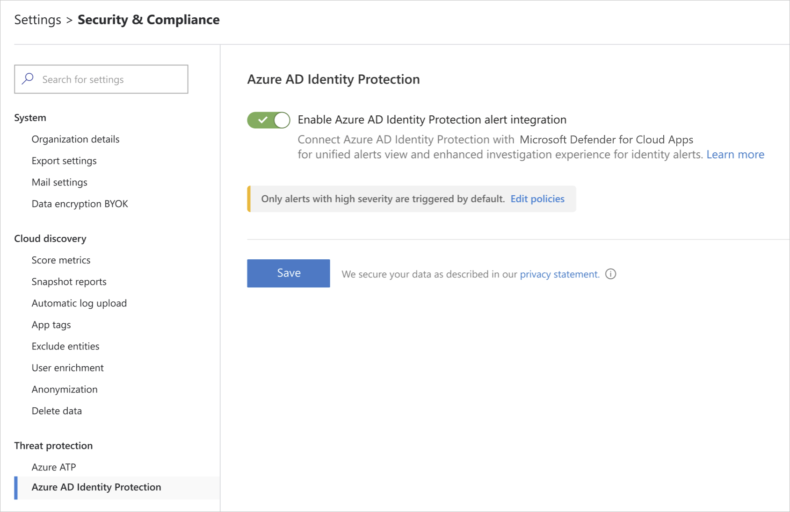

# Azure Active Directory Identity Protection integration

*Applies to: Microsoft Cloud App Security*

Microsoft Cloud App Security integrates with Azure Active Directory Identity Protection (Identity Protection) to provide user entity behavioral analytics (UEBA) across a hybrid environment. For more information about the machine learning and behavioral analytics provided by Identity Protection, see [What is Identity Protection?](/azure/active-directory/identity-protection/overview-identity-protection).

## Prerequisites

- A Cloud App Security Admin account to enable integration between Identity Protection and Cloud App Security.

## Enable Identity Protection

> [!NOTE]
> The Identity Protection feature is enabled by default. However, if the feature was disabled, you can use these steps to enable it.

To enable Cloud App Security integration with Identity Protection:

1. In Cloud App Security, under the settings cog, select **Settings**.

    

1. Under **Threat Protection**, select **Azure AD Identity Protection**.

    

1. Select **Enable Azure AD Identity Protection alert integration** and then click **Save**.

After enabling Identity Protection integration, you'll be able to see alerts for all the users in your organization.

## Disable Identity Protection

To disable Cloud App Security integration with Identity Protection:

1. In Cloud App Security, under the settings cog, select **Settings**.

1. Under **Threat Protection**, select **Azure AD Identity Protection**.

1. Clear **Enable Azure AD Identity Protection alert integration** and then click **Save**.

> [!NOTE]
> When the integration is disabled, existing Identity Protection alerts are kept in accordance with Cloud App Security retention policies.

## Configure Identity Protection Policies

The Identity Protection policies can be fine-tuned to your organization's need using the severity slider. The sensitivity slider allows you to control which alerts are ingested. In this way, you can adapt the detection according to your coverage needs and your (SNR) targets.

The following policies are available:

|Policy|Description|Default state|Default Severity|
|---|---|---|---|
|Leaked Credentials|Shows leaked credentials alerts, user's valid credentials have been leaked|Enabled|Low - Receive all alerts|
|Risky sign-in|Aggregates multiple risky sign-in detections, sign-ins that weren't performed by the user|Enabled|High - Receive only high severity alerts|

## Remediating risky users

The Identity Protection policies can be used to automatically remediate risky users by setting the user's risk level to high. Once a user is set to high, the advanced user risk analytics algorithm takes into consideration the new user status as well as the *Machine Device Management* status. This causes the relevant policy actions defined in Azure AD to be enforced, such as reset the user's password, require MFA authentication, or force the user to use a managed device. For more information, see [How does Azure AD use my risk feedback](https://docs.microsoft.com/azure/active-directory/identity-protection/howto-identity-protection-risk-feedback#how-does-azure-ad-use-my-risk-feedback) and [Governance actions](accounts.md#governance-actions).

## Next steps

> [!div class="nextstepaction"]
> [Control cloud apps with policies](control-cloud-apps-with-policies.md)

[!INCLUDE [Open support ticket](includes/support.md)]
