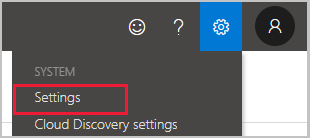

# Azure Advanced Threat Protection integration

*Applies to: Microsoft Cloud App Security*
git
Microsoft Cloud App Security integrates with Azure Advanced Threat Protection (Azure ATP) to provide user entity behavioral analytics (UEBA) across a hybrid environment - both cloud app and on-premises, for more information, see [Tutorial: Investigate risky users](tutorial-ueba.md). For more information about the machine learning and behavioral analytics provided by Azure ATP, see [What is Azure ATP?](https://docs.microsoft.com/azure-advanced-threat-protection/what-is-atp)

## Prerequisites

For complete user investigation across a hybrid environment, you must have:

- A valid license for Azure ATP connected to your Active Directory instance
- You must be a Azure Active Directory global admin to enable integration between Azure ATP and Cloud App Security

> [!NOTE]
>
> - If you don't have a subscription for Microsoft Cloud App Security, you will still be able to use Cloud App Security to get Azure ATP insights.
> - Azure ATP administrators may require new permissions to access Cloud App Security. To learn how to assign permissions to Cloud App Security, see [Manage admin access](manage-admins.md).

## Enable Azure Advanced Threat Protection

To enable Cloud App Security integration with Azure ATP:

1. In Cloud App Security, under the settings cog, select **Settings**.

    

1. Under **Threat Protection**, select **Azure ATP**.

    

1. Select **Connect Azure ATP data including alerts and activities with Cloud App Security** and then click **Save**.

> [!NOTE]
> It may take up to 12 hours until the integration takes effect.

After enabling Azure Advanced Threat Protection integration, you'll be able to see on-premises activities for all the users in your organization. You will also get advanced insights on your users that combine alerts and suspicious activities across your cloud and on-premises environments.

## Disable Azure Advanced Threat Protection

To disable Cloud App Security integration with Azure ATP:

1. In Cloud App Security, under the settings cog, select **Settings**.

1. Under **Threat Protection**, select **Azure ATP**.

1. Clear **Connect Azure ATP data including alerts and activities with Cloud App Security** and then click **Save**.

> [!NOTE]
> Existing azure ATP data is kept in accordance with Cloud App Security retention policies but the Identity Security Posture assessments are removed.

## Next steps

> [!div class="nextstepaction"]
> [Control cloud apps with policies](control-cloud-apps-with-policies.md)

[!INCLUDE [Open support ticket](includes/support.md)]
