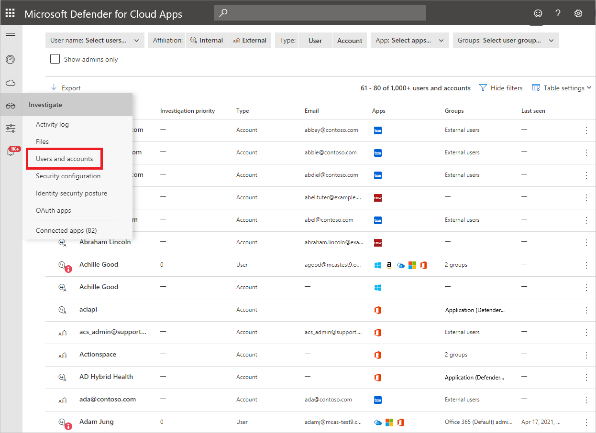

---
# required metadata

title: Visibility into cloud app accounts | Microsoft Docs
description: This topic pro.
keywords:
author: rkarlin
ms.author: rkarlin
manager: mbaldwin
ms.date: 5/22/2018
ms.topic: article
ms.prod:
ms.service: cloud-app-security
ms.technology:
ms.assetid: 7811f23b-6100-427f-93b1-44f5f81f6c76

# optional metadata

#ROBOTS:
#audience:
#ms.devlang:
ms.reviewer: reutam
ms.suite: ems
#ms.tgt_pltfrm:
#ms.custom:

---

*Applies to: Microsoft Cloud App Security*

# Accounts
Microsoft Cloud App Security gives you visibility into the accounts from your connected apps. After you connect Cloud App Security to an app using the App connector, Cloud App Security reads account information associated with connected apps. The Accounts page enables you to investigate those accounts, permissions, the groups they are members of, their aliases and the apps they are using. In addition, – when Cloud App Security detects a new account that was not previously seen in one of the connected apps - for example in activities or in file sharing - the account is added to the accounts list of that app. This enables you to have visibility into the activity of external users interacting with your cloud apps.

Admins can search for a specific user’s metadata or user’s activity. The **Users and accounts** page provides you with comprehensive details about the entity that are pulled from connected cloud applications. It also provides the user’s activity history and security alerts related to the user.

> [!NOTE]
> If you’re interested in viewing or deleting personal data, please review Microsoft's guidance in the [Microsoft Compliance Manager](https://servicetrust.microsoft.com/ComplianceManager) and in the [GDPR section of the Microsoft 365 Enterprise Compliance site](https://docs.microsoft.com/en-us/microsoft-365/compliance/gdpr]. If you’re looking for general information about GDPR, see the [GDPR section of the Service Trust portal](https://servicetrust.microsoft.com/ViewPage/GDPRGetStarted).

The **Accounts** page can be filtered to enable you to find specific accounts and to deep dive into different types of accounts, for example, you can filter for all External accounts that have not been accessed since last year. 

The **Accounts** page enables you to easily investigate your accounts, including the following issues:  

-   Check if any accounts have been inactive in a particular service for a long time (Maybe you should revoke the license for that user to that service)  
-   You can filter for the list of users with admin permissions  

-   You can search for users who are no longer part of your organization but may still have active accounts  

-   You can take governance actions on the accounts such as suspend an app or go to the account settings page. For a full list of governance actions see the [governance log](governance-actions.md).
    
-   You can see which accounts are included in each user group  

-   You can see which apps are accessed by each account and which apps are deleted for specific accounts
    

## Account filters
Following is a list of the account filters that can be applied. Most filters support multiple values as well as NOT, in order to provide you with a powerful tool for policy creation.  
  
- **Account name**: The account name is the primary alias of the user, but other identifiers from other Microsoft accounts (Office 365 and Azure Active Directory) such as proxy addresses, aliases, SID are supported and consolidated beneath the primary alias.

- **Affiliation**: The affiliation is either **Internal** or **External**. To set which users and accounts are internal, under **Settings** make sure to set the **IP address range** of your internal organization. In the event that the account has admin permissions the icon in the Accounts table appears with the addition of the red tie .

- **App**: You can filter for any API connected app being used by accounts in your organization.

- **Domain**: Enables you to filter for users in specific domains.

- **Last seen**: The **last seen** filter enables you to find accounts that are dormant and whose users haven't performed any activities in a while.

- **Organization/Department**: Enables you to filter for members of specific organizational groups defined in your connected apps.

- **User group**: Enables you to filter for members of user groups in Cloud App Security - both built-in user groups and imported user groups.

## See Also  
[Daily activities to protect your cloud environment](daily-activities-to-protect-your-cloud-environment.md)   

[Premier customers can also choose Cloud App Security directly from the Premier Portal.](https://premier.microsoft.com/)  
  
  