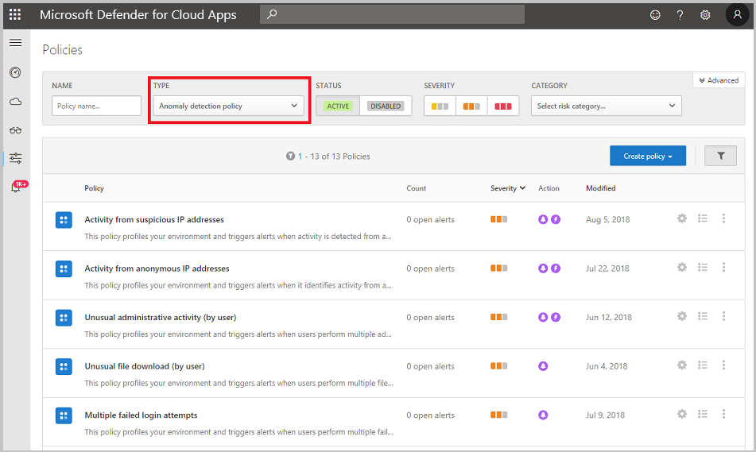
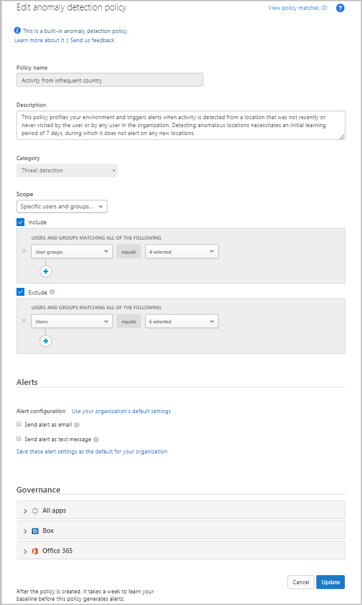

---
# required metadata

title: Create anomaly detection policies in Cloud App Security | Microsoft Docs
description: This topic provides a description of Anomaly detection policies and provides reference information about the building blocks of an anomaly detection policy.
keywords:
author: rkarlin
ms.author: rkarlin
manager: mbaldwin
ms.date: 7/18/2018
ms.topic: article
ms.prod:
ms.service: cloud-app-security
ms.technology:
ms.assetid: ab9bc377-d2f5-4f4c-a419-f1728a15d1c7

# optional metadata

#ROBOTS:
#audience:
#ms.devlang:
ms.reviewer: reutam
ms.suite: ems
#ms.tgt_pltfrm:
#ms.custom:

---

*Applies to: Microsoft Cloud App Security*

 
# Get instantaneous behavioral analytics and anomaly detection

Microsoft Cloud App Security's anomaly detection policies provide out-of-the-box user and entity behavioral analytics (UEBA) and machine learning (ML) so that you can immediately run advanced threat detection across your cloud environment. Because they are automatically enabled, the new anomaly detection policies provide immediate results by providing immediate detections, targeting numerous behavioral anomalies across your users and the machines and devices connected to your network.  In addition, the new policies expose more data from the Cloud App Security detection engine, to help you speed up the investigation process and contain ongoing threats. 

The anomaly detection policies are automatically enabled, but Cloud App Security has an initial learning period of seven days during which not all anomaly detection alerts are raised. After that, each session is compared to the activity, when users were active, IP addresses, devices, etc. detected over the past month and the risk score of these activities.  These detections are part of the heuristic anomaly detection engine that profiles your environment and triggers alerts with respect to a baseline that was learned on your organization’s activity. These detections also leverage machine learning algorithms designed to profile the users and log-on pattern to reduce false positives.

Anomalies are detected by scanning user activity. The risk is evaluated by looking at over 30 different risk indicators, grouped into multiple risk factors, as follows: 
  		  
 -   Risky IP address
 -   Login failures
 -   Admin activity
 -   Inactive accounts
 -   Location  
 -   Impossible travel
 -   Device and user agent
 -   Activity rate

Based on the policy results, security alerts are triggered. Cloud App Security looks at every user session on your cloud alerts you when something happens that is different from the baseline of your organization or from the user's regular activity. 

You can see the anomaly detection policies in the portal by clicking on **Control** and then **Policies**.

 

The following anomaly detection policies are available:

**Impossible travel**
-  This detection identifies two user activities (is a single or multiple sessions) originating from geographically distant locations within a time period shorter than the time it would have taken the user to travel from the first location to the second, indicating that a different user is using the same credentials. This detection leverages a machine learning algorithm that ignores obvious "false positives" contributing to the impossible travel condition, such as VPNs and locations regularly used by other users in the organization. The detection has an initial learning period of seven days during which it learns a new user’s activity pattern.

**Activity from infrequent country**
- This detection considers past activity locations to determine new and infrequent locations. The anomaly detection engine stores information about previous locations used by users in the organization. An alert is triggered when an activity occurs from a location that was not recently or never visited by any user in the organization. 

**Malware detection**
- This detection identifies malicious files in your cloud storage, whether they're from your Microsoft apps or third-party apps. Microsoft Cloud App Security uses Microsoft's threat intelligence to recognize whether certain files are associated with known malware attacks and are potentially malicious. This built-in policy is disabled by default. Not every file is scanned, but heuristics are used to look for files that are potentially risky. After files are detected, you can then see a list of **Infected files**. Click on the malware file name in the file drawer to open a malware report that provides you with information about that type of malware the file is infected with.
	
**Activity from anonymous IP addresses**
- This detection identifies that users were active from an IP address that has been identified as an anonymous proxy IP address. These proxies are used by people who want to hide their device’s IP address, and may be used for malicious intent. This detection leverages a machine learning algorithm that reduces "false positives", such as mis-tagged IP addresses that are widely used by users in the organization.

**Ransomware activity**
-  Cloud App Security extended its ransomware detection capabilities with anomaly detection to ensure a more comprehensive coverage against sophisticated Ransomware attacks. Using our security research expertise to identify behavioral patterns that reflect ransomware activity, Cloud App Security ensures holistic and robust protection. If Cloud App Security identifies, for example, a high rate of file uploads or file deletion activities it may represent an adverse encryption process. This data is collected in the logs received from connected APIs and is then combined with learned behavioral patterns and threat intelligence, for example, known ransomware extensions. For more information about how Cloud App Security detects ransomware, see [Protecting your organization against ransomware](use-case-ransomware.md).

**Terminated user activity**

- This detection enables you to able to identify when a terminated employee continues to perform actions on your SaaS apps. Because data shows that the greatest risk of insider threat comes from employees who left on bad terms, it is important to keep an eye on the activity on accounts from terminated employees. Sometimes, when employees leave a company, their accounts are de-provisioned from corporate apps, but in many cases they still retain access to certain corporate resources. This is even more important when considering privileged accounts, as the potential damage a former admin can do is inherently greater.
This detection takes advantage of Cloud App Security's ability to monitor user behavior across apps, allowing identification of the regular activity of the user, the fact that the account was terminated, and actual activity on other apps. For example, an employee who’s Azure AD account was terminated, but still has access to the corporate AWS infrastructure, has the potential to cause large-scale damage.  

**Activity from suspicious IP addresses**
- This detection identifies that users were active from an IP address that has been identified as risky by Microsoft Threat Intelligence. These IP addresses are involved in malicious activities, such as Botnet C&C, and may indicate compromised account. This detection leverages a machine learning algorithm that reduces "false positives", such as mis-tagged IP addresses that are widely used by users in the organization.

**Unusual activities (by user)**

These detections identify users who perform:

 - Unusual multiple file download activities
 - Unusual file share activities
 - Unusual file deletion activities
 - Unusual impersonated activities
 - Unusual administrative activities
 
These policies look for activities within a single session with respect to the baseline learned, which could indicate on a breach attempt. These detections leverage a machine learning algorithm that profiles the users log on pattern and reduces false positives. These detections are part of the heuristic anomaly detection engine that profiles your environment and triggers alerts with respect to a baseline that was learned on your organization’s activity.

**Multiple failed login attempts**
- This detection identifies users that failed multiple login attempts in a single session with respect to the baseline learned, which could indicate on a breach attempt. 

## Enable automated governance

You can enable automated remediation actions on alerts generated by anomaly detection policies. 

1. Click on the name of the detection policy in the **Policy** page.
2. In the **Edit anomaly detection policy** window that opens, under **Governance** set the remediation actions you want for each connected app or for all apps. 
3. Click **Update**.

 
## Scope anomaly detection policies

Each anomaly detection policy can be independently scoped so that it applies only to the users and groups you want to include and exclude in the policy.
For example, you can set the Activity from infrequent county detection to ignore a specific user who travels frequently. 

To scope an anomaly detection policy:
1. Click **Control** > **Policies**, and set the **Type** filter to **Anomaly detection policy**.
2. Click on the policy you want to scope.
3. Under **Scope**, change the drop-down from the default setting of **All users and groups**, to **Specific users and groups**.
4. Select **Include** to specify the users and groups for whom this policy will apply. Any user or group not selected here will not be considered a threat and will not generate an alert.
5. Select **Exclude** to specify users for whom this policy will not apply. Any user selected here will not be considered a threat and will not generate an alert, even if they are members of groups selected under **Include**.

 
## Triage anomaly detection alerts

You can triage the various alerts triggered by the new anomaly detection policies quickly and decide which ones need to be taken care of first. To do this, you need the  context for the alert, so you are able to see the bigger picture and understand whether something malicious is indeed happening.  

1. In the **Activity log**, you can open an activity to display the Activity drawer. Click on **User** to view the user insights tab. This includes information like number of alerts, activities, and where they have connected from, which is important in an investigation. 

   
   
 
2. This enables you to understand what the suspicious activities are that the user performed and gain deeper confidence as to whether the account was compromised. For example, an alert on multiple failed logins may indeed be suspicious and can indicate potential brute force attack, but it can also be an application misconfiguration, causing the alert to be a benign true positive. However, if you see a multiple failed logins alert with additional suspicious activities, then there is a higher probability that the account is compromised. In the example below, you can see that the **Multiple failed login attempts** alert was followed by **Activity from a TOR IP address** and **Impossible travel activity**, both strong indicators of compromise (IOCs) by themselves. If this wasn’t suspicious enough, then you can see that the same user performed a **Mass download activity**, which is often an indicator of the attacker performing exfiltration of data. 

   
   

3.  For malware infected files, After files are detected, you can then see a list of **Infected files**. Click on the malware file name in the file drawer to open a malware report that provides you with information about that type of malware the file is infected with. 

  

  
## See Also  
[Daily activities to protect your cloud environment](daily-activities-to-protect-your-cloud-environment.md)   

[Premier customers can also choose Cloud App Security directly from the Premier Portal.](https://premier.microsoft.com/)  
  
  
