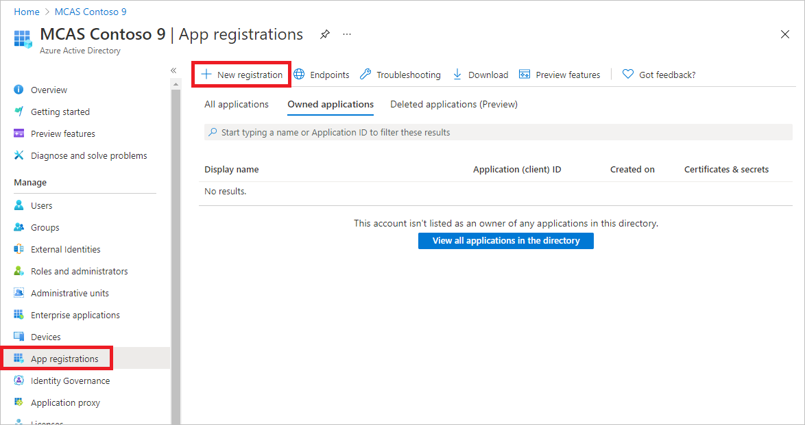
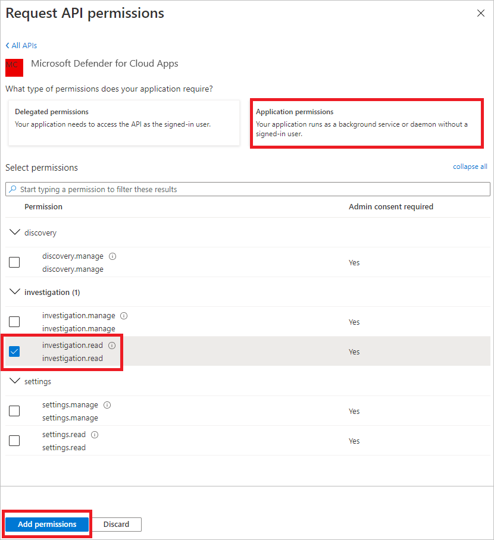
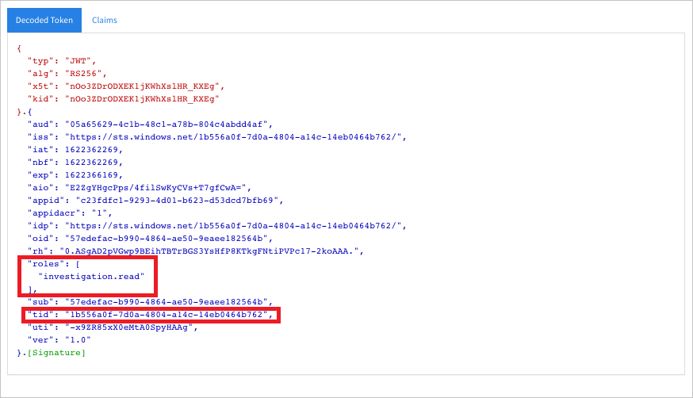

# Create an app to access Microsoft Cloud App Security without a user

[!INCLUDE [Banner for top of topics](includes/banner.md)]

This page describes how to create an application to get programmatic access to Cloud App Security without a user. If you need programmatic access to Cloud App Security on behalf of a user, see [Get access with user context](api-authentication-user.md). If you aren't sure which access you need, see the [Managing API tokens](api-authentication.md) page.

Microsoft Cloud App Security exposes much of its data and actions through a set of programmatic APIs. Those APIs will help you automate work flows and innovate based on Cloud App Security capabilities. The API access requires OAuth2.0 authentication. For more information, see [OAuth 2.0 Authorization Code Flow](/azure/active-directory/develop/active-directory-v2-protocols-oauth-code).

In general, you’ll need to take the following steps to use the APIs:

- Create an Azure Active Directory (Azure AD) application.
- Get an access token using this application.
- Use the token to access Cloud App Security API.

This article explains how to create an Azure AD application, get an access token to Microsoft Cloud App Security, and validate the token.

## Create an app

1. Sign in to [Azure](https://portal.azure.com) with a user that has the **Global Administrator** role.

2. Navigate to **Azure Active Directory** > **App registrations** > **New registration**.

   

3. In the registration form, choose a name for your application, and then select **Register**.

4. To enable your app to access Cloud App Security and assign it **'Read all alerts'** permission, on your application page, select **API Permissions** > **Add permission** > **APIs my organization uses** >, type **Microsoft Cloud App Security**, and then select **Microsoft Cloud App Security**.

   > [!NOTE]
   > *Microsoft Cloud App Security* does not appear in the original list. Start writing its name in the text box to see it appear.

   

   - Select **Application permissions** > **Investigation.Read**, and then select **Add permissions**.

        

     You need to select the relevant permissions. **Investigation.Read** is only an example.

     - To determine which permission you need, look at the **Permissions** section in the API you're interested to call.

5. Select **Grant admin consent**.

     > [!NOTE]
     > Every time you add a permission, you must select **Grant admin consent** for the new permission to take effect.

    

6. To add a secret to the application, select **Certificates & secrets**, select **New client secret**, add a description to the secret, and then select **Add**.

    > [!NOTE]
    > After you select **Add**, select **copy the generated secret value**. You won't be able to retrieve this value after you leave.

    

7. Write down your application ID and your tenant ID. On your application page, go to **Overview** and copy the **Application (client) ID** and the **Directory (tenant) ID**.

   

8. **For Microsoft Cloud App Security Partners only**. Set your app to be multi-tenanted (available in all tenants after consent). This is **required** for third-party apps (for example, if you create an app that is intended to run in multiple customers' tenant). This is **not required** if you create a service that you want to run in your tenant only (for example, if you create an application for your own usage that will only interact with your own data). To set your app to be multi-tenanted:

    - Go to **Authentication**, and add `https://portal.azure.com` as the **Redirect URI**.

    - On the bottom of the page, under **Supported account types**, select the **Accounts in any organizational directory** application consent for your multi-tenant app.

    You need your application to be approved in each tenant where you intend to use it. This is because your application interacts Cloud App Security on behalf of your customer.

    You (or your customer if you're writing a third-party app) need to select the consent link and approve your app. The consent should be done with a user who has administrative privileges in Active Directory.

    The consent link is formed as follows:

    ```url
    https://login.microsoftonline.com/common/oauth2/authorize?prompt=consent&client_id=00000000-0000-0000-0000-000000000000&response_type=code&sso_reload=true
    ```

    Where 00000000-0000-0000-0000-000000000000 is replaced with your application ID.

**Done!** You've successfully registered an application! See examples below for token acquisition and validation.

## Get an access token

For more information on Azure AD tokens, see the [Azure AD tutorial](/azure/active-directory/develop/active-directory-v2-protocols-oauth-client-creds).

### Use PowerShell

```powershell
# This script acquires the App Context Token and stores it in the variable $token for later use in the script.
# Paste your Tenant ID, App ID, and App Secret (App key) into the indicated quotes below.

$tenantId = '' ### Paste your tenant ID here
$appId = '' ### Paste your Application ID here
$appSecret = '' ### Paste your Application key here

$resourceAppIdUri = '05a65629-4c1b-48c1-a78b-804c4abdd4af'
$oAuthUri = "https://login.microsoftonline.com/$TenantId/oauth2/token"
$authBody = [Ordered] @{
    resource = "$resourceAppIdUri"
    client_id = "$appId"
    client_secret = "$appSecret"
    grant_type = 'client_credentials'
}
$authResponse = Invoke-RestMethod -Method Post -Uri $oAuthUri -Body $authBody -ErrorAction Stop
$token = $authResponse.access_token
```

### Use C#:

The following code was tested with NuGet Microsoft.IdentityModel.Clients.ActiveDirectory 3.19.8.

1. Create a new console application.
1. Install NuGet [Microsoft.IdentityModel.Clients.ActiveDirectory](https://www.nuget.org/packages/Microsoft.IdentityModel.Clients.ActiveDirectory/).
1. Add the following:

    ```text
    using Microsoft.IdentityModel.Clients.ActiveDirectory;
    ```

1. Copy and paste the following code in your app (don't forget to update the three variables: ```tenantId, appId, appSecret```):

    ```c#
    string tenantId = "00000000-0000-0000-0000-000000000000"; // Paste your own tenant ID here
    string appId = "11111111-1111-1111-1111-111111111111"; // Paste your own app ID here
    string appSecret = "22222222-2222-2222-2222-222222222222"; // Paste your own app secret here for a test, and then store it in a safe place!

    const string authority = "https://login.microsoftonline.com";
    const string MCASResourceId = "05a65629-4c1b-48c1-a78b-804c4abdd4af";

    AuthenticationContext auth = new AuthenticationContext($"{authority}/{tenantId}/");
    ClientCredential clientCredential = new ClientCredential(appId, appSecret);
    AuthenticationResult authenticationResult = auth.AcquireTokenAsync(MCASResourceId, clientCredential).GetAwaiter().GetResult();
    string token = authenticationResult.AccessToken;
    ```

### Use Python

See [Microsoft Authentication Library (MSAL) for Python](https://github.com/AzureAD/microsoft-authentication-library-for-python).

### Use Curl

> [!NOTE]
> The following procedure assumes that Curl for Windows is already installed on your computer.

1. Open a command prompt, and set CLIENT_ID to your Azure application ID.
1. Set CLIENT_SECRET to your Azure application secret.
1. Set TENANT_ID to the Azure tenant ID of the customer that wants to use your app to access Cloud App Security.
1. Run the following command:

```curl
curl -i -X POST -H "Content-Type:application/x-www-form-urlencoded" -d "grant_type=client_credentials" -d "client_id=%CLIENT_ID%" -d "scope=05a65629-4c1b-48c1-a78b-804c4abdd4af/.default" -d "client_secret=%CLIENT_SECRET%" "https://login.microsoftonline.com/%TENANT_ID%/oauth2/v2.0/token" -k
```

You'll get an answer in the following form:

```output
{"token_type":"Bearer","expires_in":3599,"ext_expires_in":0,"access_token":"eyJ0eXAiOiJKV1QiLCJhbGciOiJSUzI1NiIsIn <truncated> aWReH7P0s0tjTBX8wGWqJUdDA"}
```

## Validate the token

Ensure that you got the correct token:

1. Copy and paste the token you got in the previous step into [JWT](https://jwt.ms) in order to decode it.
1. Validate that you get a 'roles' claim with the desired permissions
1. In the following image, you can see a decoded token acquired from an app with permissions to all of Microsoft Cloud App Security's roles:



## Use the token to access Microsoft Cloud App Security API

1. Choose the API you want to use. For more information, see [Cloud App Security APIs](api-introduction.md).
1. Set the authorization header in the http request you send to "Bearer {token}" (Bearer is the authorization scheme).
1. The expiration time of the token is one hour. You can send more than one request with the same token.

The following is an example of sending a request to get a list of alerts **using C#**:

```C#
    var httpClient = new HttpClient();

    var request = new HttpRequestMessage(HttpMethod.Get, "https://portal.cloudappsecurity.com/cas/api/v1/alerts/");

    request.Headers.Authorization = new AuthenticationHeaderValue("Bearer", token);

    var response = httpClient.SendAsync(request).GetAwaiter().GetResult();

    // Do something useful with the response
```

## See also

- [Managing API tokens](api-authentication.md)