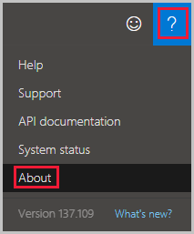
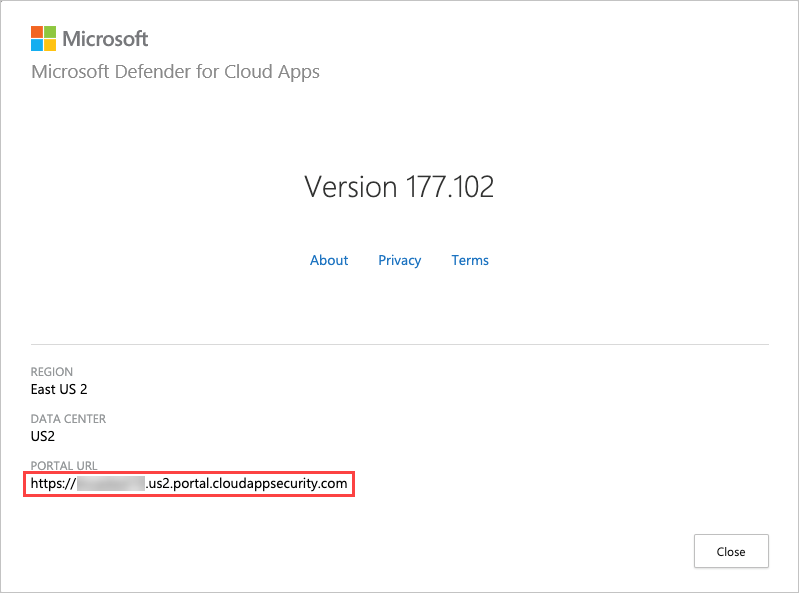

# Cloud App Security REST API

[!INCLUDE [Banner for top of topics](includes/banner.md)]

This article describes how to interact with Cloud App Security over HTTPS.

The Microsoft Cloud App Security API provides programmatic access to Cloud App Security through REST API endpoints. Applications can use the API to perform read and update operations on Cloud App Security data and objects. For example, the Cloud App Security API supports the following common operations for a user object:

- Upload log files for Cloud Discovery
- Generate block scripts
- List activities and alerts
- Dismiss or resolve alerts

## API URL structure

To use the Cloud App Security API, you must first obtain the API URL from your tenant. The API URL uses the following format: `https://<portal_url>/api/<endpoint>`.

To obtain the Cloud App Security portal URL for your tenant, do the following steps:

1. In the Cloud App Security portal, click the **question mark icon** in the menu bar. Then, select **About**.

    

1. In the Cloud App Security about screen, you can see the portal url.

    

Once you have the portal url, add the `/api` suffix to it to obtain your API URL. For example, if your portal's URL is `https://mytenant.us2.contoso.com`, then your API URL is `https://mytenant.us2.contoso.com/api`.

## API tokens

Cloud App Security requires an API token in the header of all API requests to the server, such as the following:

```http
Authorization: Token <your_token_key>
```

Where `<your_token_key>` is your personal API token.

For more information about API tokens, see [Managing API tokens](api-authentication.md).

### Example

```rest
curl -XGET -H "Authorization:Token <your_token_key>" "https://<tenant_id>.<tenant_region>.contoso.com/api/example-endpoint"
```

## What actions are supported?

The following table describes the actions supported:

|Resource|HTTP verbs|URI routes|
|---|---|---|
|Activities|GET or POST|/api/v1/activities/|
|Alerts|GET or POST|/api/v1/alerts/|
|Cloud Discovery|GET, POST, or PUT|/api/v1/discovery/|
|Data Enrichment|GET, POST, or DELETE|/api/subnet/|
|Entities|GET or POST|/api/v1/entities/|
|Files|GET or POST|/api/v1/files/|

Where **Resource** represents a group of related entities.

## What field types are supported?

The following table describes the supported field types:

|Field|Description|
|---|---|
|string|A textual string|
|boolean|A boolean value representing true/false|
|integer|32-bit signed integer|
|timestamp|Milliseconds since epoch|

## Limits

You can choose to limit your requests by providing a limit parameter in the request.

The following methods are supported for providing the limit parameter:

- URL-encoded (with `Content-Type: application/x-www-form-urlencoded` header)
- Form data
- JSON body (with `Content-Type: multipart/form-data` and an appropriate boundary header)

> [!NOTE]
>
> - If no limit is provided a default of 100 will be set.
> - Responses for all requests made with the API token are limited to a maximum of 100 items.
> - The throttle limit for all API requests is 30 requests per minute per tenant.

## Filters

When you have a large number of results, you'll find it useful to fine-tune requests using filters. This section describes the structure of, and operators that can be used with, filters.

### Structure

Some of our API endpoints support filters when performing queries. In their relevant sections, you will find a reference listing all available filterable fields and supported operators for that resource.

Most filters support multiple values to provide you with powerful queries. When combining filters and operators we use AND as the logical operator between the filters.

### Example

```rest
curl -XGET -H "Authorization:Token <your_token_key>" "https://<tenant_id>.<tenant_region>.contoso.com/api/example-endpoint" -d '{
  "filters": {
    "some.field": {
      "eq": ["value1", "value2"],
      "isset": true
    },
    "some.field2": {
      "gte": 5
    }
  },
  "skip": 5,
  "limit": 10
}'
```

### Operators

> [!NOTE]
> Not all operators are compatible with all filters.

The following table describes the supported operators:

| Operator | Response type | Description |
| --- | --- | --- |
| contains | list of strings | Returns all relevant records containing one of the provided strings |
| deq | list of values | Returns all records who contain one value that does not equal one the provided values |
| descendantof | list of values | Returns all relevant records matching values or descendants of them |
| doesnotstartwith | list of strings | Returns all relevant records not starting with each of the provided strings |
| endswith | list of strings | Returns all relevant records ending with one of the provided strings |
| eq | list of values | Returns all relevant records containing one of the provided values |
| gt | single value | Returns all records whose value is greater than the provided value |
| gte | single value | Returns all records whose value is greater than or equal to the provided value |
| gte_ndays | number | Returns all records with date later than N days ago |
| isnotset | boolean | When set to "true", returns all relevant records that don't have a value in the specified field |
| isset | boolean | When set to "true", returns all relevant records that have a value in the specified field |
| lt | single value | Returns all records whose value is less than the provided value |
| lte | single value | Returns all records whose value is less than or equal to the provided value |
| lte_ndays | number | Returns all records with date earlier than N days ago |
| ncontains | list of strings | Returns all relevant records not containing one of the provided strings |
| ndescendantof | list of values | Returns all relevant records not matching values or descendants of them |
| neq | list of values | Returns all relevant records not containing all the provided values |
| range | list of objects containing "start" and "end" fields | Returns all records within one of the provided ranges |
| startswith | list of strings | Returns all relevant records starting with one of the provided strings |
| startswithsingle | string | Returns all relevant records starting with the provided string |
| text | string | Performs a full-text search of all records |

## Next steps

> [!div class="nextstepaction"]
> [API authentication](api-authentication.md)

[!INCLUDE [Open support ticket](includes/support.md)]
