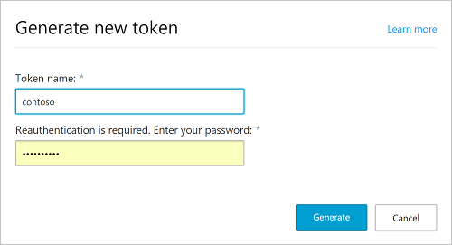
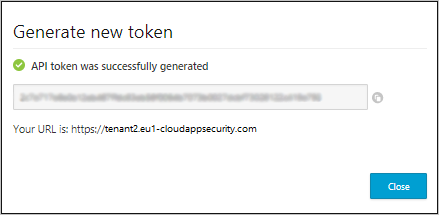

# Managing internal tokens (legacy)

[!INCLUDE [Banner for top of topics](includes/banner.md)]

In order to access the Defender for Cloud Apps API, you have to create an API token and use it in your software to connect to the API. This token will be included in the header when Defender for Cloud Apps makes API requests.

The API tokens tab enables you to help you manage all the API tokens of your tenant.

## Generate a token

1. On the **Settings** menu, select **Security extensions** and then **API tokens**.

2. Click the plus icon, **Generate new token** and provide a name to identify the token in the future, and click **Next**.

    

3. Copy the token value and save it somewhere for recovery - if you lose it you need to regenerate the token. The token has the privileges of the user who issued it. For example, a security reader can't issue a token that can alter data.

4. You can filter the tokens by status: Active, Inactive, or Generated.

    - **Generated:** Tokens that have never been used.
    - **Active:** Tokens that were generated and were used within the past seven days.
    - **Inactive:** Tokens that were used but there was no activity in the last seven days.

5. After you generate a new token, you'll be provided with a new URL to use to access the Defender for Cloud Apps portal.

    

    The generic portal URL continues to work but is considerably slower than the custom URL provided with your token. If you forget the URL at any time, you can view it by going to the **?** icon in the menu and selecting **About**.

## API token management

The API token page includes a table of all the API tokens that were generated.

Full admins see all tokens generated for this tenant. Other users only see the tokens that they generated themselves.

The table provides details about when the token was generated and when it was last used and allows you to revoke the token.

After a token is revoked, it's removed from the table, and the software that was using it fails to make API calls until a new token is provided.

> [!NOTE]
>
> - SIEM connectors and log collectors also use API tokens. These tokens should be managed from the log collectors and SIEM agent sections and do not appear in this table.
> - Deprovisioned users API tokens are retained in Defender for Cloud Apps but cannot be used. Any attempt to use them will result in a permission denied response. However, we recommend that such tokens are revoked on the **API tokens** page.

[!INCLUDE [Open support ticket](includes/support.md)]

## Check out this video!

[Microsoft Defender for Cloud Apps – REST APIs and Tokens](https://channel9.msdn.com/Shows/Microsoft-Security/Microsoft-Cloud-App-Security--REST-APIs-and-Tokens)
