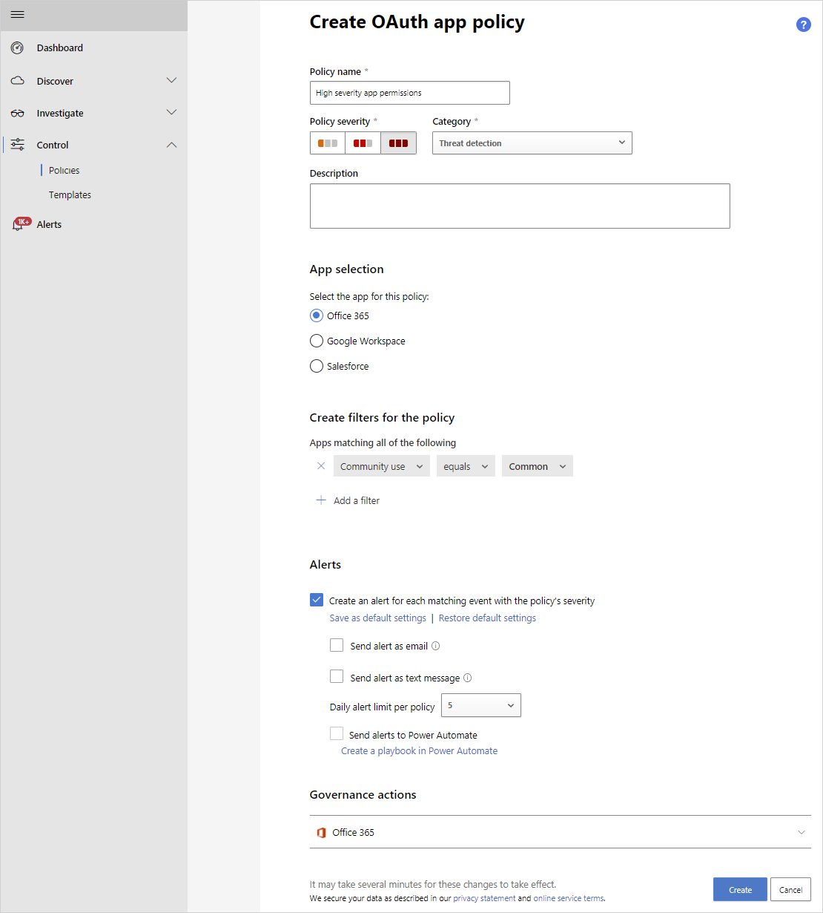

---
# required metadata

title: Create policies to control app permissions in Cloud App Security | Microsoft Docs
description: This topic provides instructions for creating and working with app permission policies in Microsoft Cloud App Security.
keywords:
author: rkarlin
ms.author: rkarlin
manager: mbaldwin
ms.date: 6/24/2018
ms.topic: article
ms.prod:
ms.service: cloud-app-security
ms.technology:
ms.assetid: 9f68302c-bb3d-450c-bbf5-f8130cb163e3

# optional metadata

#ROBOTS:
#audience:
#ms.devlang:
ms.reviewer: reutam
ms.suite: ems
#ms.tgt_pltfrm:
#ms.custom:

---
*Applies to: Microsoft Cloud App Security*

# App permission policies

In addition to the existing investigation of OAuth apps connected to your environment, you can set permission policies to so that you get automated notifications when an OAuth app meets certain criteria. For example, you can automatically be alerted when there are apps that require a high permission level and were authorized by more than 50 users. 

App permission policies enable you to investigate, for Office 365, G Suite and Salesforce, which permissions each app requested and which users authorized them. You are also able to mark these permissions as approved or banned. Marking them as banned will revoke permissions for each app for each user who authorized it. 

To create a new app permission policy:
1. Under **Investigate** select **App permissions**.
2. Filter the apps according to your needs, for example, you can view all apps that request **Permission** to **Modify calendars in your mailbox**.
3. Click the **New policy from search** button. 
    
4. You can use the **Community use** filter to get information on whether allowing permission to this app is common, uncommon or rare. This can be helpful if you have an app that's rare and requests permission that has a high severity level or requests permission from many users. 

Alternatively, you can also create the policy by clicking **Control** followed by **Policies**. Then click **Create policy** followed by **App permission policy**.

  
   

  ## See Also  
  [Data protection policies](data-protection-policies.md)   

[Premier customers can also choose Cloud App Security directly from the Premier Portal.](https://premier.microsoft.com/)  
  
  