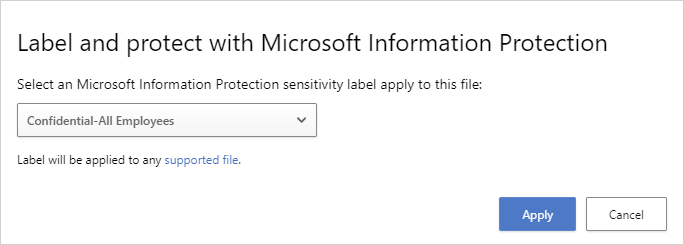
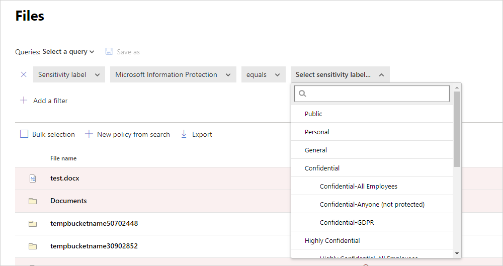

---
# required metadata

title: Integrate Azure Information Protection with Cloud App Security | Microsoft Docs
description: This article provides information about how to leverage your Azure Information Protection tags in Cloud App Security for added control of your organization's cloud app use.
keywords:
author: rkarlin
ms.author: rkarlin
manager: mbaldwin
ms.date: 1/11/2017
ms.topic: article
ms.prod:
ms.service: cloud-app-security
ms.technology:
ms.assetid: 8168319a-199f-4e6c-ad68-e0f236480803

# optional metadata

#ROBOTS:
#audience:
#ms.devlang:
ms.reviewer: reutam
ms.suite: ems
#ms.tgt_pltfrm:
#ms.custom:

---

# Azure Information Protection integration

Cloud App Security lets you apply Azure Information Protection classification labels automatically, with or without protection, to files as a file policy governance action. You can also investigate files by filtering for the applied classification label within the Cloud App Security portal. This enables greater visibility and control of your sensitive data in the cloud. Integrating Azure Information Protection with Cloud App Security is as easy as selecting one single checkbox. 

By integrating Azure Information Protection into Cloud App Security, you can leverage the full power of both services and secure files in your cloud, including:
- The ability to apply classification labels as a governance action to files that match specific policies
- The ability to view all classified files in a central location
- The ability to perform investigation according to classification level, and quantify exposure of sensitive data over your cloud applications
- The ability to create policies to make sure classified files are being handled properly

> [!NOTE] 
> To enable this feature, you need both a Cloud App Security license and a license for Azure Information Protection Premium P2. As soon as both licenses are in place, Cloud App Security syncs the organizations labels from the Azure Information Protection service.

## Prerequisites

Cloud App Security currently supports applying Azure Information Protection classification labels for the following file types:

- Word: docm, docx, dotm, dotx
- Excel: xlam, xlsm, xlsx, xltx
- PowerPoint: potm, potx, ppsx, ppsm, pptm, pptx
- PDF and image files will be available in future versions 

This feature is currently available for files that are stored in Box, SharePoint Online and OneDrive for Business. More cloud apps will be supported in future versions.

Files that were labeled with protection outside of Cloud App Security cannot currently be scanned or changed by Cloud App Security. Files that were labeled (without protection) external to Cloud App Security, can be scanned and Cloud App Security can apply a different label (with or without protection) as defined in Cloud App Security policies.

## How it works
You are probably familiar with file classification labels in [Azure Information Protection](https://docs.microsoft.com/information-protection/). You can see the Azure Information Protection classification tags in Cloud App Security. As soon as you integrate Cloud App Security with Azure Information Protection, Cloud App Security scans files as follows:
1. Cloud App Security retrieves the list of all the classification labels used in your tenant. This is performed every hour to keep the list up to date.
2. Cloud App Security then scans the files for classification labels, as follows:
    a. If you enabled automatic scan (see the following), all new or modified files are added to the scan queue and all existing files and repositories will be scanned, classified and protected.
    b. If you set a file policy (see the following) to search for classification labels, these files are added to the scan queue for classification labels.
3. As noted above, these scans are for the classification labels discovered in the initial scan Cloud App Security performs to see which classification labels are used in your tenant. External labels, classification labels set by someone external to your tenant, are added to the list of classification labels. If you don't want to scan for these, select the **Only scan files for Azure Information Protection classification labels from this tenant** check box (see the following).
4. After you enable Azure Information Protection on Cloud App Security, all new files that are added to Office 365 will be scanned for classification labels as well.
5. You can create new policies within Cloud App Security that apply your classification labels automatically.

## How to integrate Azure Information Protection with Cloud App Security
  
### Enable Azure Information Protection

This is all you have to do to integrate Azure Information Protection with Cloud App Security: Enable automatic scan to enable searching for Azure Information Protection classification labels on your Office 365 files without the need to create a policy. After you enable this, if you have files in your cloud environment that are labeled with Azure Information Protection classification labels, you will see them in Cloud App Security.

To enable Cloud App Security to scan files with content inspection enabled for classification labels:

1. In Cloud App Security, under the settings cog, select the **General settings** page.
2. Under Azure Information Protection, select **Automatically scan files for Azure Information Protection classification labels**. 

After enabling Azure Information Protection, you will be able to see files that have classification labels and filter them per label in Cloud App Security. After Cloud App Security is connected to the cloud app, you will be able to use the Cloud App Security Azure Information Protection integration features that enable you to apply Azure Information Protection labels (with or without protection) directly in the Cloud App Security portal, by adding them directly to files or by configuring a file policy to apply classification labels automatically as a governance action.

 

> [!NOTE] 
> Automatic scan does not scan existing files until they are modified again. To scan existing files for Azure Information Protection classification labels, you must have at least one **Content inspection File policy**. If you have none, create a new **File policy**, delete all the preset filters, check the **Content inspection** option. Then, under **Content inspection**, click **Include files that match a preset expression** and select any predefined value, and save the policy. This enables content inspection, which automatically detects Azure Information Protection classification labels.

#### Set internal and external tags
By default, Cloud App Security scans classification labels that were defined in your organization as well as external ones that were defined by other organizations. 

To ignore classification labels set external to your organization, in the Cloud App Security portal, under **General settings**, under **Azure security settings** select **Ignore Azure Information Protection classification labels from other tenants**.
 

### Apply labels directly to files

1. From the **Files** page, select the file you want to protect and then click the three dots at the end of the file's row and choose **Apply classification label**.

 
  
  >[!NOTE]
  >Azure Information Protection protects files with a maximum size of 50 MB. 

2. You are asked to choose one of your organization's classification labels to apply to the file, and click **Apply**. 

3. After you choose a classification label and click apply, Cloud App Security will apply the classification label to the original file.

5. You can also remove classification labels by choosing the **Remove classification label** option. 

For more information about how Cloud App Security and Azure Information Protection work together, see [Protect data against user mistakes](https://docs.microsoft.com/enterprise-mobility-security/solutions/protect-data-user-mistake).

### Automatically label files (preview)

You can automatically apply classification labels to files by creating a file policy and setting **Apply classification label** as the governance action.

Follow these instructions to create the file policy:

1.	Create a file policy.
2.	Set the policy including the type of file you want to detect, for example, all files where **Access level** does not equal **Internal** and where the **Owner OU** equals your finance team. 
3.  Under governance actions for the relevant app to **Apply a classification label** and then select the label type.

   

### Control file exposure

- If this is the document that you labeled with an Azure Information Protection classification label:

   

- You are able to see this file in Cloud App Security, in the **Files** page, by filtering for the classification label:

   

- You can get more information about these files and their classification labels in the file drawer by clicking on the relevant file in the **Files** page, and check whether it has a classification label:

   

- Then, you can create file policies in Cloud App Security to control files that are shared inappropriately and find files that are labeled and were recently modified.
- In addition, you can trigger alerts on activities related to classified files.

  

- You can also create a policy that automatically applies a classification label to specific files.

> [!Note]
> When Azure Identity Protection labels are disabled on a file, the disabled labels appear as disabled in Cloud App Security. Deleted labels are not displayed.

**Sample policy - confidential data that is externally shared on Box:**

1.	Create a file policy.
2.	Set the policy’s name, severity, and category.
3.	Add the following filters to find all confidential data that is externally shared on Box:

 

**Sample policy - restricted data that was recently modified outside the Finance folder on SharePoint:**

1.	Create a file policy.
2.	Set the policy’s name, severity, and category.
3.	Add the following filters to find all restricted data that was recently modified, and add exclude the Finance folder in the folder selection option: 
 
 

You can also choose to set alerts, user notification or take immediate action for these policies.
Learn more about [governance actions](governance-actions.md).

Learn more about [Azure Information Protection](https://docs.microsoft.com/en-us/information-protection/understand-explore/what-is-information-protection) and check out the Azure Information Protection [Quick start tutorial](https://docs.microsoft.com/en-us/information-protection/get-started/infoprotect-quick-start-tutorial).

 
## Related Videos  
[Cloud App Security + Azure Information Protection Integrations](https://channel9.msdn.com/Shows/Microsoft-Security/MCAS--AIP-Integrations)  

## See Also  
[Control cloud apps with policies](control-cloud-apps-with-policies.md)   
[For technical support, visit the Cloud App Security assisted support page.](http://support.microsoft.com/oas/default.aspx?prid=16031)   
[Premier customers can also choose Cloud App Security directly from the Premier Portal.](https://premier.microsoft.com/)  
  
