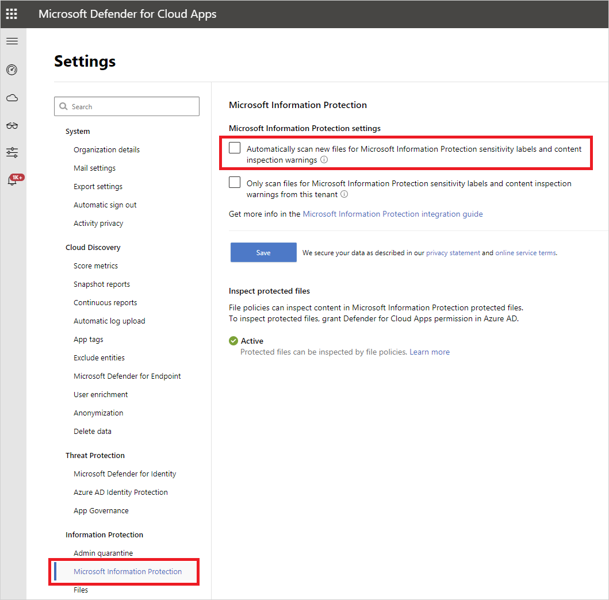
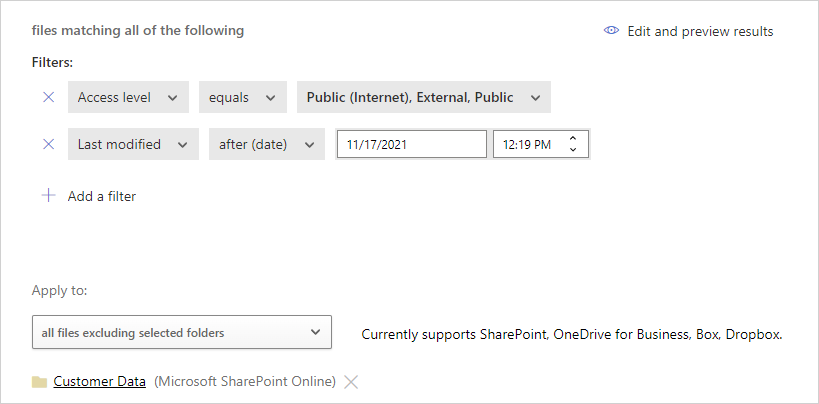

---
# required metadata

title: Azure Inforamtion Protection integration | Microsoft Docs
description: This article provides information about how to leverage your Azure Information Protection tags in Cloud App Security for added control of your organization's cloud app use.
keywords:
author: rkarlin
ms.author: rkarlin
manager: mbaldwin
ms.date: 11/03/2016
ms.topic: article
ms.prod:
ms.service: cloud-app-security
ms.technology:
ms.assetid: bc11bbfe-ec6c-458c-8302-8112c383199d

# optional metadata

#ROBOTS:
#audience:
#ms.devlang:
ms.reviewer: reutam
ms.suite: ems
#ms.tgt_pltfrm:
#ms.custom:

---

# Azure Information Protection integration

Cloud App Security can leverage Azure Information Protection classification labels and allow you to apply policies based on the applied labels.
After this feature is enabled, you can use the classification label in order to:
-	Quantify data exposure
-	Create policies and alert on violations of uploading or sharing of classified data in your connected cloud apps
-	Investigate audit trails and remediate files that are in violation of your policies 

In addition, as part of the Cloud App Security private preview, you can trigger alerts on activities related to classified files.

## Terminology overview:
-	Classification label- an attribute added to the files in your organization either automatically by administrators. who define rules and conditions; manually by users; or a combination where users are given recommendations.
-	External classification label- labels from other organizations that were added on your files. These will be marked as external in Cloud App Security, i.e. “Confidential (external)”.
-	File tag- the classification label’s presentation in Cloud App Security. This field is shown for each file in the files table and can be used in filters.
-	File policy- a set of rules that rely on file filters that allow you to enforce a wide range of automated processes leveraging the cloud provider’s APIs.

## License and tenant creation
To enable this feature you will need both a Cloud App Security license and an Azure Information Protection license. As soon as both licenses are in place, Cloud App Security will populate the list of file tags with the name of the classification labels from Azure Information Protection:

 	 
In addition, by default, files that are going through content inspection by one or more file policies will also be scanned for classification labels.

## Enable automatic scan (coming soon)
To enable automatic scans for file tags for new files in Office 365:

1. In Office 365, go to the **General settings** page.
2. Under Azure security settings select **Automatically scan files for Azure Information Protection classification labels**. 
After it's enabled, all new files that are added to Office 365, not only the ones that are scanned for content by a file policy, will be scanned for file tags as well.

 

## Internal and external tags (coming soon)
By default, Cloud App Security will scan classification labels that were defined in your organization as well as external ones that were defined by other organizations. 

To ignore them, under **Azure security setting** select **Ignore Azure Information Protection classification labels from other tenants**.
 

> [!Note]
> If you are working in a test tenant you will probably not want to ignore external classification labels in order to be able to test files you receive from other tenants.

 

## Gain visibility

The file tags that were scanned for each file are visible in the file drawer.
In the **Files** page, click on the relevant file to see if it has any file tags:

You can click on the tags to view more information or to see the full list of tags:
 

Use the **File tags** filter to search for files that were tagged with a specific tag:
 

Or for files that were tagged with any file tag:

## Use Azure Information Protection tags to apply control
Create file policies in Cloud App Security to find files that are shared inappropriately and find files that are labeled and were recently modified. 

**Policy #1 - confidential data that is externally shared on Box:**

1.	Create a file policy.
2.	Set the policy’s name, severity and category.
3.	Add the following filters to find all confidential data that is externally shared on Box:

 

**Policy #2 - restricted data that was recently modified outside the Finance folder on SharePoint:**

1.	Create a file policy.
2.	Set the policy’s name, severity and category.
3.	Add the following filters to find all restricted data that was recently modified, and add exclude the Finance folder in the folder selection option: 
 
 

You can also choose to set alerts, user notification or take immediate action for these policies.
Learn more about [governance actions](governance-actions).

Learn more about [Azure Information Protection](https://docs.microsoft.com/en-us/information-protection/understand-explore/what-is-information-protection) and check out the Azure Information Protection [Quick start tutorial](https://docs.microsoft.com/en-us/information-protection/get-started/infoprotect-quick-start-tutorial).

  

## See Also  
[Control cloud apps with policies](control-cloud-apps-with-policies.md)   
[For technical support, please visit the Cloud App Security assisted support page.](http://support.microsoft.com/oas/default.aspx?prid=16031)   
[Premier customers can also choose Cloud App Security directly from the Premier Portal.](https://premier.microsoft.com/)  
  
  