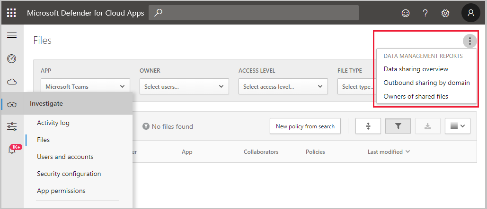

---
# required metadata

title: Generate reports - Microsoft Cloud App Security | Microsoft Docs
description: This article provides instructions for generating data management reports in Microsoft Cloud App Security.
keywords:
author: rkarlin
ms.author: rkarlin
manager: barbkess
ms.date: 12/10/2018
ms.topic: conceptual
ms.collection: M365-security-compliance
ms.prod:
ms.service: cloud-app-security
ms.technology:
ms.assetid: 0dcc3c35-f787-4822-84c6-d4dff897dd6c

# optional metadata

#ROBOTS:
#audience:
#ms.devlang:
ms.reviewer: reutam
ms.suite: ems
#ms.tgt_pltfrm:
ms.custom: seodec18
---

# Generate data management reports

*Applies to: Microsoft Cloud App Security*

Microsoft Cloud App Security enables you to generate reports that provide you with an overview of files in your cloud apps.

To generate these reports

1. Go to **Files**. 
2. In the upper right-hand corner, click the three dots and under **Data management reports**, select one of the following reports.

 

## Data sharing overview 

This report lists the number of files, by access permissions, stored in each of your cloud apps. Sharing files has been made easy with cloud apps because of the ease of access and ubiquity. A **Private file** isn't shared with anyone except its owner. If the file is shared, Cloud App Security differentiates between four types of states:
- A **Publicly shared (Internet)** file is a file that can be accessed without any authentication, even through a search engine result.
 - A **Publicly shared** file is a file that can be accessed without any authentication, using a link.
 - An **Externally shared** file is a file that can be accessed by individuals outside the organization, after authenticating themselves to the cloud app.
- An **Internally shared** file is a file that can be accessed by all or some users in your organization.

## Outbound sharing by domain

This report lists the domains with which corporate files are shared by your employees. For each domain, the report shows which users are sharing files with that domain. The report also shows which files are shared and who the collaborator files are shared with. It's recommended that you manage the sharing with these domains. You can manage the sharing via the files tab in the app page of each relevant app.

## Owners of shared files

This lists users who are sharing corporate files with the outside world. Externally shared files are files shared with specific external collaborators. Publicly shared files are accessible to anyone on the Internet, via a private link. These files can only be found by people who explicitly have the link. Publicly shared files (Internet) are accessible to anyone on the Internet even through a search engine result. If you find users that share an excessive number of files, it's recommended you investigate why. You can investigate using the Files tab and then contact these users to further understand their usage of external sharing.

  
## Next steps 
[Control](control.md)   

[Premier customers can also create a new support request directly in the Premier Portal.](https://premier.microsoft.com/)  
  
  
