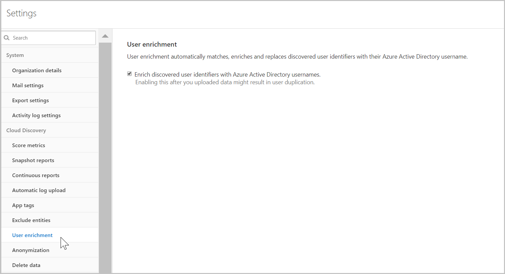

---
# required metadata

title: Enrich Cloud App Security Discovery data with Azure AD usernames 
description: This article provides information about how to enrich Cloud App Security Discovery data with Azure AD usernames.
keywords:
author: rkarlin
ms.author: rkarlin
manager: angrobe
ms.date: 12/10/2018
ms.topic: conceptual
ms.collection: M365-security-compliance
ms.prod:
ms.service: cloud-app-security
ms.technology:
ms.assetid: 45295c2c-3e4d-4482-bf95-2e47072f9236

# optional metadata

#ROBOTS:
#audience:
#ms.devlang:
ms.reviewer: reutam
ms.suite: ems
#ms.tgt_pltfrm:
ms.custom: seodec18
---
# Cloud Discovery enrichment

*Applies to: Microsoft Cloud App Security*

Cloud Discovery data can now be enriched with Azure Active Directory username data. When you enable this feature, the username, received in discovery traffic logs, is matched and replaced by the Azure AD username. Cloud discovery enrichment enables the following features:
- You can investigate Shadow IT usage by Azure Active Directory user.
- You can correlate the Discovered cloud app use with the API collected activities.
- You can then create custom logs based on Azure AD user groups. For example, a Shadow IT report for a specific Marketing department.

## Prerequisites:
- Data source must provide username information
- Office 365 app connector connected

## Enabling user data enrichment 
    
1. Under the Settings cog, select **Cloud Discovery settings**.
     
2. In the **User enrichment** tab, select **Enrich discovered user identifiers with Azure Active Directory usernames**. This option enables Cloud App Security to use Azure Active Directory data to enrich usernames by default.

3. Click **Save**.
 

  

  
      
## Next steps
  
[Control cloud apps with policies](control-cloud-apps-with-policies.md)   

[Premier customers can also create a new support request directly in the Premier Portal.](https://premier.microsoft.com/)  
    
      
  
