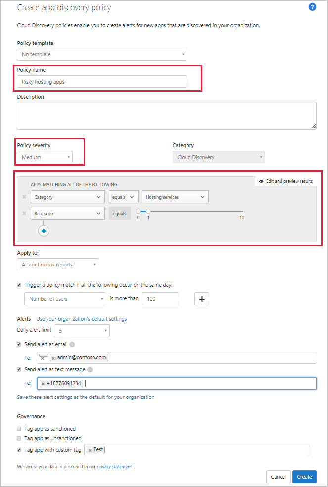

---
# required metadata

title: Create policies on Cloud Discovery apps in Cloud App Security | Microsoft Docs
description: This topic provides information about working with Cloud Discovery policies.
keywords:
author: rkarlin
ms.author: rkarlin
manager: mbaldwin
ms.date: 1/23/2017
ms.topic: article
ms.prod:
ms.service: cloud-app-security
ms.technology:
ms.assetid: 45446111-ed1a-4699-9df5-840cc6664a6b

# optional metadata

#ROBOTS:
#audience:
#ms.devlang:
ms.reviewer: reutam
ms.suite: ems
#ms.tgt_pltfrm:
#ms.custom:

---

# Cloud Discovery policies
    
## Creating an app discovery policy  
Discovery policies enable you to set alerts that notify you when new apps are detected within your organization.  
  
1.  In the console, click on **Control** followed by **Policies**.  
  
2.  Click **Create policy** and select **App discovery** policy.  
  
       
  
3.  Give your policy a name and description, if you want you can base it on a template, for more information on policy templates, see [Control cloud apps with policies](control-cloud-apps-with-policies.md).  
  
4.  To set which discovered apps will trigger this policy, click **Add filters**.  
  
     The filters are chosen from the left hand side of the page of the filter pop up. It is possible to filter by **App name**, **Domain**, **Risk factor**, **Risk score**, and **Category**. The right side of the page will show the results for the chosen filters from the current service catalog. After choosing the filters, save and make sure the appropriate tags appear in the filters box.  
  
5.  Under **Apply to** choose whether this applies to **Users**, **IP addresses** or both.  
  
6.  Set the **Daily usage threshold** that the app must meet in order to match the policy.  
  
7.  Set a **Daily alert limit** and select whether the alert will be sent as an email or as a text message, or both, and provide details as necessary. You can click the Save alert settings to default to enable future policies to save these alert settings, including the phone number and email addresses, as the default.  
  
8.  Click **Create**.  
  
For example, if you are interested in discovering risky hosting apps found in your cloud environment, set your policy as follows:  
  
Set the policy filters to discover any services found in the **hosting services** category, and that have a low score, indicating they are risky.   
Set the **Severity** of the policy to **Medium**.   
At the bottom set the thresholds that should trigger an alert for a certain discovered app - only if over 100 users in the environment used the app, and only if they downloaded a certain amount of data from the service.   
Additionally, you can set the limit of daily alerts you wish to receive.  
  
  
  
## Cloud Discovery anomaly detection  
Cloud App Security searches all the logs in your Cloud Discovery for anomalies. For example, when a user who never used Dropbox before suddenly uploads 600 GB to Dropbox, or when there are a lot more transactions than usual on a particular app. By default, the Anomaly detection policy is enabled, so it's not necessary to configure a new policy for it to work, but you can fine-tune which types of anomalies you want to be alerted about in the default policy.  
  
1.  In the console, click on **Control** followed by **Policies**.  
  
2.  Click **Create policy** and select **Cloud Discovery anomaly detection policy**.  
  
       
  
3.  Give your policy a name and description, if you want you can base it on a template, for more information on policy templates, see [Control cloud apps with policies](control-cloud-apps-with-policies.md).  
  
4.  To set which discovered apps will trigger this policy, click **Add filters**.  
  
     The filters are chosen from the left hand side of the page of the filter pop up. It is possible to filter by service name, domain, risk factor, risk score, and category. The right side of the page will show the results for the chosen filters from the current service catalog. After choosing the filters, save and make sure the appropriate tags appear in the filters box.  
  
5.  Under **Apply to** choose whether this applies **All data views** or **Specific data views**, and whether it applies to **Users**, **IP addresses** or both.  
  
6.  Select the dates during which the anomalous activity occurred to trigger the alert under **Raise alerts only for suspicious activities occurring after date.**  
  
7.  Under **Alerts**, you can set the anomaly detection sensitivity from low to high to configure the frequence of alerts you want to recieve.  
Set a **Daily alert limit** and select whether the alert will be sent as an email or as a text message, or both, and provide details as necessary. You can click the Save alert settings to default to enable future policies to save these alert settings, including the phone number and email addresses, as the default. You can also click **Use organization defaults** to set these settings according to the default for your organization.  
  
9. Click **Create**.  
  
  
  
## See Also  
[User activity policies](user-activity-policies.md)   
[For technical support, please visit the Cloud App Security assisted support page.](http://support.microsoft.com/oas/default.aspx?prid=16031)   
[Premier customers can also choose Cloud App Security directly from the Premier Portal.](https://premier.microsoft.com/)  
  
  