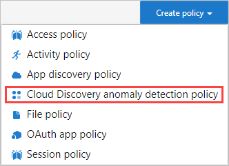

---
# required metadata

title: Create policies on Cloud Discovery apps in Cloud App Security | Microsoft Docs
description: This topic provides information about working with Cloud Discovery policies.
keywords:
author: rkarlin
ms.author: rkarlin
manager: mbaldwin
ms.date: 12/9/2018
ms.topic: conceptual
ms.prod:
ms.service: cloud-app-security
ms.technology:
ms.assetid: 45446111-ed1a-4699-9df5-840cc6664a6b

# optional metadata

#ROBOTS:
#audience:
#ms.devlang:
ms.reviewer: reutam
ms.suite: ems
#ms.tgt_pltfrm:
#ms.custom:

---
# Cloud Discovery policies

*Applies to: Microsoft Cloud App Security*

You can create app discovery policies to alert you when new apps are detected. Cloud App Security also searches all the logs in your Cloud Discovery for anomalies. 

## Creating an app discovery policy  
Discovery policies enable you to set alerts that notify you when new apps are detected within your organization.  
  
1. In the console, click on **Control** followed by **Policies**.  
  
2. Click **Create policy** and select **App discovery policy**.  
  
       
  
3. Give your policy a name and description. If you want, you can base it on a template. For more information on policy templates, see [Control cloud apps with policies](control-cloud-apps-with-policies.md).  
  
4. Set the **Severity** of the policy.

5. To set which discovered apps trigger this policy, add filters.  
  
6. You can set a threshold for how sensitive the policy should be. Enable **Trigger a policy match if all the following occur on the same day**. You can set criteria that the app must exceed daily to match the policy. Select one of the following criteria: 
     - Daily traffic
     - Downloaded data
     - Number of IP addresses
     - Number of transactions
     - Number of users
     - Uploaded data

  
7. Set a **Daily alert limit** under **Alerts**. Select whether the alert is sent as an email, a text message, or both. Then provide phone numbers and email addresses as needed.
     - Clicking **Save alert settings as the default for your organization** enables future policies to use the setting.
     - If you have a default setting, you can select **Use your organization's default settings**.
  
8. Select **Governance** actions to apply when an app matches this policy. It can tag policies as **Sanctioned**, **Unsanctioned**, or a custom tag. 

9. Click **Create**.  
  
For example, if you're interested in discovering risky hosting apps found in your cloud environment, set your policy as follows:  
  
Set the policy filters to discover any services found in the **hosting services** category, and that have a risk score of 1, indicating they're highly risky.

 Set the thresholds that should trigger an alert for a certain discovered app at the bottom. For instance, alert only if over 100 users in the environment used the app and if they downloaded a certain amount of data from the service.
Additionally, you can set the limit of daily alerts you wish to receive.  
  
  
  
## Cloud Discovery anomaly detection

Cloud App Security searches all the logs in your Cloud Discovery for anomalies. For instance, when a user, who never used Dropbox before, suddenly uploads 600 GB to it, or when there are a lot more transactions than usual on a particular app. The anomaly detection policy is enabled by default. It's not necessary to configure a new policy for it to work. However, you can fine-tune which types of anomalies you want to be alerted about in the default policy.  
  
1. In the console, click on **Control** followed by **Policies**.  
  
2. Click **Create policy** and select **Cloud Discovery anomaly detection policy**.  
  
       
  
3. Give your policy a name and description. If you want, you can base it on a template, For more information on policy templates, see [Control cloud apps with policies](control-cloud-apps-with-policies.md).  
  
4. To set which discovered apps trigger this policy, click **Add filters**.  
  
     The filters are chosen from drop-down lists. To add filters, click the plus button. To remove a filter, you click the 'X'. 
  
5. Under **Apply to** choose whether this policy applies **All continuous reports** or **Specific continuous reports**. Select whether the policy applies to **Users**, **IP addresses**, or both.  
  
6. Select the dates during which the anomalous activity occurred to trigger the alert under **Raise alerts only for suspicious activities occurring after date.**  
  
7. Set a **Daily alert limit** under **Alerts**. Select whether the alert is sent as an email, a text message, or both. Then provide phone numbers and email addresses as needed.
     - Clicking **Save alert settings as the default for your organization** enables future policies to use the setting.
     - If you have a default setting, you can select **Use your organization's default settings**.
  
8. Click **Create**.  
  
  
  
## Next steps 
[User activity policies](user-activity-policies.md)   

[Premier customers can also create a new support request directly in the Premier Portal.](https://premier.microsoft.com/)  
  
  