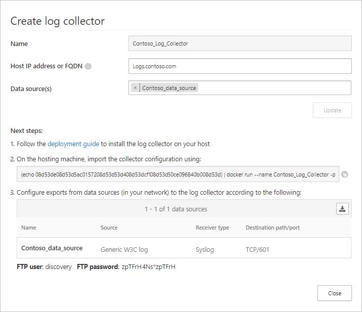
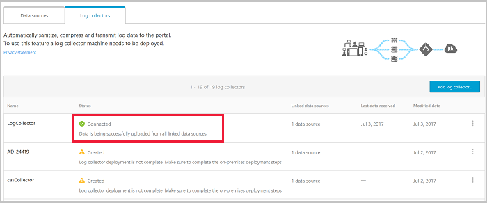

---
# required metadata

title: Configure automatic log upload for continuous reports in Cloud App Security | Microsoft Docs
description: This topic provides information about how to upload logs to create automatic Cloud Discovery reports.
keywords:
author: rkarlin
ms.author: rkarlin
manager: mbaldwin
ms.date: 9/25/2017
ms.topic: article
ms.prod:
ms.service: cloud-app-security
ms.technology:
ms.assetid: c4123272-4111-4445-b6bd-2a1efd3e0c5c

# optional metadata

#ROBOTS:
#audience:
#ms.devlang:
ms.reviewer: reutam
ms.suite: ems
#ms.tgt_pltfrm:
#ms.custom:

---

# Configure automatic log upload for continuous reports on a virtual appliance

> [!WARNING] 
> It is highly recommended to configure log upload using the [Docker](discovery-docker.md) for more flexible deployment.

## Technical requirements
- Hypervisor: HyperV or VMware
- Disk space: 250 GB
- CPU: 2
- RAM: 4 GB 
- Firewall settings: 
    - Allow the log collector to receive inbound FTP and Syslog traffic
    - Allow the log collector to initiate outbound traffic to the portal (for example contoso.cloudappsecurity.com) on port 443

  
## Log collector performance
The Log collector can successfully handle log capacity of up to 50 GB per hour.
The main bottlenecks in the log collection process are:
- Network bandwidth - your network bandwidth determines the log upload speed.
- I/O performance of the virtual machine allocated by your IT - determines the speed at which logs are written to the log collector’s disk.
The log collector has a built-in safety mechanism that monitors the rate at which logs arrive and compares it to the upload rate. In cases of congestion, the log collector starts to drop log files. If your setup generally exceeds 50 GB per hour, it is recommended to split the traffic between multiple log collectors.

## Set up and configuration  
  
### Step 1 – Web portal configuration: Define data sources and link them to a log collector  
  
1.  Go to the automated upload setting page:  
    In the Cloud App Security portal, click the settings icon , followed by  **Log collectors**.  
  
3.  For each firewall or proxy from which you want to upload logs, create a matching data source:  
  
    a.  Click **Add data source**.  
  
    b.  **Name** your proxy or firewall.  
  
    c.  Select the appliance from the **Source** list. If you select **Custom log format** to work with a network appliance that is not listed, see [Working with the custom log parser](custom-log-parser.md) for configuration instructions.
  
    d.  Compare your log with the sample of the expected log format. If your log file format does not match this sample, you should add your data source as **Other**.  
  
    e.  Set the **Receiver type** to either **FTP** or **Syslog**. For **Syslog**, choose **UDP** or **TCP**.  
  
    f.  Repeat this process for each firewall and proxy whose logs can be used to detect traffic on your network.  
  
4.  Go to the **Log collectors** tab at the top.  
  
    a.  Click **Add log collector**.  
  
    b.  Give the log collector a **name**.  
  
    c.  Select all **Data sources** that you want to connect to the collector, and click **Update** to save the configuration and generate an access token.  

  
  > [!NOTE] 
  > - A single Log collector can handle multiple data sources.
  > - Copy the contents of the screen because you will use it when you configure the Log Collector to communicate with Cloud App Security. If you selected Syslog, this information includes information about which port the Syslog listener is listening on.
4.  **Download** a new log collector virtual machine by clicking on Hyper-V or VMWare. Then,unzip the file using the password you received in the portal.  
  
###	Step 2 – On-premises deployment of the virtual machine and network configuration   

> [!NOTE] 
> The following steps describe the deployment in Hyper-V. The deployment steps for VM hypervisor are slightly different.  

1.  Open the Hyper-V Manager.  
  
2.  Select **New** and then **Virtual Machine** and click **Next**.  
   
  
3.  Provide a **Name** for the new virtual machine, for example CloudAppSecurityLogCollector01.then click **Next**.  
  
4.  Select **Generation 1** and click **Next**.  
  
5.  Change the **Startup memory** to **4096 MB**.  
        
6. Check **Use Dynamic Memory** for this virtual machine and click **Next**.  
  
7.  If available, choose the network **Connection** and click **Next**.  
  
8.  Choose **Use an existing virtual hard disk** and select the **.vhd** file that was included in the Zip file you downloaded.  
  
9.  Click **Next** and then click **Finish**.  
    The machine is added to your Hyper-V environment.  
  
9. Click on the machine in the **Virtual Machines** table and click **Start**.   
  
10. Connect to the Log Collector virtual machine to see if it has been assigned a DHCP address: 
Click on the virtual machine and select **Connect**. You should see the login prompt. If you see an IP address, then you can connect to the virtual machine using a terminal/SSH tool.  If you do not see an IP address, log in using the Hyper-V/VMWare connection tools with the credentials you copied down when you created the Log Collector previously. You can change the password and configure the virtual machine using the network configuration utility by running the following command:
```
sudo network_config
```
> [!NOTE]
> The virtual machine is pre-configured to obtain an IP address from a DHCP server. If you need to configure a static IP address, default gateway, hostname, DNS servers, and NTPS, you can use the **network_config** utility or perform changes manually.


At this point, your log collector should be connected to your network and should be able to reach the Cloud App Security portal.  

### Step 3 – On-premises configuration of the log collection 
The first time you log in to the log collector and import the log collector's configuration from the portal, as follows. 

1.  Log in to the log collector over SSH using the Interactive admin credentials provided to you in the portal. (If this is your first time logging in to the console, you will need to change the password and log in again after changing the password. If you are using a terminal session, you might need to restart the terminal session. )
2.  Run the collector config utility with the access token provided to you when you created the log collector.```sudo collector_config <access token> ```
3. Enter your console domain, for example: ```contoso.portal.cloudappsecurity.com```
  This is available from the URL you see after logging in to the Cloud App Security portal. 

4. Enter the name of the log collector you want to configure, for example:
**CloudAppSecurityLogCollector01** or **NewYork** from the preceding picture.

5.  Import the log collector's configuration from the portal, as follows:  
  
      a.  Log in to the log collector over SSH using the Interactive admin credentials provided to you in the portal.  
  
      b.  Run the collector config utility with the access token provided to you in the command ```sudo collector_config \<access token>```  
     
      c.  Enter your console domain, for example: ``` contoso.portal.cloudappsecurity.com ```
  
      d. Enter the name of the log collector you want to configure, for example:``` CloudAppSecurityLogCollector01  ```

### Step 4 - On-premises configuration of your network appliances

Configure your network firewalls and proxies to periodically export logs to the dedicated Syslog port of the FTP directory according to the directions in the dialog, for example:  
  
     `London Zscaler - Destination path: 614`  
  
     BlueCoat_HQ - Destination path: \<<machine_name>>\BlueCoat_HQ\  
  
### Step 5 - Verify the successful deployment in the Cloud App Security portal

Check the collector status in the **Log collector** table and make sure the status is **Connected**. If it is **Created**, it is possible that the log collector connection and parsing have not completed.



Go to the Governance log and verify that logs are being periodically uploaded to the portal.  
  
If you encounter problems during deployment, see [Troubleshooting Cloud Discovery](troubleshooting-cloud-discovery.md).

### Optional - Create custom continuous reports

After you have verified that the logs are being uploaded to Cloud App Security and the reports are being generated, you can create custom reports. You can now create custom discovery reports based on Azure Active Directory user groups. For example, if you want to see the cloud use of your marketing department, you can import the marketing group using the import user group feature, and then create a custom report for this group. You can also customize a report based on IP address tag or IP address ranges.

1. In the Cloud App Security portal, under the Settings cog, select **Cloud Discovery settings**, and then select **Manage continuous reports**. 
2. Click the **Create report** button and fill in the fields.
3. Under the **Filters** you can filter the data by data source, by [imported user group](user-groups.md), or by [IP address tags and ranges](ip-tags.md). 

> [!NOTE]
> All custom reports are limited to a maximum of 1 GB of uncompressed data. If there is more than 1 GB of data, the first 1 GB of data will be exported into the report.


## See Also  
[Working with Cloud Discovery data](working-with-cloud-discovery-data.md)   
[For technical support, visit the Cloud App Security assisted support page.](http://support.microsoft.com/oas/default.aspx?prid=16031)   
[Premier customers can also choose Cloud App Security directly from the Premier Portal.](https://premier.microsoft.com/)  
    
      
  