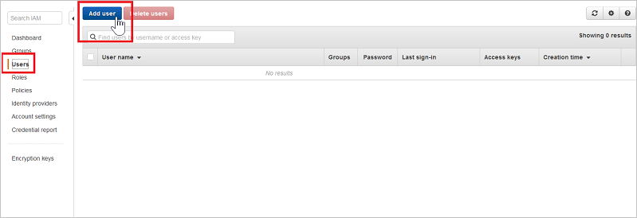
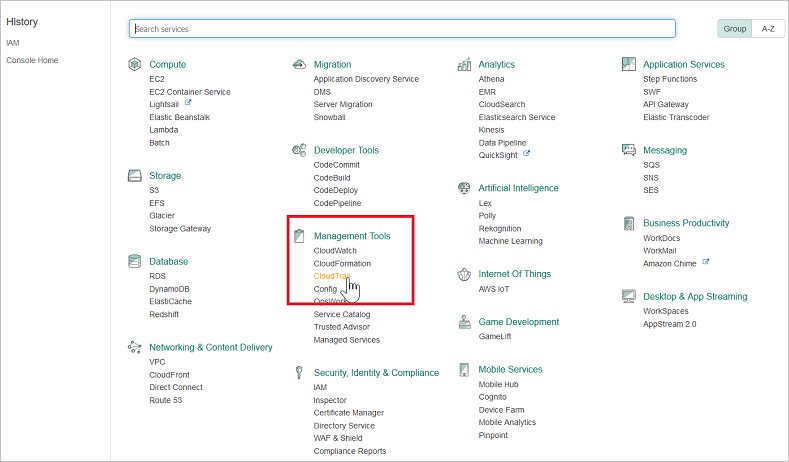

---
# required metadata

title: Connect AWS to Microsoft Cloud App Security | Microsoft Docs
description: This topic provides information about how to connect your AWS app to Cloud App Security using the API connector.
keywords:
author: rkarlin
manager: mbaldwin
ms.date: 10/15/2016
ms.topic: get-started-article
ms.prod:
ms.service: cloud-app-security
ms.technology:
ms.assetid: a6b4c745-cd5c-4458-819c-80cbe8b25f29

# optional metadata

#ROBOTS:
#audience:
#ms.devlang:
ms.reviewer: reutam
ms.suite: ems
#ms.tgt_pltfrm:
#ms.custom:

---

# Connect AWS to Microsoft Cloud App Security
  This section provides instructions for connecting Cloud App Security to your existing Amazon Web Services account using the connector APIs.  
  
## How to connect Amazon Web Services to Cloud App Security  
  
1.  In your Amazon Web Services console, click on **Identity & Access Management**.  
  
       
  
2.  Click on the **Users** tab.  
  
       
  
3.  Click on **Create New Users**.  
  
       
  
4.  Create a new user for Cloud App Security and make sure the **Generate an access key for each user** checkbox is checked.  
  
5.  Click **Download Credentials**.  
  
       
  
6.  In the **Permissions** tab, click **Attach Policy**.  
  
       
  
7.  The **Review Policy** screen opens.
 
       
  

8. Under **Policy Name** type "AdallomTrustPolicy". 
10. Under **Policy Document**, copy and paste the following::  
  
    ```     
    {  
      "Version" : "2012-10-17",  
      "Statement" : [{  
          "Action" : [  
            "cloudtrail:DescribeTrails",  
  
           "cloudtrail:LookupEvents",  
            "cloudtrail:GetTrailStatus",  
            "cloudwatch:Describe*",  
            "cloudwatch:Get*",  
            "cloudwatch:List*",  
            "iam:List*",  
            "iam:Get*"  
          ],  
          "Effect" : "Allow",  
          "Resource" : "*"  
        }  
      ]  
     }  
  
    ```  
  
9. In the downloaded file `credentials.csv`, find the new user's credentials. You will need to copy these later.  
  
10. Return to the AWS console main page and on the top right corner choose your main region from the dropdown window and then click on **CloudTrail** in the main menu.  
  
       
  
    1.  If you have not used CloudTrail for this region before, click on the **Get Started** button and set it up by selecting the appropriate S3 bucket.  
  
         Click the **Configuration** tab on the top left of the screen. Under **Additional configuration**, click on the edit icon.  
  
           
  
    2.  Click **Yes** when asked if you want to **Include global services** and click **Save**. This only applies to the region you chose.  
  
           
  
    3.  Repeat Step 11 for all regions, but do not set any other region to Include global services.  
  
11. In the Cloud App Security portal, click **Investigate** and then **Sanctioned apps**.  
  
12. In  the AWS row, click **Connect** in the **App Connector status** column, or click the **Connect an app** button followed by **AWS**.  
  
       
  
13. In the Amazon Web Services settings page, paste the **Access key** and **Secret key** from the csv file into the fields in the API page, and click **Update Access key**.  
  
14. Make sure the connection succeeded by clicking **Test API**.  
  
     Testing may take a couple of minutes. When it is finished, you will get a Success or Failure notification. After receiving a success notice, click **Done**.  
  
 After connecting AWS, you will receive events for 7 days prior to connection.
  
## See Also  
 [Control cloud apps with policies](control-cloud-apps-with-policies.md)   
 [For technical support, please visit the Cloud App Security assisted support page.](http://support.microsoft.com/oas/default.aspx?prid=16031)   
 [Premier customers can also choose Cloud App Security directly from the Premier Portal.](https://premier.microsoft.com/)  
  
  