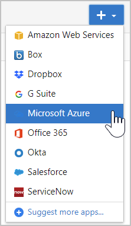
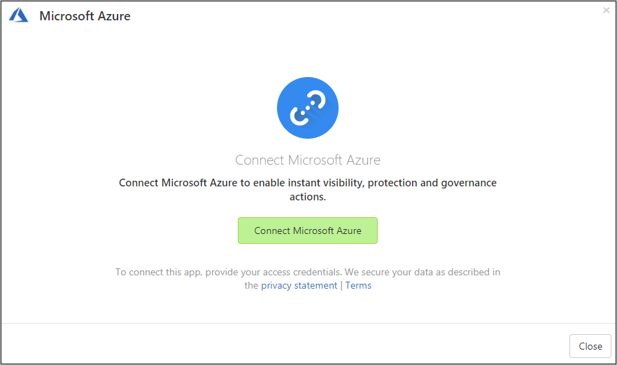

---
# required metadata

title: Connect Azure to Cloud App Security
description: This article provides information about how to connect Azure to Cloud App Security using the API connector for visibility and control over use.
keywords:
author: shsagir
ms.author: shsagir
manager: shsagir
ms.date: 12/10/2018
ms.topic: conceptual
ms.collection: M365-security-compliance
ms.prod:
ms.service: cloud-app-security
ms.technology:

# optional metadata

#ROBOTS:
#audience:
#ms.devlang:
ms.reviewer: reutam
ms.suite: ems
#ms.tgt_pltfrm:
ms.custom: seodec18

---
# Connect Azure to Microsoft Cloud App Security

*Applies to: Microsoft Cloud App Security*

This article provides instructions for connecting Microsoft Cloud App Security to your existing Azure account using the app connector API. This connection gives you visibility into and control over Azure use. For information about how Cloud App Security protects Azure, see [Protect Azure](protect-azure.md).

## How to connect Azure to Cloud App Security

> [!NOTE]
>
> - User must be a Global administrator in Azure AD to connect Azure to Microsoft Cloud App Security.
> - Cloud App Security displays activities from **all** subscriptions.
> - Currently, Cloud App Security monitors only ARM activities.

1. In **Connected apps** page, click the plus button and select **Microsoft Azure**.

    

2. In the Azure pop-up, click **Connect Microsoft Azure**.

    

> [!NOTE]
> After connecting Azure, data will be pulled. You will see data from then onwards.

If you have any problems connecting the app, see [Troubleshooting App Connectors](troubleshooting-api-connectors-using-error-messages.md).

## Next steps

> [!div class="nextstepaction"]
> [Control cloud apps with policies](control-cloud-apps-with-policies.md)

[!INCLUDE [Open support ticket](includes/support.md)]
