---
# required metadata

title: Connect Google Cloud Platform to Cloud App Security
description: This article provides information about how to connect your Google Cloud Platform to Cloud App Security using the API connector for visibility and control over use.
keywords:
author: shsagir
ms.author: shsagir
manager: shsagir
ms.date: 06/28/2020
ms.topic: conceptual
ms.service: cloud-app-security

# optional metadata
#ROBOTS: NOINDEX # Used to prevent showing on search pages
#services: na
#ms.subservice: na
ms.collection: M365-security-compliance
---
# Connect Google Cloud Platform to Microsoft Cloud App Security

*Applies to: Microsoft Cloud App Security*

This article provides instructions for connecting Microsoft Cloud App Security to your existing Google Cloud Platform (GCP) account using the connector APIs. This connection gives you visibility into and control over GCP use. For information about how Cloud App Security protects GCP, see [Protect GCP](protect-gcp.md).

We recommend that you use a dedicated project for the integration and restrict access to the project to maintain stable integration and prevent deletions/modifications of the setup process. Also, if your GCP instance is part of a G Suite instance already connected to Cloud App Security, we recommend following the **For a GCP instance that is part of a connected G Suite organization** steps when you add the GCP connection details.

## Prerequisites

The integrating GCP user must have the following permissions:

- **IAM and Admin edit** – Organization level
- **Project creation and edit**

You can connect one or both of the following GCP to Cloud App Security connections:

- **Security auditing**: This connection gives you visibility into and control over GCP app use.
- **Security configuration**: This connection gives you fundamental security recommendations based on the Center for Internet Security (CIS) benchmark for GCP.

Since you can add either or both of the connections, the steps in this article are written as independent instructions. If you have already added one of the connections, where relevant edit the existing configurations.

## How to connect GCP security auditing to Cloud App Security

Connecting GCP security auditing gives you visibility into and control over GCP app use.

Follow these steps to connect AWS Security auditing to Cloud App Security.

> [!div class="checklist"]
>
> - [Configure Google Cloud Platform](#configure-google-cloud-platform)
> - [Connect Google Cloud Platform auditing to Cloud App Security](#connect-google-cloud-platform-auditing-to-cloud-app-security)
> - [Aggregated export sink](#aggregated-export-sink)

### Configure Google Cloud Platform

> [!NOTE]
> The instructions for connecting your GCP environment for auditing follow [Google's recommendations](https://cloud.google.com/blog/products/gcp/best-practices-for-working-with-google-cloud-audit-logging) for consuming aggregated logs. The integration leverages Google StackDriver and will consume additional resources that might impact your billing. The consumed resources are:
>
> - [Aggregated export sink – Organization level](https://cloud.google.com/logging/docs/export/aggregated_exports#concept)
> - [Pub/Sub topic – GCP project level](https://cloud.google.com/logging/docs/export/using_exported_logs#pubsub-overview)
> - [Pub/Sub subscription – GCP project level](https://cloud.google.com/logging/docs/export/using_exported_logs#pubsub-overview)
>
> The Cloud App Security auditing connection only imports Admin Activity audit logs; Data Access and System Event audit logs are not imported. For more information about GCP logs, see [Cloud Audit Logs](https://go.microsoft.com/fwlink/?linkid=2109230).

#### Create a dedicated project

Create a dedicated project in GCP under your organization to enable integration isolation and stability

1. Sign in to your GCP portal using your integrating GCP user account.
1. Click **Create Project** to start a new.
1. In the **New project** screen, name your project and click **Create**.

    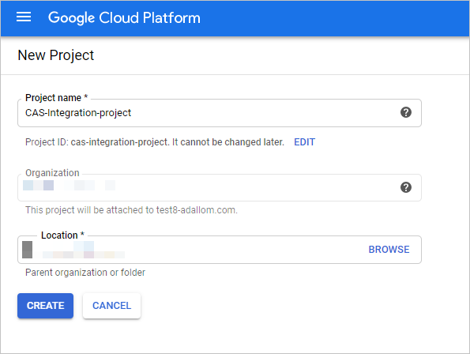

#### Enable the Pub/Sub API

1. Switch to the dedicated project.
1. Go to the Pub/Sub tab. A service activation message should appear.

#### Create a dedicated service account for the security auditing integration

1. Under **IAM & admin**, click **Service accounts**.
1. Click **CREATE SERVICE ACCOUNT** to create a dedicated service account.
1. Enter an account name, and then click **Create**.
1. Specify the **Role** as **Pub/Sub Admin** and then click **Save**.

    

1. Copy the **Email** value, you'll need this later.

    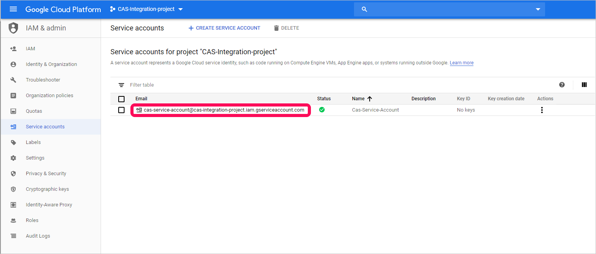

1. Under **IAM & admin**, click **IAM**.

    1. Switch to organization level.
    1. Click **ADD**.
    1. In the **New members** box, paste the **Email** value you copied earlier.
    1. Specify the **Role** as **Logs Configuration Writer** and then click **Save**.

        

#### Create a private key for the dedicated service account

1. Switch to project level.
1. Under **IAM & admin**, click **Service accounts**.
1. Open the dedicated service account and click **Edit**.
1. Click **CREATE KEY**.
1. In the **Create private key** screen, select **JSON**, and then click **CREATE**.

    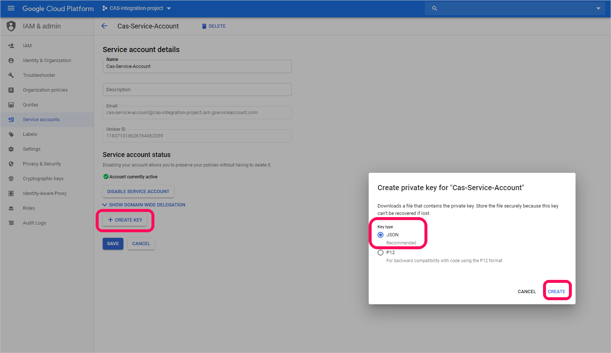

    > [!NOTE]
    > You'll need the JSON file that is downloaded to your machine later.

#### Retrieve your Organization ID

Make a note of your **Organization ID**, you'll need this later. For more information, see [Getting your organization ID](https://cloud.google.com/resource-manager/docs/creating-managing-organization#retrieving_your_organization_id).

### Connect Google Cloud Platform auditing to Cloud App Security

#### Add the GCP connection details

1. In the Cloud App Security portal, click **Investigate** and then **Connected apps**.

1. In the **App connectors** page, to provide the AWS connector credentials, do one of the following:

    > [!NOTE]
    > We recommended that you connect your G Suite instance to get unified user management and governance. This is the recommended even if you do not use any G Suite products and the GCP users are managed via the G Suite user management system.

    **For a new connector**

    1. Click the plus sign followed by **Google Cloud Platform**.

        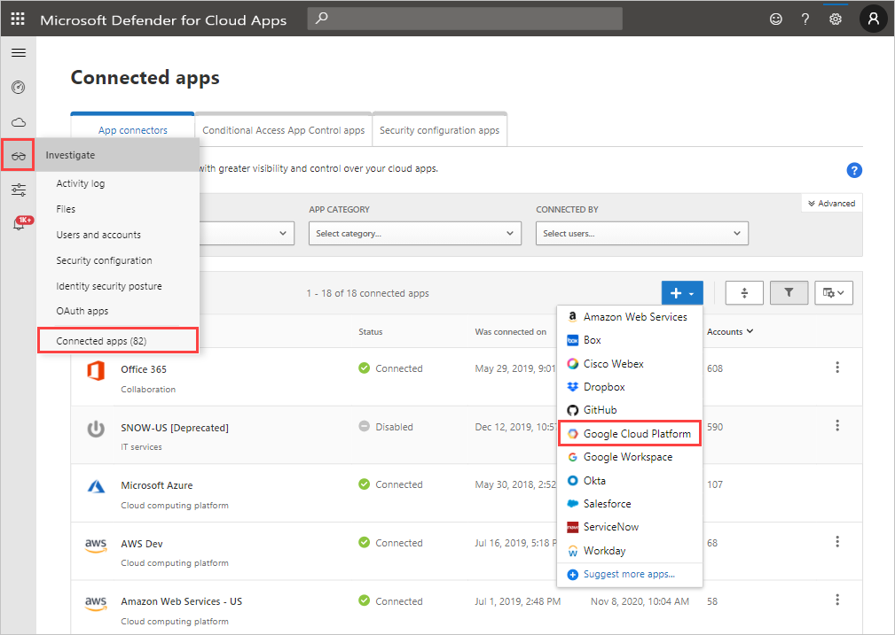

    1. In the pop-up, provide a name for the connector, and then click **Connect Google Cloud Platform**.

        

    1. In the **Project details** page, do the following, and then click **Connect Google Cloud Platform**.
        1. In the **Organization ID** box, enter the organization you made a note of earlier.
        1. In the **Private key file** box, browse to the JSON file you downloaded earlier.

        

    **For an existing connector**

    1. In the list of connectors, on the row in which the AWS connector appears, click **Connect security auditing**.

        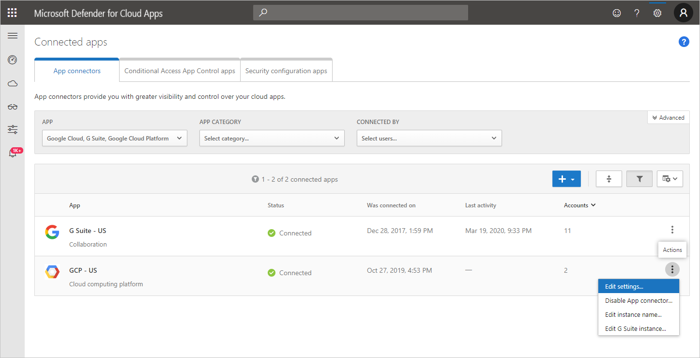

    1. In the **Project details** page, do the following, and then click **Connect Google Cloud Platform**.
        1. In the **Organization ID** box, enter the organization you made a note of earlier.
        1. In the **Private key file** box, browse to the JSON file you downloaded earlier.

        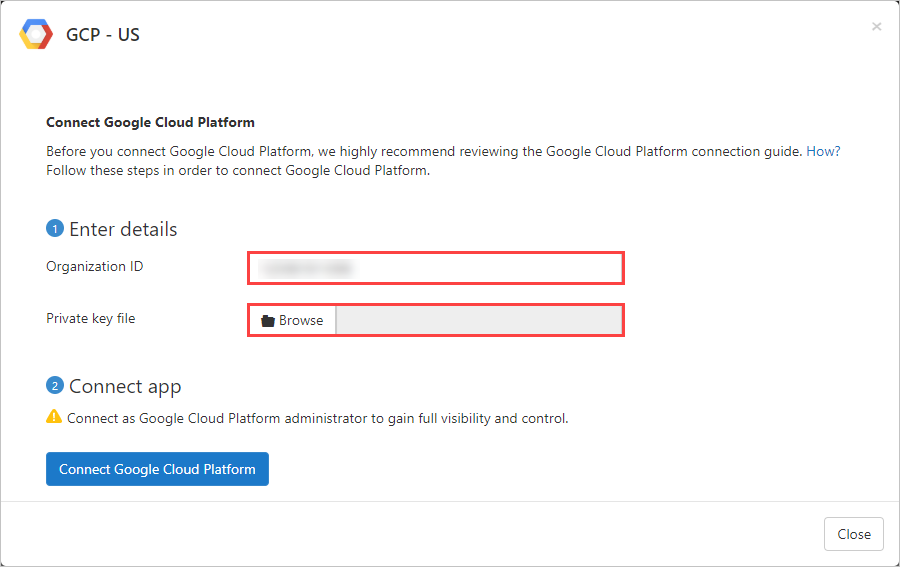

1. Click **Test API** to make sure the connection succeeded.

    Testing may take a couple of minutes. When it's finished, you get a success or failure notification. After receiving a success notice, click **Done**.

If you have any problems connecting the app, see [Troubleshooting App Connectors](troubleshooting-api-connectors-using-error-messages.md).

### Aggregated export sink

Disabling aggregated export sink is currently only possible via Google Cloud Shell.

#### To disable aggregated export sink

| Step | Script | For more information |
|-|-|-|
| 1. Start a Google Cloud Shell session. | | [Using Cloud Shell](https://cloud.google.com/shell/docs/using-cloud-shell) |
| 2. Set the current project. | `gcloud config set project {PROJECT_ID}` | [gcloud config set](https://cloud.google.com/sdk/gcloud/reference/config/set) |
| 3. List the organization-level sinks. | `gcloud logging sinks list --organization={ORGANIZATION_ID}` | [gcloud logging sinks list](https://cloud.google.com/sdk/gcloud/reference/logging/sinks/list) |
| 4. Delete the relevant sink. | `gcloud logging sinks delete {SINK_NAME} --organization={ORGANIZATION_ID}` | [gcloud logging sinks delete](https://cloud.google.com/sdk/gcloud/reference/logging/sinks/delete) |

## How to connect GCP security configuration to Cloud App Security

Connecting GCP security configuration gives you insights into fundamental security recommendations based on the Center for Internet Security (CIS) benchmark for GCP.

Follow these steps to connect GCP security configuration to Cloud App Security.

> [!div class="checklist"]
>
> - [Set up GCP Security Command Center with Security Health Analytics](#set-up-gcp-security-command-center-with-security-health-analytics)
> - [Enable Security Command Center API](#enable-security-command-center-api)
> - [Create a dedicated service account for the security configuration integration](#create-a-dedicated-service-account-for-the-security-configuration-integration)
> - [Connect Google Cloud Platform security configuration to Cloud App Security](#connect-google-cloud-platform-security-configuration-to-cloud-app-security)

### Set up GCP Security Command Center with Security Health Analytics

1. Set up [Security Command Center](https://cloud.google.com/security-command-center/docs/quickstart-security-command-center).
1. [Enable GCP Security Health Analytics](https://cloud.google.com/security-command-center/docs/how-to-use-security-health-analytics).
1. Verify that there is data flowing to the Security Command Center.

    > [!NOTE]
    >
    > - The instructions for connecting your GCP environment for security configuration follow [Google's recommendations](https://cloud.google.com/security-command-center/docs/how-to-notifications#enable-scc-api) for consuming security configuration recommendations. The integration leverages Google Security Command Center and will consume additional resources that might impact your billing.
    > - When you first enable Security Health Analytics, it may take several hours for data to be available.

### Enable Security Command Center API

1. In Cloud Console API Library, select the project you want to connect to Cloud App Security.
1. In the API Library, search for and select the "Security Command Center API".
1. In the API page, click **ENABLE**.

### Create a dedicated service account for the security configuration integration

1. In GCP Security Command Center, select the project you want to connect to Cloud App Security.
1. Under **IAM & admin**, click **Service accounts**.
1. Click **CREATE SERVICE ACCOUNT** to create a dedicated service account.
1. Enter an account name, and then click **Create**.
1. Specify the **Role** as **Security Center Admin Viewer** and then click **Save**.

    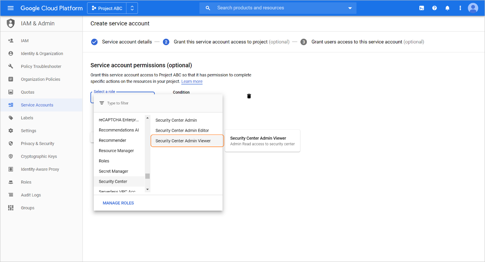

1. Copy the **Email** value, you'll need this later.

    

1. Under **IAM & admin**, click **IAM**.

    1. Switch to organization level.
    1. Click **ADD**.
    1. In the **New members** box, paste the **Email** value you copied earlier.
    1. Specify the **Role** as **Security Center Admin Viewer** and then click **Save**.

        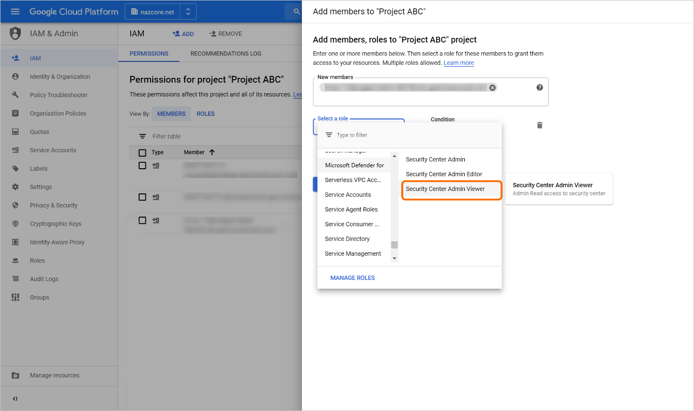

#### Create a private key for the dedicated service account

1. Switch to project level.
1. Under **IAM & admin**, click **Service accounts**.
1. Open the dedicated service account and click **Edit**.
1. Click **CREATE KEY**.
1. In the **Create private key** screen, select **JSON**, and then click **CREATE**.

    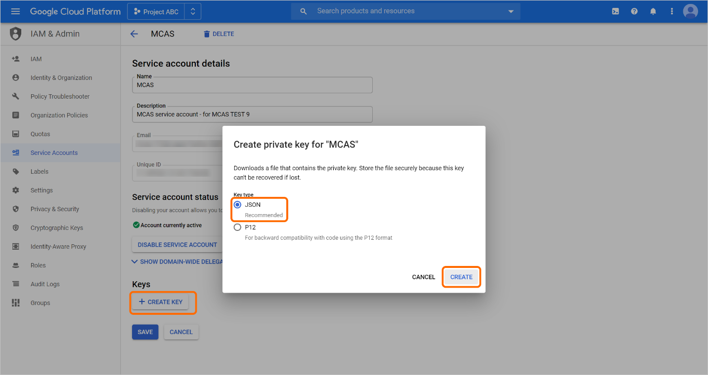

    > [!NOTE]
    > You'll need the JSON file that is downloaded to your machine later.

#### Retrieve your Organization ID

Make a note of your **Organization ID**, you'll need this later. For more information, see [Getting your organization ID](https://cloud.google.com/resource-manager/docs/creating-managing-organization#retrieving_your_organization_id).
    

### Connect Google Cloud Platform security configuration to Cloud App Security

1. In Cloud App Security, click **Investigate**, and then select **Connected apps**.

1. In the **Security configuration apps** tab, click the plus button, and then select **Google Cloud Platform**.

    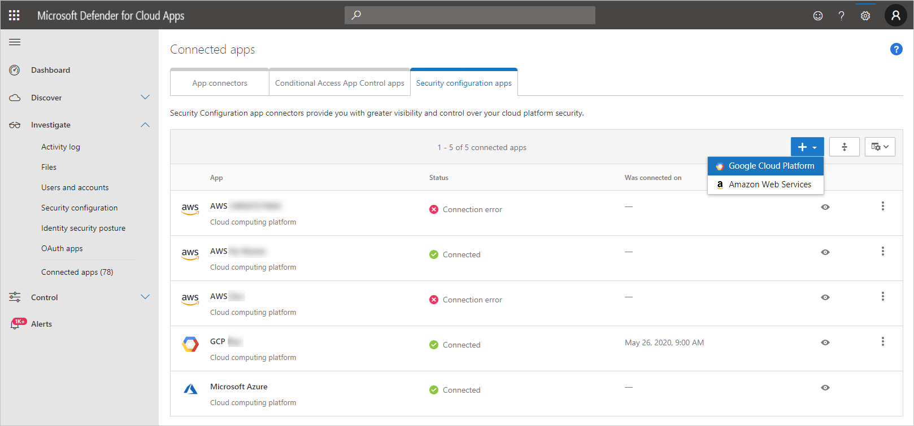

1. In the **Instance name** page, choose the instance type, and then click **Next**.

    - For an existing connector, choose the relevant instance.

        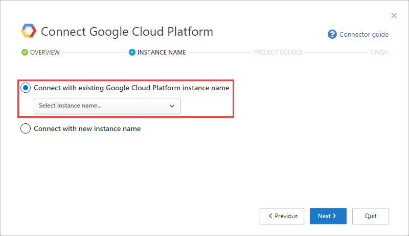

    - For a new connector, provide a name for the instance.

        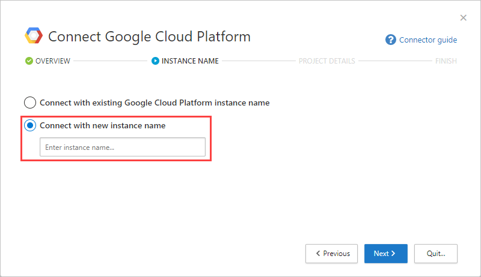

1. In the **Project details** page, do the following, and then click **Next**.
    1. In the **Organization ID** box, enter the organization you made a note of earlier.
    1. In the **Private key file** box, browse to the JSON file you downloaded earlier.

    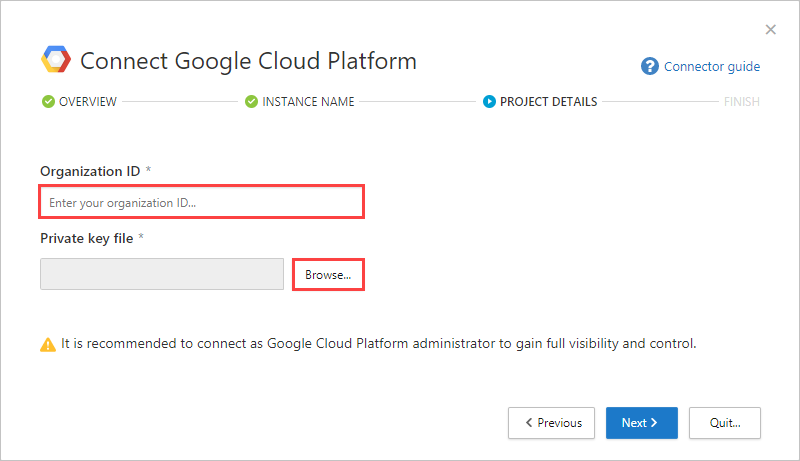

1. In the **Finished** page, make sure the connection succeeded, and then click **Finished**.

If you have any problems connecting the app, see [Troubleshooting App Connectors](troubleshooting-api-connectors-using-error-messages.md).

## Next steps

> [!div class="nextstepaction"]
> [Control cloud apps with policies](control-cloud-apps-with-policies.md)

[!INCLUDE [Open support ticket](includes/support.md)]
