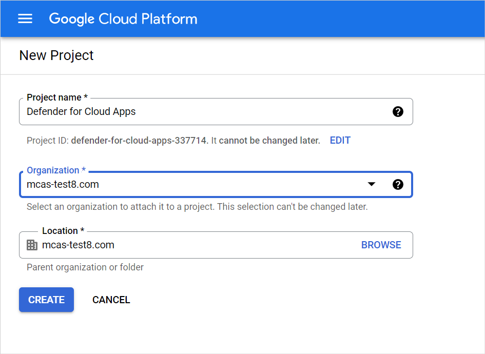
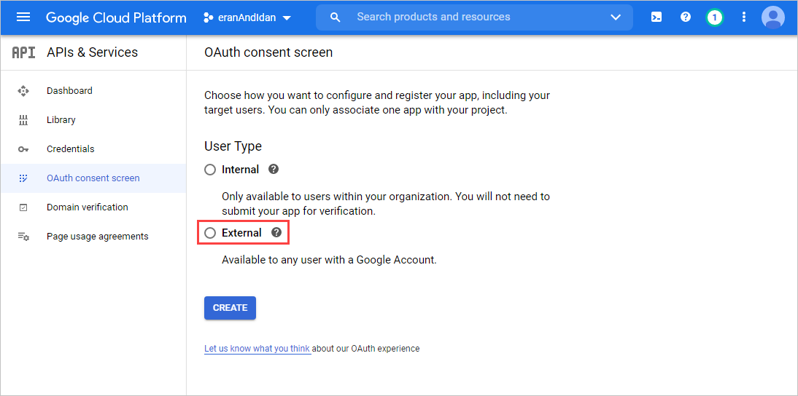
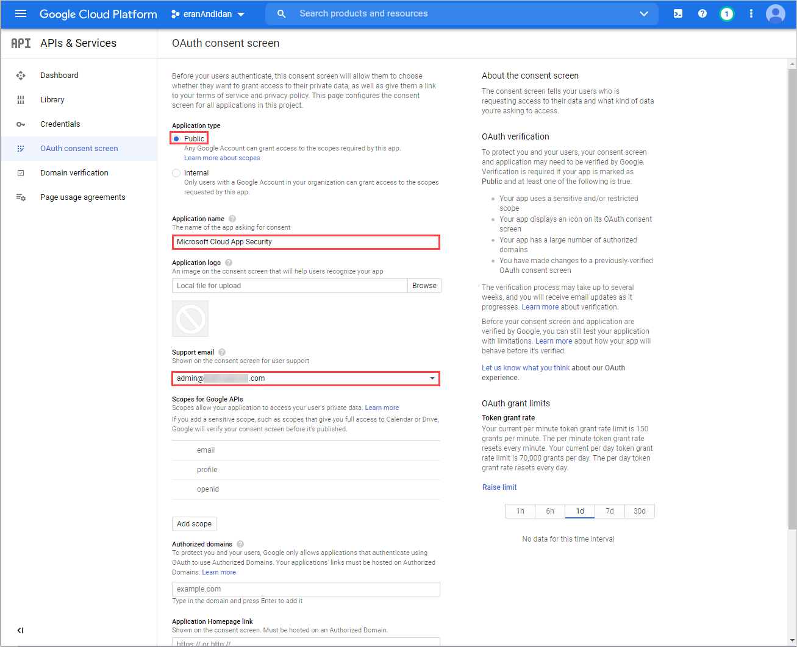
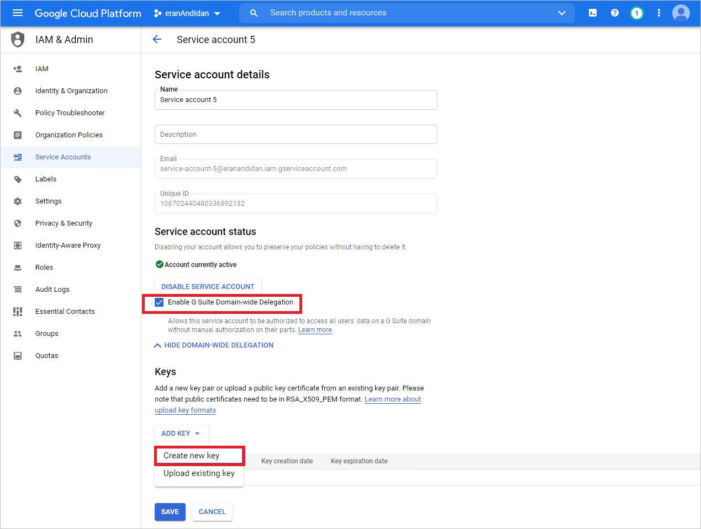
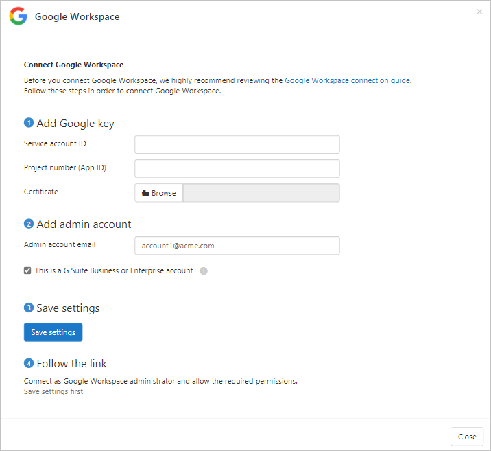

# Connect Google Workspace to Microsoft Cloud App Security

[!INCLUDE [Banner for top of topics](includes/banner.md)]

This article provides instructions for connecting Microsoft Cloud App Security to your existing Google Workspace account using the connector APIs. This connection gives you visibility into and control over Google Workspace use. For information about how Cloud App Security protects Google Workspace, see [Protect Google Workspace](protect-google-workspace.md).

## Configure Google Workspace

1. As a Google Workspace Super Admin, sign in to <a href="https://cloud.google.com/console/project" target="_blank">https://cloud.google.com/console/project</a>.

1. Click **Create project** to start a new project.

    

1. In the **New project** page, name your project as follows: **Cloud App Security** and click **Create**.

    

1. After the project is created, in the tool bar, click on **Google Cloud Platform**. Make sure that the right project is selected in the drop-down at the top.

    

1. Select menu, go to **APIs & Services** > **Library** and enable the following APIs (use the search line if the API isn't listed):

    - Admin SDK API
    - Google Drive API

    > [!NOTE]
    > For each API, click **Enable** to active it.
    >
    > 
    >
    > Ignore the **Credentials** warning for now.

1. Select menu, go to **APIs & Services** > **Dashboard**, and make sure you have the following APIs enabled:

    - Admin SDK API
    - Google Drive API

1. In the **OAuth consent page** page, do the following:
    1. Under **User Type**, choose **External**, and then click **Create**.

        

    1. Fill out the following information, and then click **Save**.

        | Field name | Value |
        | --- | --- |
        | Application type | Public |
        | Application name | Microsoft Cloud App Security |
        | Support email | `<your_email_address>` |

        All other fields are optional.

        

1. In the **Credentials** page, do the following:
    1. Select **CREATE CREDENTIALS** and then select **Service Account**.
    1. Under **Service account details**, provide a name and description, and then click **Create**.
    1. Under **Grant this service account access to project**, for **Role** select **Project**, select **Editor** and then click **Done**.

    

1. In the **Service Account** page, do the following:
    1. Under **Service Accounts**, locate and edit the service account you created earlier.

        

    1. Make a copy of the email address. You'll need this later.
    1. Under **Keys**, from the **ADD KEY** menu select **Create new key**, select **P12**, and then click **CREATE**. Save the file that's downloaded, you'll need it later.
    1. Under **Service account status**, select **Enable G Suite Domain-wide Delegation**, and then click **Save**.

    

1. In the **Credentials** page, under **OAuth 2.0 Client IDs**, copy the **Client ID** assigned to your service account - you'll need it later.

    

1. Go to [admin.google.com](https://admin.google.com/) and navigate to **Security** > **API Controls** > **MANAGE DOMAIN WIDE DELEGATION**, click **Add New**, and do the following:

    1. In the **Client ID** box, enter the **Client ID** that you copied earlier.
    1. In the **OAuth Scopes** box, enter the following list of required scopes (copy the text and paste it in the box):  
    `https://www.googleapis.com/auth/admin.reports.audit.readonly,https://www.googleapis.com/auth/admin.reports.usage.readonly,https://www.googleapis.com/auth/drive,https://www.googleapis.com/auth/drive.appdata,https://www.googleapis.com/auth/drive.apps.readonly,https://www.googleapis.com/auth/drive.file,https://www.googleapis.com/auth/drive.metadata.readonly,https://www.googleapis.com/auth/drive.readonly,https://www.googleapis.com/auth/drive.scripts,https://www.googleapis.com/auth/admin.directory.user.readonly,https://www.googleapis.com/auth/admin.directory.user.security,https://www.googleapis.com/auth/admin.directory.user.alias,https://www.googleapis.com/auth/admin.directory.orgunit,https://www.googleapis.com/auth/admin.directory.notifications,https://www.googleapis.com/auth/admin.directory.group.member,https://www.googleapis.com/auth/admin.directory.group,https://www.googleapis.com/auth/admin.directory.device.mobile.action,https://www.googleapis.com/auth/admin.directory.device.mobile,https://www.googleapis.com/auth/admin.directory.user`

    1. Click **AUTHORIZE**.

    

## Configure Cloud App Security

1. In the [Cloud App Security portal](https://portal.cloudappsecurity.com/), click **Investigate** and then **Connected apps**.

1. To provide the Google Workspace connection details, under **App connectors**, do one of the following:

    **For a Google Workspace organization that already has a connected GCP instance**

    - In the list of connectors, at the end of row in which the GCP instance appears, click the three dots and then click **Add Google Workspace**.

    **For a Google Workspace organization that does not already have a connected GCP instance**

    - In the **Connected apps** page, click the plus sign (**+**) and select **Google Workspace**.

1. In the pop-up, fill in the following information:

    

    1. Enter the **Service account ID**, the **Email** that you copied earlier.

    1. Enter the **Project number (App ID)** that you copied earlier.

    1. Upload the P12 **Certificate** file that you saved earlier.

    1. Enter one **admin account email** of your Google Workspace admin.

    1. If you have a Google Workspace Business or Enterprise account, check this check box. For information about which features are available in Cloud App Security for Google Workspace Business or Enterprise, see [Enable instant visibility, protection, and governance actions for your apps](enable-instant-visibility-protection-and-governance-actions-for-your-apps.md).

    1. Click **Save settings**.

    1. **Follow the link** to connect to Google Workspace. This opens Google Workspace and you're asked to authorize access for Cloud App Security.

    1. Make sure the connection succeeded by clicking **Test now**.  
    Testing may take a couple of minutes.  
    After receiving a success notice, click **Done** and close the Google Workspace page.

After connecting Google Workspace, you'll receive events for 7 days prior to connection.

After connecting Google Workspace, Cloud App Security performs a full scan. Depending on how many files and users you have, completing the full scan can take awhile. To enable near real-time scanning, files on which activity is detected are moved to the beginning of the scan queue. For example, a file that is edited, updated, or shared is scanned right away. This doesn't apply to files that aren't inherently modified. For example, files that are viewed, previewed, printed, or exported are scanned during the regular scan.

If you have any problems connecting the app, see [Troubleshooting App Connectors](troubleshooting-api-connectors-using-error-messages.md).

## Next steps

> [!div class="nextstepaction"]
> [Control cloud apps with policies](control-cloud-apps-with-policies.md)

[!INCLUDE [Open support ticket](includes/support.md)]
