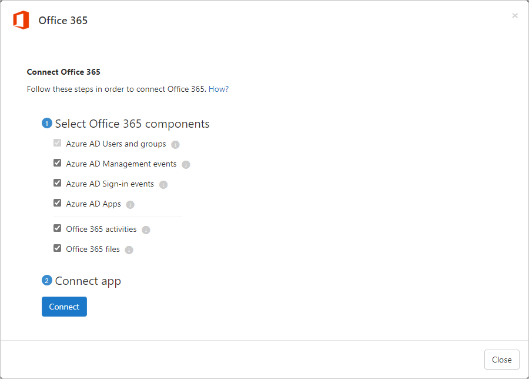

---
# required metadata

title: Connect Office 365 to Cloud App Security 
description: This article provides information about how to connect your Office 365 to Cloud App Security using the API connector for visibility and control over use.
keywords:
author: shsagir
ms.author: shsagir
manager: shsagir
ms.date: 08/17/2020
ms.topic: how-to
ms.collection: M365-security-compliance
ms.prod:
ms.service: cloud-app-security
ms.technology:

# optional metadata

#ROBOTS:
#audience:
#ms.devlang:
ms.reviewer: reutam
ms.suite: ems
#ms.tgt_pltfrm:
ms.custom: seodec18

---
# Connect Office 365 to Microsoft Cloud App Security

*Applies to: Microsoft Cloud App Security*

This article provides instructions for connecting Microsoft Cloud App Security to your existing Microsoft Office 365 account using the app connector API. This connection gives you visibility into and control over Office 365 use. For information about how Cloud App Security protects Office 365, see [Protect Office 365](protect-office-365.md).
  
Cloud App Security supports the legacy Office 365 Dedicated Platform as well as the latest offerings of Office 365 services (commonly referred as the vNext release family of Office 365).  Cloud App Security doesn't support the Legacy Microsoft Business Productivity Online Standard Suite (BPOS).

> [!NOTE]
> In some cases, a vNext service release differs slightly at the administrative and management levels from the standard Office 365 offering.

Cloud App Security supports the following Office 365 apps:

- Dynamics 365 CRM
- Exchange (only appears after activities from Exchange are detected in the portal, and requires you to turn on auditing)
- Office 365
- OneDrive
- Power Automate
- Power BI (only appears after activities from Power BI are detected in the portal, and requires you to turn on auditing)
- SharePoint
- Skype for Business
- Teams (only appears after activities from Teams are detected in the portal)
- Yammer

> [!NOTE]
> Cloud App Security integrates directly with [Office 365's audit logs](/microsoft-365/compliance/detailed-properties-in-the-office-365-audit-log?view=o365-worldwide) and receives all audited events from **all supported services**, such as PowerApps, Forms, Sway, and Stream.

## How to connect Office 365 to Cloud App Security  

> [!NOTE]
>
>- You must have at least one assigned Office 365 license to connect Office 365 to Cloud App Security.
>- To enable monitoring of Office 365 activities in Cloud App Security, you are required to enable auditing in the [Office Security and Compliance Center](https://support.microsoft.com/help/4026501/office-auditing-in-office-365-for-admins).
>- Exchange administrator audit logging, which is enabled by default in Office 365, logs an event in the Office 365 audit log when an administrator (or a user who has been assigned administrative privileges) makes a change in your Exchange Online organization. Changes made using the Exchange admin center or by running a cmdlet in Windows PowerShell are logged in the Exchange admin audit log. For more detailed information about admin audit logging in Exchange, see [Administrator audit logging](/exchange/security-and-compliance/exchange-auditing-reports/view-administrator-audit-log).
>- Exchange Mailbox audit logging must be turned on for each user mailbox before user activity in Exchange Online is logged, see [Exchange Mailbox activities](https://support.office.com/article/Search-the-audit-log-in-the-Office-365-Security-Compliance-Center-0d4d0f35-390b-4518-800e-0c7ec95e946c).
>- If Office apps are enabled, groups that are part of Office 365 are also imported to Cloud App Security from the specific Office apps, for example if SharePoint is enabled, Office 365 groups are imported as SharePoint groups as well.
>- You must [enable auditing in PowerBI](https://powerbi.microsoft.com/documentation/powerbi-admin-auditing/) to get the logs from there. Once auditing is enabled, Cloud App Security starts getting the logs (with a delay of 24-72 hours).
>- You must [enable auditing in Dynamics 365](/dynamics365/customer-engagement/admin/enable-use-comprehensive-auditing#enable-auditing) to get the logs from there. Once auditing is enabled, Cloud App Security starts getting the logs (with a delay of 24-72 hours).
>- If your Azure Active Directory is set to automatically sync with the users in your Active Directory on-premises environment the settings in the on-premises environment override the Azure AD settings and use of the **Suspend user** governance action is reverted.
>- For Azure AD sign-in activities, Cloud App Security only surfaces interactive sign-in activities and sign-in activities from legacy protocols such as ActiveSync. Noninteractive sign-in activities may be viewed in the Azure AD audit log.
> - [Multi-geo deployments](/office365/enterprise/office-365-multi-geo) are only supported for OneDrive

1. In **Connected apps** page, click the plus button and select **Office 365**.

    

1. In the Office 365 pop-up, click **Connect Office 365**.

    

1. In the Office 365 components page, select the options you require, and then click **Connect**.

    > [!NOTE]
    >
    > - For best protection, we recommend selecting all Office 365 components.
    > - The **Office 365 files** component, requires the **Office 365 activities** component and Cloud App Security file monitoring (**Settings** > **Files** > **Enable file monitoring**).

    

1. After Office 365 is displayed as successfully connected, click **Close**.

> [!NOTE]
> After connecting Office 365, you will see data from a week back including any third-party applications connected to Office 365 that are pulling APIs. For third-party apps that weren't pulling APIs prior to connection, you see events from the moment you connect Office 365 because Cloud App Security turns on any APIs that had been off by default.

If you have any problems connecting the app, see [Troubleshooting App Connectors](troubleshooting-api-connectors-using-error-messages.md).

## Next steps

> [!div class="nextstepaction"]
> [Control cloud apps with policies](control-cloud-apps-with-policies.md)

[!INCLUDE [Open support ticket](includes/support.md)]