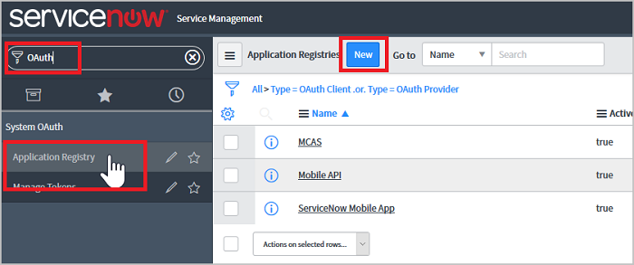
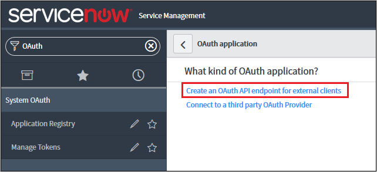
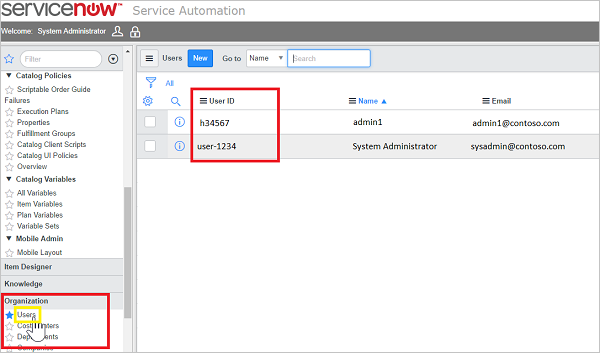
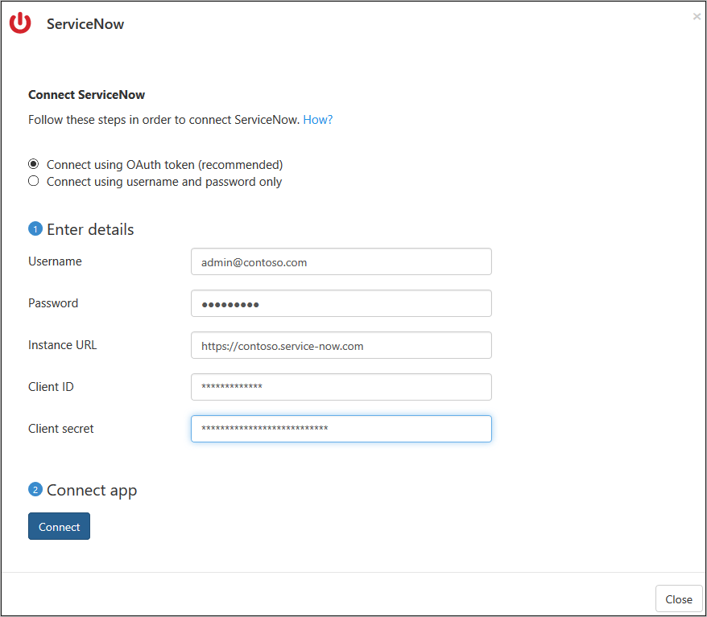

---
# required metadata

title: Connect ServiceNow to Cloud App Security for visibility and control over use | Microsoft Docs
description: This topic provides information about how to connect your ServiceNow app to Cloud App Security using the API connector.
keywords:
author: rkarlin
ms.author: rkarlin
manager: mbaldwin
ms.date: 10/29/2018
ms.topic: conceptual
ms.prod:
ms.service: cloud-app-security
ms.technology:
ms.assetid: c626d94d-2ffd-4daf-8fa4-4b6d308cf012

# optional metadata

#ROBOTS:
#audience:
#ms.devlang:
ms.reviewer: reutam
ms.suite: ems
#ms.tgt_pltfrm:
#ms.custom:

---

*Applies to: Microsoft Cloud App Security*

# Connect ServiceNow to Microsoft Cloud App Security

This section provides instructions for connecting Microsoft Cloud App Security to your existing ServiceNow account using the app connector API. 

> [!NOTE]
>  We recommend deploying ServiceNow  using OAuth app tokens, available for Fuji and later releases (see the relevant [ServiceNow documentation](http://wiki.servicenow.com/index.php?title=OAuth_Applications#gsc.tab=0). 
> For earlier releases, a [legacy connection mode](#legacy-servicenow-connection) is available based on user/password. The username/password provided are only used for API token generation and are not saved after the initial connection process.
> 
> [!NOTE]
>  Cloud App Security supports ServiceNow versions of Eureka, Fiji,  Geneva, Helsinki, and Istanbul. In order to connect ServiceNow with Cloud App Security, you must have the role **Admin** and make sure the ServiceNow instance supports API access.  For more information, see the [ServiceNow Product Documentation](http://wiki.servicenow.com/index.php?title=Base_System_Roles#gsc.tab=0).
  
## How to connect ServiceNow to Cloud App Security using OAuth
  
  
1. Sign in with an Admin account to your ServiceNow account.  
 
   > [!NOTE]
   >  The username/password provided are only used for API token generation and are not saved after the initial connection process.

2. In the **Filter navigator** search bar, type **OAuth** and select **Application Registry**.

3. In the **Application Registries** menu bar, click **New** to create a new OAuth profile.

   

4. Under **What kind of OAuth application?**, click **Create an OAuth API endpoint for external clients**.

   

5. Under **Application Registries New record** fill in the following fields:
    
    - **Name** field, name the new OAuth profile, for example, CloudAppSecurity. 
    
    - The **Client ID** is generated automatically. Copy this ID, you need to paste it into Cloud App Security to complete connection.
    
    - In the **Client Secret** field, enter a string. If left empty, a random Secret is generated automatically. Copy and save it for later. 
    
    - Increase the **Access Token Lifespan** to at least 3,600.
    
    - Click **Submit**.

   

6. In the Cloud App Security portal, click **Investigate** and then **Connected apps**.  
  
7. In the **App connectors** page, click the plus button and then **ServiceNow**.  
  
      
  
8. In the popup, add your ServiceNow user ID, password, instance URL, Client ID, and Client secret in the appropriate boxes. To find your ServiceNow User ID, in the ServiceNow portal, go to **Users** and then locate your name in the table.

   
  
9. Click **Connect**.  
  
      
  
10. Make sure the connection succeeded by clicking **Test now**.  
  
    Testing may take a couple of minutes. After receiving a success notice, click **Close**.  
  
After connecting ServiceNow, you'll receive events for 60 days prior to connection.
  
## Legacy ServiceNow connection

To connect ServiceNow with Cloud App Security, you must have admin-level permissions and make sure the ServiceNow instance supports API access.   

1. Sign in with an Admin account to your ServiceNow account.   

2. Create a new service account for Cloud App Security and attach the Admin role to the newly created account.   

3. Make sure the REST API plug-in is turned on.   

      

4. In the Cloud App Security portal, click **Investigate** and then **Sanctioned apps**.   

5. In the ServiceNow row, click **Connect** in the **App Connector status** column, or click the **Connect an app** button and then **ServiceNow**.   

      

6. In the ServiceNow settings page, on the API tab, add your ServiceNow user ID, password, and instance URL in the appropriate boxes.   

7. Click **Connect**.   

      

8. Make sure the connection succeeded by clicking **Test API**.   
  
   Testing may take a couple of minutes. After receiving a success notice, click **Close**.    
   After connecting ServiceNow, you will receive events for 60 days prior to connection. 

## Next steps 
[Control cloud apps with policies](control-cloud-apps-with-policies.md)   

[Premier customers can also choose Cloud App Security directly from the Premier Portal.](https://premier.microsoft.com/)  
  
