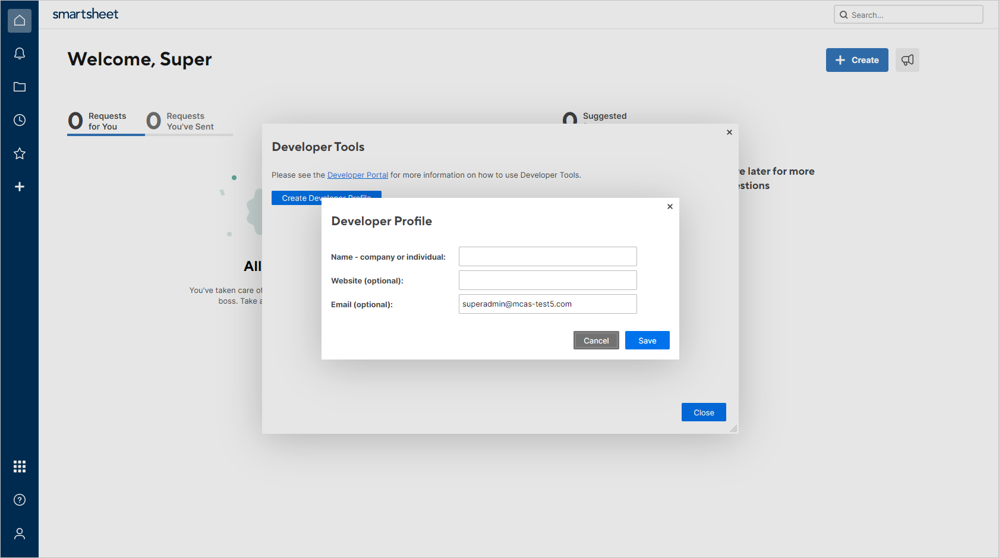
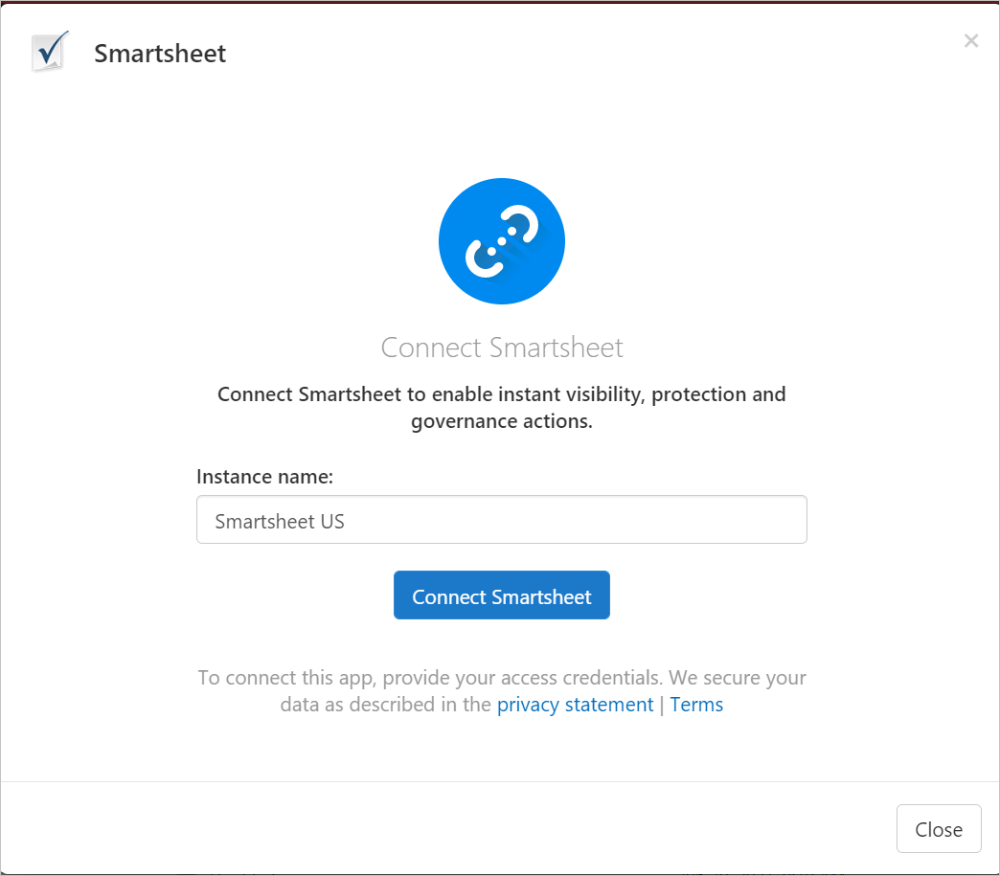

# Connect Smartsheet to Microsoft Cloud App Security (Preview)

[!INCLUDE [Banner for top of topics](includes/banner.md)]

This article provides instructions for connecting Microsoft Cloud App Security to your existing Smartsheet using the App Connector APIs. This connection gives you visibility into and control over your organization's Smartsheet use.

## Prerequisites

- The Smartsheet user used for logging into Smartsheet must be a System Admin.
- Supported Smartsheet licenses:
  - Enterprise plan with Platinum package.

## How to connect Smartsheet to Cloud App Security

### Configure Smartsheet

1. Register to add **Developer Tools** to your existing Smartsheet account:
    1. Add your Smartsheet mail [here](https://developers.smartsheet.com/register/).

        
    1. Enter your mailbox and activate your Developer Tools by clicking the activation mail.
    1. In the redirected screen in Smartsheet select **Create Developer Profile**, fill your name and mail, select **Save**, and then **Close**.
    

2. In Smartsheet, enter **Developer Tools**:

3. In **Developer Tools**, select **Create New App**:

4. In the new app creation page, fill the following:
    - App name: **Microsoft Cloud App Security** (you can also choose another name).
    - Description: **Microsoft Cloud App Security connects to Smartsheet via its API and detects threats within users' activity.** (you can also choose another description).
    - App URL: `https://portal.cloudappsecurity.com`
    - App contact/support: `https://docs.microsoft.com/en-us/cloud-app-security/support-and-ts`
    - App Redirect URL: `https://portal.cloudappsecurity.com/api/oauth/saga`
    - Publish app: **Yes**.
    - Logo: keep empty.

5. Select **Save**, and copy the **App client id** and **App secret** that was generated. You'll need it in the following steps.

### Configure Cloud App Security

>[!NOTE]
>The Smartsheet user that is configuring the integration must always remain a Smartsheet admin, even after the connector is installed.

1. In the [Cloud App Security portal](https://portal.cloudappsecurity.com/), select **Investigate** and then **Connected apps**.

2. In the **App connectors** page, select the plus button followed by **Smartsheet**.

3. In the pop-up, give the connector a descriptive name, and press **Connect Smartsheet**.

    

4. In the next screen, enter the following fields:

    - **Client ID**: the app client id that you've saved.
    - **Client Secret**: the app secret that you've saved.

5. Select **Connect in Smartsheet**.
6. Make sure the connection succeeded by selecting **Test now**. Testing may take a few minutes. After receiving a success notice, select **Close**.
7. The first connection can take up to four hours to get all users and their activities in the seven days before the connection.
8. After the connector’s **Status** is marked as **Connected**, the connector is live and works.

## Activities limitations

- Login/Logouts activities are not supported by Smartsheet.
- Smartsheet activities don't contain IP addresses.
- System activities will be shown with the **Smartsheet** account name.

## Rate limits

The default rate limit is 300 requests per minute. For more information, see [Smartsheet documentation](https://smartsheet.redoc.ly/#section/Work-at-Scale/Rate-Limiting).

## Next steps

> [!div class="nextstepaction"]
> [Control cloud apps with policies](control-cloud-apps-with-policies.md)

[!INCLUDE [Open support ticket](includes/support.md)]
