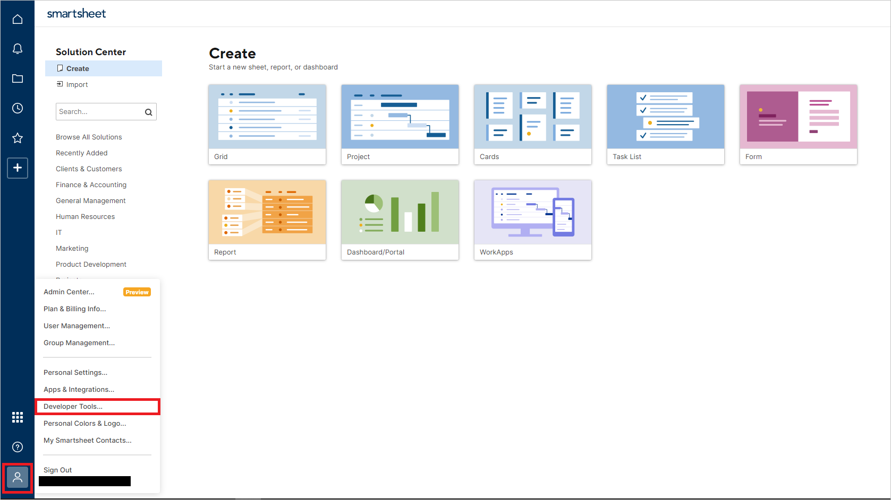
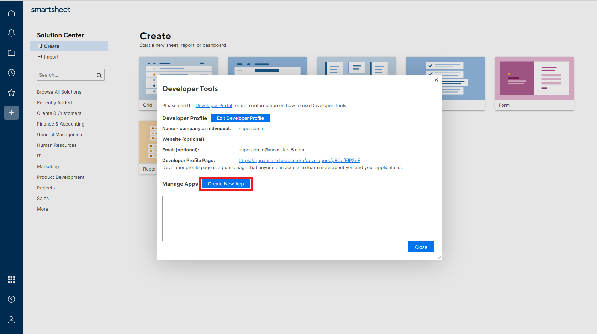
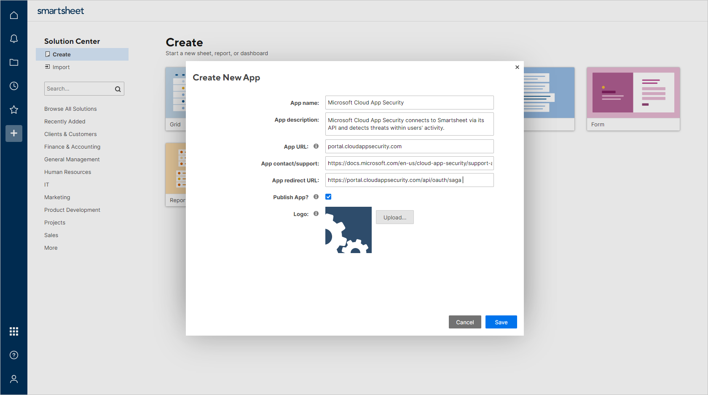

# Connect Smartsheet to Microsoft Cloud App Security

[!INCLUDE [Banner for top of topics](includes/banner.md)]

This article describes how to connect Microsoft Cloud App Security to your existing Smartsheet by using the App Connector APIs. The resulting connection gives you visibility into and control over your organization's use of Smartsheet.

## Prerequisites

- The Smartsheet user used to sign in to Smartsheet must be a system admin.
- Event Reporting must be enabled by Smartsheet, either through standalone purchase or via an Enterprise plan with the Advance Platinum package.

## How to connect Smartsheet to Cloud App Security

### Configure Smartsheet
>[!NOTE]
>The Smartsheet license must be an Enterprise plan with the Platinum package.

1. Register to add Developer Tools to your existing Smartsheet account:
    1.  Go to the [Developer Sandbox Account Registration](https://developers.smartsheet.com/register/) page.
    1. Enter your Smartsheet email address in the text box:

        
    1. An activation mail will appear in your mailbox. Activate Developer Tools by using the activation mail.
    1. In Smartsheet, select **Create Developer Profile**. Enter your name and email address. Select **Save** and then **Close**:
    
       

2. In Smartsheet, select **Developer Tools**:

   

3. In the **Developer Tools** dialog, select **Create New App**:

   

4. In the **Create New App** dialog, provide the following values:
    - **App name**: For example, **Microsoft Cloud App Security**. 
    - **App description**: For example, **Microsoft Cloud App Security connects to Smartsheet via its API and detects threats within users' activity.** 
    - **App URL**: **https://portal.cloudappsecurity.com**
    - **App contact/support**: **https://docs.microsoft.com/en-us/cloud-app-security/support-and-ts**
    - **App redirect URL**: **https://portal.cloudappsecurity.com/api/oauth/saga**
    - **Publish App?**: Select. 
    - **Logo**: Leave blank.
    
      

5. Select **Save**, and copy the **App client id** and **App secret** that was generated. You'll need it in the following steps.

### Configure Cloud App Security

>[!NOTE]
>The Smartsheet user that is configuring the integration must always remain a Smartsheet admin, even after the connector is installed.

1. In the [Cloud App Security portal](https://portal.cloudappsecurity.com/), select **Investigate** and then **Connected apps**.

2. In the **App connectors** page, select the plus button followed by **Smartsheet**.

3. In the pop-up, give the connector a descriptive name, and press **Connect Smartsheet**.

    

4. In the next screen, enter the following fields:

    - **Client ID**: the app client id that you've saved.
    - **Client Secret**: the app secret that you've saved.

5. Select **Connect in Smartsheet**.
6. Make sure the connection succeeded by selecting **Test now**. Testing may take a few minutes. After receiving a success notice, select **Close**.
7. The first connection can take up to four hours to get all users and their activities in the seven days before the connection.
8. After the connector’s **Status** is marked as **Connected**, the connector is live and works.

## Activities limitations

- Login/Logouts activities are not supported by Smartsheet.
- Smartsheet activities don't contain IP addresses.
- System activities will be shown with the **Smartsheet** account name.

## Rate limits

The default rate limit is 300 requests per minute. For more information, see [Smartsheet documentation](https://smartsheet.redoc.ly/#section/Work-at-Scale/Rate-Limiting).

## Next steps

> [!div class="nextstepaction"]
> [Control cloud apps with policies](control-cloud-apps-with-policies.md)

[!INCLUDE [Open support ticket](includes/support.md)]
