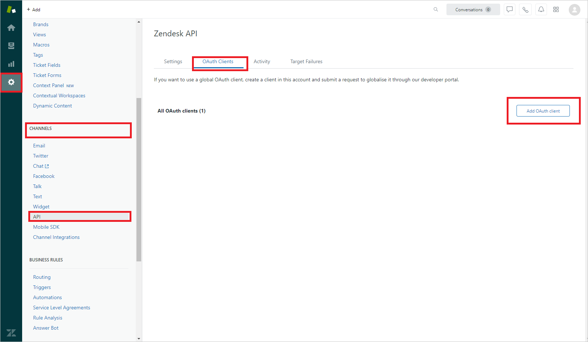
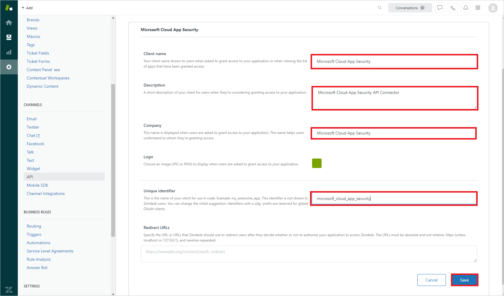
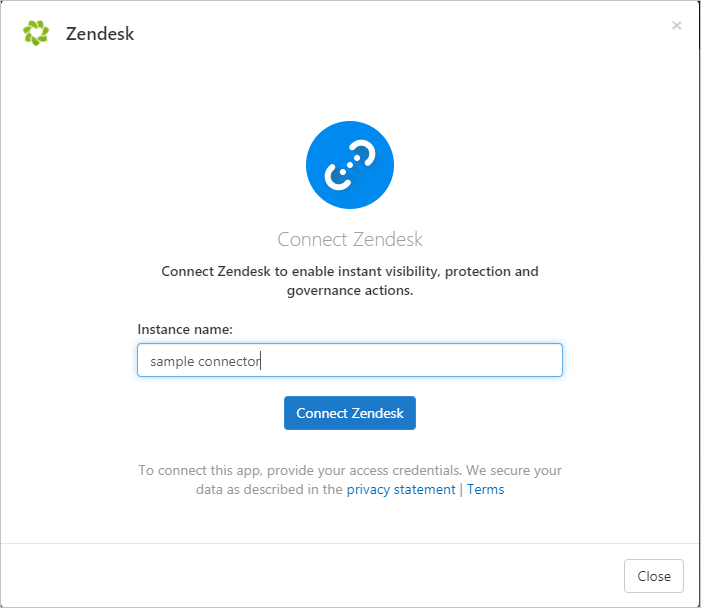

# Connect Zendesk to Microsoft Cloud App Security (Preview)

[!INCLUDE [Banner for top of topics](includes/banner.md)]

This article provides instructions for connecting Microsoft Cloud App Security to your existing Zendesk using the App Connector APIs. This connection gives you visibility into and control over your organization's Zendesk use.

## Prerequisites

- The Zendesk user used for logging into Zendesk must be an admin.
- Supported Zendesk licenses:
  - Team
  - Growth
  - Professional
  - Enterprise
  - Enterprise Plus
 
 >[!NOTE]
> Connecting Zendesk to Cloud App Security with a Zendesk user that is not an admin will result in a connection error.

## How to connect Zendesk to Cloud App Security

### Configure Zendesk

1. Navigate to **Admin** -> **Channels** -> **API** -> **OAuth Client** and select **Add OAuth client**.

    

1. Select **New Credential**.
1. Fill out the following fields:

    - Client name: **Microsoft Cloud App Security** (you can also choose another name).
    - Description: **Microsoft Cloud App Security API Connector** (you can also choose another description).
    - Company: **Microsoft Cloud App Security** (you can also choose another company).
    - Unique identifier: **microsoft_cloud_app_security** (you can also choose another unique identifier).
    - Redirect URL: `https://portal.cloudappsecurity.com/api/oauth/saga`

        

1. Select **Save**, and then select **OK**.

1. Copy the **Secret** that was generated. You'll need it in the upcoming steps.

### Configure Cloud App Security

>[!NOTE]
>The Zendesk user that is configuring the integration must always remain a Zendesk admin, even after the connector is installed.

1. In the [Cloud App Security portal](https://portal.cloudappsecurity.com/), select **Investigate** and then **Connected apps**.

1. In the **App connectors** page, select the plus button followed by **Zendesk**.

1. In the pop-up, give the connector a descriptive name, and press **Connect Zendesk**.

    

1. In the next screen, enter the following fields:

    - **Client ID**: the Unique identifier you used when you created the OAuth app in the Zendesk admin portal.
    - **Client Secret**: your saved secret.
    - **Client endpoint**: Zendesk URL. It should be `<account_name>.zendesk.com`.

1. Select **Connect in Zendesk**.
1. Make sure the connection succeeded by selecting **Test now**. Testing may take a few minutes. After receiving a success notice, select **Close**.
1. The first connection can take up to four hours to get all users and their activities in the seven days before the connection.
1. After the connector’s **Status** is marked as **Connected**, the connector is live and works.

>[!NOTE]
>System activities will be shown with the **Zendesk** account name.

## Rate limits

The default rate limit is 200 requests per minute. To increase the rate limit, [open a support ticket](support-and-ts.md).

>[!NOTE]
>The maximum rate limit for every subscription is described [here](https://developer.zendesk.com/api-reference/ticketing/account-configuration/usage_limits/#zendesk-support-plan-limits).

## Next steps

> [!div class="nextstepaction"]
> [Control cloud apps with policies](control-cloud-apps-with-policies.md)

[!INCLUDE [Open support ticket](includes/support.md)]
