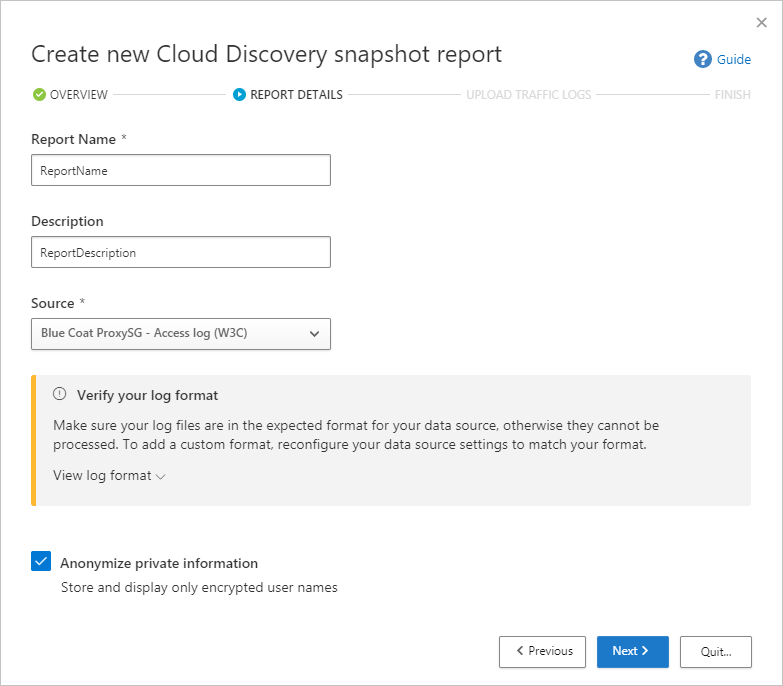
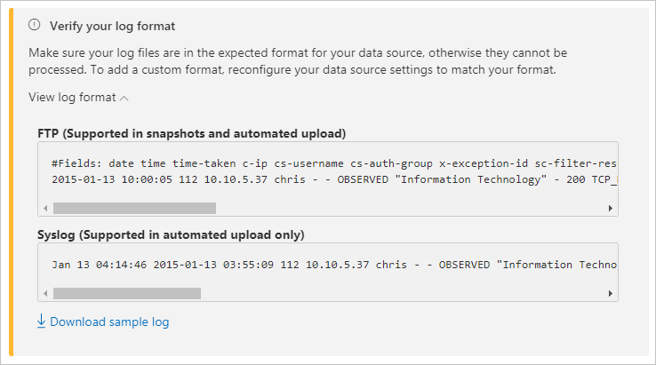
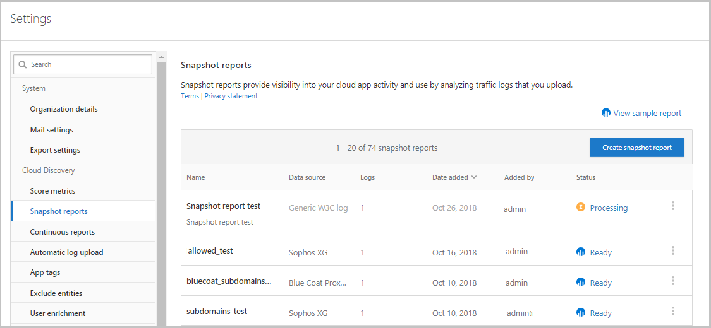

---
# required metadata

title: Create snapshot reports of Cloud Discovery cloud app use | Microsoft Docs
description: This article provides information about how to upload logs manually to create a snapshot report of your Cloud Discovery apps.
keywords:
author: rkarlin
ms.author: rkarlin
manager: mbaldwin
ms.date: 3/19/2017
ms.topic: article
ms.prod:
ms.service: cloud-app-security
ms.technology:
ms.assetid: ecc1949d-c861-4636-952a-c3a260719bb5

# optional metadata

#ROBOTS:
#audience:
#ms.devlang:
ms.reviewer: reutam
ms.suite: ems
#ms.tgt_pltfrm:
#ms.custom:

---

# Create snapshot Cloud Discovery reports
It is important to upload a log manually and let Cloud App Security parse it before attempting to use the automatic log collector.
If you don't have a log yet and you want to see a sample of what your log should look like, follow the procedure below, and download a sample log file to see what your log is supposed to look like.

To create a snapshot report:
  
1.  Collect log files from your firewall and proxy, through which users in your organization access the Internet. Make sure to gather logs during times of peak traffic that are representative of all user activity in your organization.  
  
2.  In the Cloud App Security portal, click on **Discover** and then **Create new snapshot report**.  
  
   
     
3.  Enter a **Report name** and a **Description**
  
      

4.  Select the **Data source** from which you want to upload the log files.  
  
5. Verify your log format to make sure that it is formatted properly according to the sample you can download. Click **View and verify** and then click **Download sample log**. Then compare your log with the sample provided to make sure it's compatible. 

   

5.  **Choose the traffic logs** that you want to upload. You can upload up to 20 files at once. Compressed and zipped files are also supported.  
  
6.  Click **Create**.  

7.  After upload completes, the status message will appear at the top right corner of your screen letting you know that your log was successfully uploaded.  
  
8.  After you upload your log files, it will take some time for them to be parsed and analyzed.  
After processing of your log files completes, you will receive an email to notify you that it is done. 
  
9. A notification banner will appear in the status bar at the top of the portal to update you with the processing status of your log files.  
 
   
10. After the logs are uploaded successfully, you should see a notification letting you know that the log file processing completed successfully. At this point, a you can view the report either by clicking the link in the status bar, or by going to the Settings cog, and selecting **Cloud Discovery settings**.   
  
     
11. Then selecting **Manage snapshot reports** and select your snapshot report.
 

  
      
## See Also  
[Control cloud apps with policies](control-cloud-apps-with-policies.md)   
[For technical support, please visit the Cloud App Security assisted support page.](http://support.microsoft.com/oas/default.aspx?prid=16031)   
[Premier customers can also choose Cloud App Security directly from the Premier Portal.](https://premier.microsoft.com/)  
    
      
  