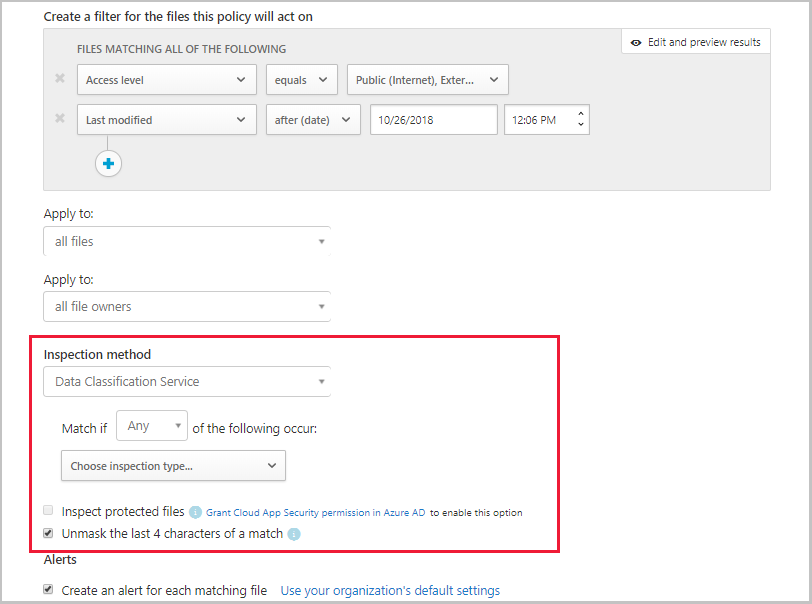

---
# required metadata

title: Cloud App Security content inspection using Microsoft Data Classification Service
description: This article describes the process Cloud App Security follows when performing DLP content inspection using Microsoft Data Classification Service. 
keywords:
author: rkarlin
ms.author: rkarlin
manager: angrobe
ms.date: 12/10/2018

ms.topic: conceptual
ms.collection: M365-security-compliance
ms.prod:
ms.service: cloud-app-security
ms.technology:
ms.assetid: bf25d1e6-e5dc-449f-b50e-1cd4a21b6d3d

# optional metadata

#ROBOTS:
#audience:
#ms.devlang:
ms.reviewer: reutam
ms.suite: ems
#ms.tgt_pltfrm:
ms.custom: seodec18

---
# Microsoft Data Classification Services integration

*Applies to: Microsoft Cloud App Security*

Microsoft Cloud App Security enables you to natively use the Microsoft Data Classification Service to classify the files in your cloud apps. Microsoft Data Classification Service provides a unified information protection experience across Office 365, Azure Information Protection, and Microsoft Cloud App Security. The classification service allows you to extend your data classification efforts to the third-party cloud apps protected by Microsoft Cloud App Security, using the decisions you already made across an even greater number of apps.

>[!NOTE]
> This feature is currently available in the US, Europe (except France), and APAC.

## Enable content inspection with Data Classification Services

You have the option to set the **Inspection method** to use the **Microsoft Data Classification Service** with no additional configuration required. This option is useful when creating a data leak prevention policy for your files in Microsoft Cloud App Security.

1. In the [file policy](data-protection-policies.md) page, under **Inspection method**, select **Data Classification Service**.
     
2. Select whether the policy should apply when **any** or **all** of the criteria are met.
3. **Choose inspection type** by selecting the **Sensitive information types**.
 

4. You can use the [default sensitive information types](https://support.office.com/article/what-the-sensitive-information-types-look-for-fd505979-76be-4d9f-b459-abef3fc9e86b) to define what happens to files protected by Microsoft Cloud App Security. You can also reuse any of your [Office 365 custom sensitive information types](https://support.office.com/article/create-a-custom-sensitive-information-type-82c382a5-b6db-44fd-995d-b333b3c7fc30).

5. Optionally, you can unmask the last four characters of a match. By default, matches are masked and shown in their context, and include the 40 characters before and after the match. If you select this checkbox, it will unmask the last four characters of the match itself.

6. You can also set alerts and governance actions for the policy. For more information, see [file policies](data-protection-policies.md) and [governance actions](governance-actions.md).

Setting these policies enables you to easily extend the strength of the Office 365 DLP capabilities to all your other sanctioned cloud apps and protect the data stored in them with the full toolset provided to you by Microsoft Cloud App Security – such as the ability to
[automatically apply Azure Information Protection classification labels](azip-integration.md) and the ability to control sharing permissions.

## Next steps  
[Control cloud apps with policies](control-cloud-apps-with-policies.md)   

[Premier customers can also create a new support request directly in the Premier Portal.](https://premier.microsoft.com/)  
  
