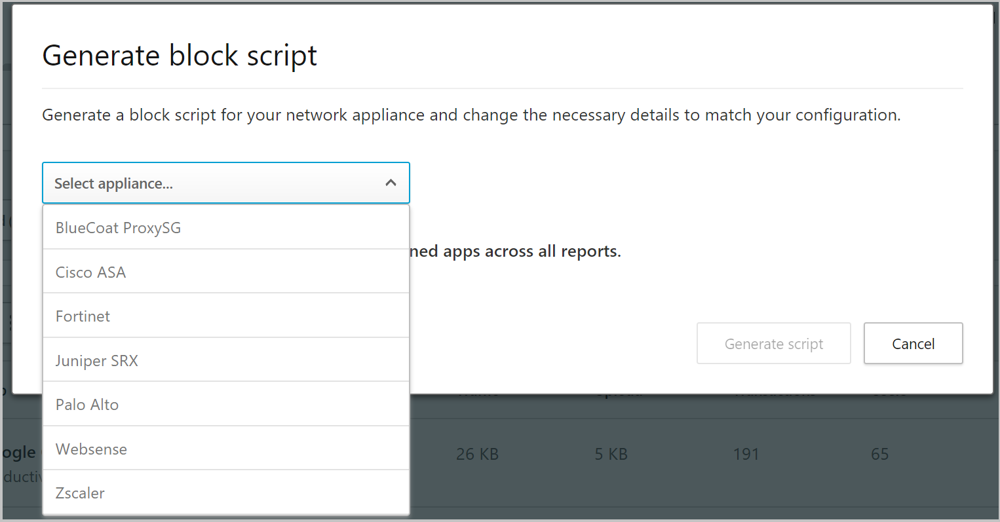
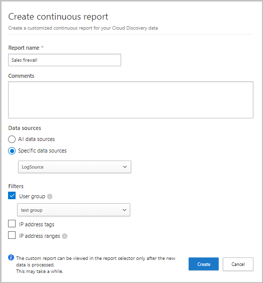
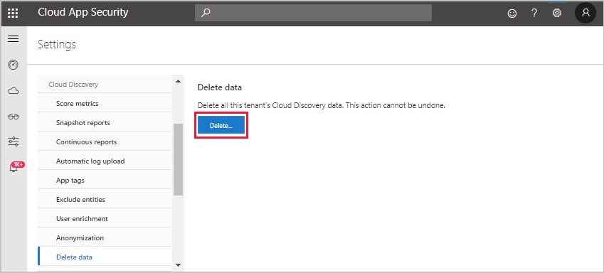

---
# required metadata

title: Working with discovered apps in Cloud App Security | Microsoft Docs
description: This topic describes the process for identifying and remediating risky cloud discovery apps in Cloud App Security.
keywords:
author: rkarlin
ms.author: rkarlin
manager: mbaldwin
ms.date: 6/4/2017
ms.topic: get-started-article
ms.prod:
ms.service: cloud-app-security
ms.technology:
ms.assetid: 645fd8c7-06d0-4f93-a85c-2976e7b3766d

# optional metadata

#ROBOTS:
#audience:
#ms.devlang:
ms.reviewer: reutam
ms.suite: ems
#ms.tgt_pltfrm:
#ms.custom:

---

# Working with discovered apps

## Review the Cloud Discovery Dashboard

The Cloud Discovery dashboard is designed to give you more insight into how cloud apps are being used in your organization. It provides an at-a-glance overview of what kinds of apps are being used, your open alerts, the risk levels of apps in your organization. It also shows you who your top app users are and provides an App Headquarter location map. The Cloud Discovery Dashboard has many options for filtering the data, to allow you to generate specific views, depending on what you're most interested in, and easy-to-understand graphics to give you the full picture at a glance.

The first thing you should do to get a general picture of your Cloud Discovery apps is to look at the Cloud Discovery Dashboard and review the following:
 
1. First look at the overall cloud app use in your organization in the High level usage overview.

2. Then, dive one level deeper to see which are the top categories being used in your org for each of the different use parameters and how much of this usage is by Sanction apps.

3. Go even deeper and see all the apps in a specific category in the Discovered apps widget.

4. You can see the top users and source IP addresses to identify which users are the most dominant users of cloud apps in your organization.
5. Check how the discovered apps spread according to geographic location (according to their HQ) in the App Headquarters map.

6. Finally, don’t forget to review the risk score of the discovered app in the **App risk overview** and check the discovery alerts status to see how many open alerts should you investigate.

## Deep dive into Discovered apps
If you want to deep dive into the data provided by Cloud Discovery, you can review which apps were discovered and determine if they are risky or not. To do this, it's helpful to use the filters to review the apps that were discovered as being used in your environment.

For example, if you want to unsanction and block risky cloud storage and collaboration apps, you can use the Discovered apps page to filter for the apps you want and then bulk unsanction them, as follows. In the **Discovered apps** page, under **Browse by category** select both **Cloud storage** and **Collaboration**. Then, use the Advanced filters and set **Compliance risk factor** to **SOC 2** equals **False**; **Usage** > **Users** to greater than 50 users; and **Usage** > **Transactions** to greater than 100; **Security risk factor** > **Data at rest encryption** equals **False** and then set **Risk score** equals less than 6.
Once the results are filtered for these risky apps, you can use the bulk action checkbox to unsanction them all in one action. After they are unsanctioned you can use a blocking script to block them from being used in your environment.

## Discovered app filters

There are basic and advaned Discovered app filters. To acheive a complex filter (such as in the example above) use the advanced option which includes all of the following:

  

- **Categories**: the categories filter, which is located on the left of the page, enables you to search for types of apps according to popular categories, for example Social network apps, Cloud storage apps, etc. You can select multiple categories at a time, or a single category, and then apply the basic and advanced filters on top of these.
- **App tag**: select whether the app was sanctioned or unsanctioned or not.
- **Apps and domains**: enables you to search for specific apps or apps used in specific domains 
- **Compliance risk factor**: lets you search for a specific compliance factor (HIPAA, ISO 27001, SOC 2, PCI-DSS, etc.)
- **General risk factor**: lets you search for apps by Consumer popularity, Data center locale, Domain, Domain registration (before or after date), Founded during a specific year, Headquarters in a specific locale, Holding (private or public), Hosting company, Logon URL, Vendor
- **Risk score**: lets you filter apps by risk score so that you can focus on, for example, reviewing only very risky apps.
- **Security risk factor**: enables you to filter based on
- **Usage**: Lets you filter based on apps used by specific IP addresses or apps Last seen being used before a specific date (to enable you to weed out apps that are stale and no longer in use), apps with less than a specified amount of **Traffic**, apps with fewer than a specified amount of **Transactions**, apps with less than or more than a specified amount of data uploads, apps with more than or less than a specified amount of **Users**.

>[!NOTE]
> If at any point you want to clear the filters, you can do so by clicking the clear filters icon .

## Remediate

After you have reviewed the list of discovered apps in your environment, you can secure your environment against unwanted app use in the following ways.

## Governing discovered apps
Cloud App Security enables you to block access to unsanctioned apps by leveraging your existing on-prem security appliances. Generate a dedicated block script and import it to your appliance.
This solution does not require redirection of all of the organization's web traffic to a proxy.

### Sanctioning/unsanctioning an app 

You can unsanction a specific risky app by clicking the three dots at the end of the row and selecting **Unsanction**.
Unsanctioning an app doesn't block use, but enables you to more easily monitor its use with the Cloud Discovery filters. 
You can then notify users of the app that it has been unsanctioned and suggest an alternative, safe app for their use.

  

If you have a list of apps you want to sanction or unsanction, you can use the checkbox to select all the apps you want to manage, and then select the action.

### Exporting a block script to govern discovered apps

1. In the Cloud Discovery dashboard, for any app that is **Unsanctioned**, in the title bar, click on the three dots and select **Generate block script...**. 

     

3. In **Generate block script**, select the appliance you want to generate the block script for. 

     

4. Then, click the Generate script button. This will create a block script for all your unsanctioned apps. By default, the file will be named with the date on which it was exported and the appliance type you selected, for example *2017-02-19_CAS_Fortigate_block_script.txt* 

     

5. Import the file created to your appliance.

### Creating a new policy from search
After you have search results filtered for specific apps you want to apply specific actions to, you can create a new policy from your filtered search results.
At the top of the Discovered apps page, click the three dots and then select **Create new policy**. This will automatically open a new Discovery Policy template filtered using the filters currently applied.

## Exclude entities  
If you have system users or IP addresses that are particularly noisy and uninteresting or apps that are not relevant, you may want to exclude their data from the Cloud Discovery data that is analyzed. For example, you might want to exclude all information originating from 127.0.0.1 or local host.  
  
To create an exclusion:  
  
1.  In the portal, under the settings icon, select **Cloud Discovery settings**.  
  
2.  Click the **Exclude entities** tab.  
  
3.  Choose either the **Excluded users** or **Excluded IP addresses** tab and click the button to **Add user** or **Add IP address**.  
  
4.  Add a user alias or IP address. We recommend adding information about why the user or IP address was excluded.  
  
       
  
## Manage continuous reports  
Custom continuous reports provide you more granularity when monitoring your organization's Cloud Discovery log data. By creating custom reports, it is possible to filter on specific geographic locations, networks and sites, or organizational units. By default, only the following reports appear in your Cloud Discovery report selector:  
  
-  The **Global report** consolidates all the information in the portal from all the data sources you included in your logs.  
  
- The **Data source specific report** displays only information from a specific data source.  
  
To create a new continuous report:  
  
1.  In the portal, under the settings icon, select **Cloud Discovery settings**.  
  
2.  Click the **Manage continuous report** tab.  
  
3.  Click the **Create report** button.  
  
4.  Enter a report name.  
  
5.  Select the data sources you want to include (all or specific).  
  
6.  Set the filters you want on the data, these can be **Organizational Units**, **IP address tags** or **IP address ranges**. For more information on working with IP address tags and IP address ranges, see [Organize the data according to your needs](ip-tags.md).  
  
     

## Deleting Cloud Discovery data  
There are a number of reasons why you may want to delete your Cloud Discovery data. We recommend deleting it in the following cases:  
  
-   If you manually uploaded log files and a long time passed before you updated the system with new log files and you don't want old data affecting your results.  
  
-   When you set a new custom data view, it will apply only to new data from that point forward, so you may want to erase old data, and then upload your log files again to enable the custom data view to pick up events in the log file data.  
  
-   If many users or IP addresses recently started working again after being offline for some time, their activity will be identified as anomalous and you may get many false positive violations.  
  
To delete Cloud Discovery data:  
  
1.  In the portal, under the settings icon, select **Cloud Discovery settings**.  
  
2.  Click the **Delete data** tab.  
  
     It is important to be sure you want to delete data before continuing - it cannot be undone and it deletes **all** Cloud Discovery data in the system.  
  
3.  Click the **Delete** button.  
  
       
  
    > [!NOTE]  
    >  The deletion process takes a few minutes and is not immediate.  

## The Cloud App Catalog
The Cloud App Catalog gives you a full picture of what Cloud Discovery knows how to identify. Cloud Discovery analyzes your traffic logs against Cloud App Security's cloud app catalog of over 14,000 cloud apps that are ranked and scored based on more than 50 attributes, to provide you with ongoing visibility into cloud use, Shadow IT, and the risk Shadow IT poses into your organization.
The **Cloud app catalog** rates risk for your cloud apps based on regulatory certification, industry standards, and best practices. Four complementary processes run in the Cloud app catalog to keep it up to date:
1.  Automated data extraction directly from the cloud app (for attributes such as SOC 2 compliance).
2.  Automated advanced data extraction for data by Cloud App Security's algorithms (for attributes such as HTTP security headers).
3.  Continuous analysis by the Cloud App Security cloud analyst team (for attributes such as encryption at rest).
4.  Customer-based revision requests, based on customer submission requests for changes to the Cloud app catalog. All requests are reviewed by our cloud analyst team and updated based on their findings.
  
  

## Cloud Discovery data anonymization

Cloud Discovery data anonymization enables you to protect user privacy. Once the data log is uploaded to the Cloud App Security portal, the log is sanitized and all username information is replaced with encrypted usernames. This way, all cloud activities are kept anonymous. For more information see [Cloud Discovery anonymization](cloud-discovery-anonymizer.md).

## Suggesting a change

If you find a new app in your environment that hasn't been scored by Cloud App Security, you can request a review of the app:

1. At the top of the Discovered apps page, click the three dots and then select **Suggest new app**. 

2. In the **Suggest new cloud app** popup, fill in details about the new app including the name and domain of the app. 

3. We recommend selecting the checkbox to enable Cloud App Security analysts to contact you in case additional information about the app is needed, and so that you can be updated when the analysis is complete.

## See also
 
[Create snapshot Cloud Discovery reports](create-snapshot-cloud-discovery-reports.md)

[Configure automatic log upload for continuous reports](configure-automatic-log-upload-for-continuous-reports.md)

[Working with Cloud Discovery data](working-with-cloud-discovery-data.md)

