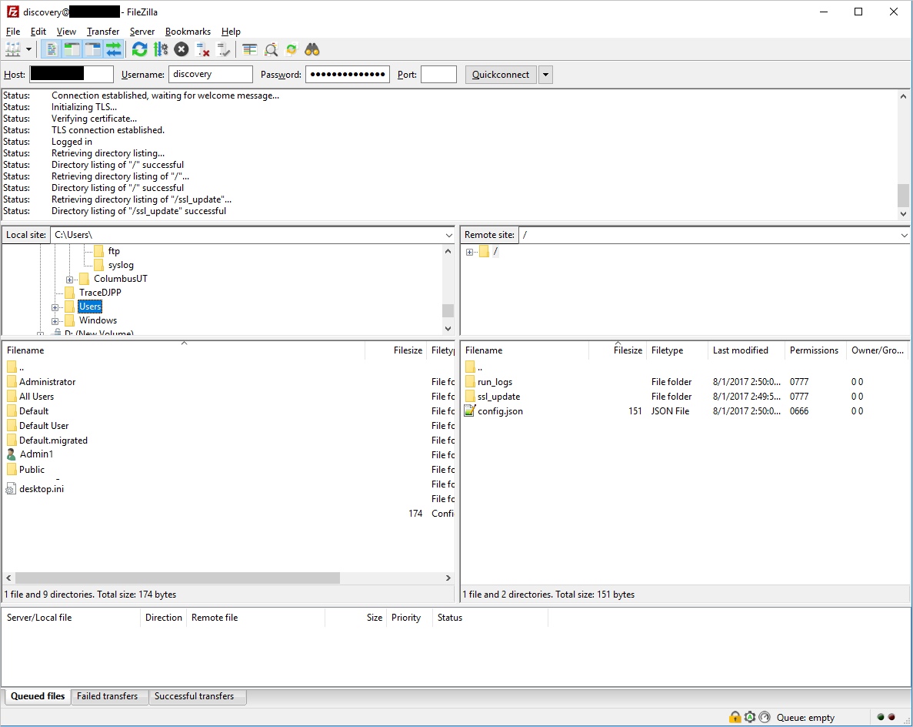
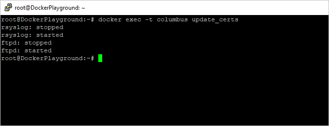

---
# required metadata

title: Customize certificates for the Cloud Discovery docker | Microsoft Docs
description: This topic describes the process for customizing certificates for the Cloud Discovery docker.
keywords:
author: rkarlin
ms.author: rkarlin
manager: mbaldwin
ms.date: 26/11/2017
ms.topic: get-started-article
ms.prod:
ms.service: cloud-app-security
ms.technology:
ms.assetid: 0e9c15d3-902b-4b8f-8dec-31953b4451e0

# optional metadata

#ROBOTS:
#audience:
#ms.devlang:
ms.reviewer: reutam
ms.suite: ems
#ms.tgt_pltfrm:
#ms.custom:

---

# Customize certificate files

Follow this procedure to customize the certificate files you use for secure connections to the Cloud Discovery docker.

1.	Open an FTP client and connect to the log collector.

  

2.	Navigate to the `ssl_update` directory.
3.	Upload new certificate files to the `ssl_update` directory (the names are mandatory).

    

    1.	For FTP: Only one file is required, containing the key and certificate data, in that order, named **pure-ftpd.pem**.
    
    2.	For Syslog: Three files are required: **ca.pem**, **server-key.pem** and **server-cert.pem**. If any of the files is missing, the update will not take place.

4.	In a terminal run: `docker exec -t <collector name> update_certs`. This should produce a similar output to that seen in the following screen.

    

## See Also
[Working with Cloud Discovery
data](working-with-cloud-discovery-data.md)  
[For technical support, please visit the Cloud App Security assisted support
page](http://support.microsoft.com/oas/default.aspx?prid=16031)  
[Premier customers can also choose Cloud App Security directly from the Premier
Portal](https://premier.microsoft.com/)

