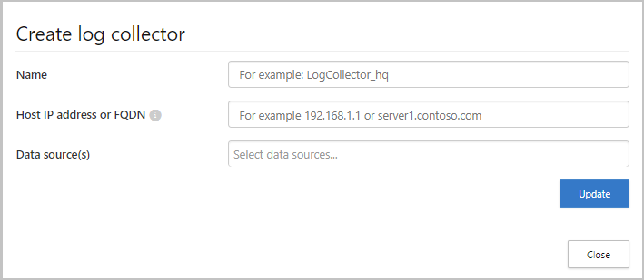
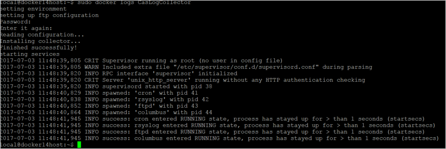
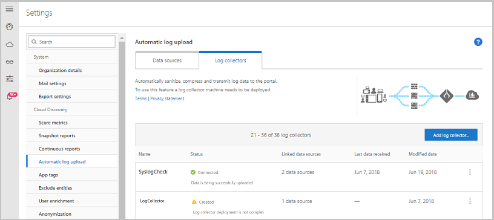

---
# required metadata

title: Roll out continuous reports for Cloud App Security using a Docker on Windows | Microsoft Docs
description: This article describes the process configuring automatic log upload for continuous reports in Cloud App Security using a Docker on Windows in an on-premises server.
keywords:
author: rkarlin
ms.author: rkarlin
manager: angrobe
ms.date: 4/19/2019
ms.topic: conceptual
ms.collection: M365-security-compliance
ms.prod:
ms.service: cloud-app-security
ms.technology:
ms.assetid: ff73a393-da43-4954-8b02-38d2a48d39b3

# optional metadata

#ROBOTS:
#audience:
#ms.devlang:
ms.reviewer: reutam
ms.suite: ems
#ms.tgt_pltfrm:
#ms.custom:

---
# Docker on Windows on-premises

*Applies to: Microsoft Cloud App Security*

You can configure automatic log upload for continuous reports in Cloud App Security using a Docker on Windows.

## Technical requirements

- OS: **Windows 10** (fall creators update) and Windows Server **version 1709+**

- Disk space: 250 GB

- CPU: 2

- RAM: 4 GB

- Set your firewall as described in [Network requirements](network-requirements.md#log-collector)

- Virtualization on the operating system must be enabled with Hyper-V

## Log collector performance

The Log collector can successfully handle log capacity of up to 50 GB per hour. The main bottlenecks in the log collection process are:

- Network bandwidth - Your network bandwidth determines the log upload speed.

- I/O performance of the virtual machine - Determines the speed at which logs are written to the log collector’s disk. The log collector has a built-in safety mechanism that monitors the rate at which logs arrive and compares it to the upload rate. In cases of congestion, the log collector starts to drop log files. If your setup typically exceeds 50 GB per hour, it's recommended that you split the traffic between multiple log collectors.

## Set up and configuration  

### Step 1 – Web portal configuration: Define data sources and link them to a log collector

1. Go to the **Automatic log upload** settings page. 

     a. In the Cloud App Security portal, click the settings icon followed by **Log collectors**.

      

2. For each firewall or proxy from which you want to upload logs, create a matching data source.

     a. Click **Add data source**.

      
          
     b. **Name** your proxy or firewall.
      
      

     c. Select the appliance from the **Source** list. If you select **Custom log format** to work with a network appliance that isn't listed, see [Working with the custom log parser](custom-log-parser.md) for configuration instructions.

     d. Compare your log with the sample of the expected log format. If your log file format doesn't match this sample, you should add your data source as **Other**.

     e. Set the **Receiver type** to either **FTP**, **FTPS**, **Syslog – UDP**, or **Syslog – TCP**, or **Syslog – TLS**.
     
     >[!NOTE]
     >Integrating with secure transfer protocols (FTPS and Syslog – TLS) often requires additional settings or your firewall/proxy.

      f. Repeat this process for each firewall and proxy whose logs can be used to detect traffic on your network. It's recommended to set up a dedicated data source per network device to enable you to:
     - Monitor the status of each device separately, for investigation purposes.
     - Explore Shadow IT Discovery per device, if each device is used by a different user segment.

3. Go to the **Log collectors** tab at the top.

   a. Click **Add log collector**.

   b. Give the log collector a **name**.

   c. Enter the **Host IP address** of the machine you'll use to deploy the Docker. The host IP address can be replaced with the machine name, if there is a DNS server (or equivalent) that will resolve the host name.

   d. Select all **Data sources** that you want to connect to the collector, and click **Update** to save the configuration see the next deployment steps.

   

   > [!NOTE]
   > - A single Log collector can handle multiple data sources.
   > - Copy the contents of the screen because you will need the information when you configure the Log Collector to communicate with Cloud App Security. If you selected Syslog, this information will include information about which port the Syslog listener is listening on.

4. Further deployment information will appear. **Copy** the run command from the dialog. You can use the copy to clipboard icon. . You will need this later.

5. **Export** the expected data source configuration. This configuration describes how you should set the log export in your appliances.

   

### Step 2 – On-premises deployment of your machine
The following steps describe the deployment in Windows. The deployment steps for other platforms are slightly different.

1. Open a PowerShell terminal as an administrator on your Windows machine.

2. Use the following command to download the Windows Docker installer: 
 `Invoke-WebRequest https://adaprodconsole.blob.core.windows.net/public-files/LogCollectorInstaller.ps1 -OutFile (Join-Path $Env:Temp LogCollectorInstaller.ps1)`
 If you want to validate that the installer is signed by Microsoft, see [Validate installer signature](#validate-signature).

3. To enable PowerShell script execution, run `Set-ExecutionPolicy RemoteSigned`.

4. Run: `& (Join-Path $Env:Temp LogCollectorInstaller.ps1)` 
This installs the Docker client on your machine. While the log collector container is installed, the machine will be restarted twice and you will have to log in again. **Make sure the Docker client is set to use Linux containers.**

5. After each restart, from the directory into which you saved the installer, re-run: `& (Join-Path $Env:Temp LogCollectorInstaller.ps1)`   

6. Before the installation completes, you will have to paste in the run command you copied earlier.

7. Deploy the collector image on the hosting machine by importing the collector configuration. Import the configuration by copying the run command generated in the portal. If you need to configure a proxy, add the proxy IP address and port number. For example, if your proxy details are 192.168.10.1:8080, your updated run command is:

           (echo db3a7c73eb7e91a0db53566c50bab7ed3a755607d90bb348c875825a7d1b2fce) | docker run --name MyLogCollector -p 21:21 -p 20000-20099:20000-20099 -e "PUBLICIP='192.168.1.1'" -e "PROXY=192.168.10.1:8080" -e "CONSOLE=mod244533.us.portal.cloudappsecurity.com" -e "COLLECTOR=MyLogCollector" --security-opt apparmor:unconfined --cap-add=SYS_ADMIN --restart unless-stopped -a stdin -i microsoft/caslogcollector starter

   
8. Verify that the collector is running properly with the following command: `docker logs <collector_name>`

You should see the message: **Finished successfully!**

  

### Step 3 - On-premises configuration of your network appliances

Configure your network firewalls and proxies to periodically export logs to the dedicated Syslog port of the FTP directory according to the directions in the dialog. For example:

    BlueCoat_HQ - Destination path: \<<machine_name>>\BlueCoat_HQ\

### Step 4 - Verify the successful deployment in the Cloud App Security portal

Check the collector status in the **Log collector** table and make sure the status is **Connected**. If it's **Created**, it's possible the log collector connection and parsing haven't completed.

 

You can also go to the **Governance log** and verify that logs are being periodically uploaded to the portal.

If you have problems during deployment, see [Troubleshooting Cloud Discovery](troubleshooting-cloud-discovery.md).

### Optional - Create custom continuous reports 

Verify that the logs are being uploaded to Cloud App Security and that reports are generated. After verification, create custom reports. You can create custom discovery reports based on Azure Active Directory user groups. For example, if you want to see the cloud use of your marketing department, import the marketing group using the import user group feature. Then create a custom report for this group. You can also customize a report based on IP address tag or IP address ranges.

1. In the Cloud App Security portal, under the Settings cog, select Cloud Discovery settings, and then select **Continuous reports**. 
2. Click the **Create report** button and fill in the fields.
3. Under the **Filters** you can filter the data by data source, by [imported user group](user-groups.md), or by [IP address tags and ranges](ip-tags.md). 

### Optional - Validate installer signature 

To make sure that the docker installer is signed by Microsoft:
1. Right click on the file and select **Properties**.
2. Click on **Digital Signatures** and make sure that it says **This digital signature is OK**.  
3. Make sure that **Microsoft Corporation** is listed as the sole entry under **Name of signer**.  

If the digital signature is not valid, it will say **This digital signature is not valid**:

## Next steps

[Troubleshooting Cloud Discovery docker deployment](troubleshoot-docker.md)

[Premier customers can also create a new support request directly in the Premier Portal.](https://premier.microsoft.com/)

