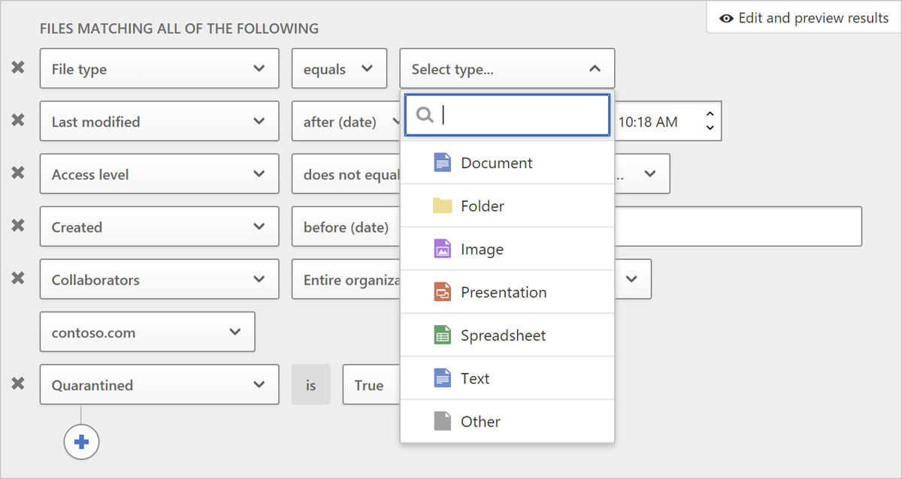
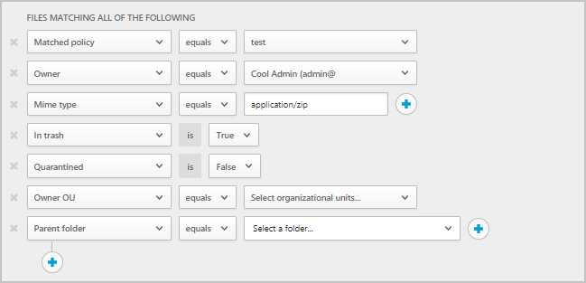
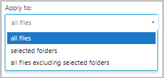

# Files

[!INCLUDE [Banner for top of topics](includes/banner.md)]

To provide data protection, Microsoft Cloud App Security gives you visibility into all the files from your connected apps. After you connect Microsoft Cloud App Security to an app using the App connector, Microsoft Cloud App Security scans all the files, for example all the files stored in OneDrive and Salesforce. Then, Cloud App Security rescans each file every time it's modified – the modification can be to content, metadata, or sharing permissions. Scanning times depend on the number of files stored in your app. You can also use the **Files** page to filter files to investigate what kind of data is saved in your cloud apps.
> [!NOTE]
> File monitoring should be enabled in Settings. Go to **Settings**, and then under **Information Protection**, select **Files**. Select **Enable file monitoring** and then select **Save**.
> If there are no active file policies, then after seven days since the last file page engagement time, file monitoring becomes disabled.
> If there are no active file policies, then after 35 days since the last file page engagement time, Cloud App Security begins deleting the data of the stored files.

## File filter examples

For example, use the **Files** page to secure externally shared files labeled as **confidential**, as follows:
After you connect an app to Cloud App Security, integrate with Azure Information Protection. Then, in the **Files** page, filter for files labeled **confidential** and exclude your domain in the **Collaborators** filter. If you see that there are confidential files shared outside your organization, you can create a file policy to detect them. You can apply automatic governance actions to these files, such as **Remove external collaborators** and **Send policy-match digest to file owner** to prevent data loss to your organization.

Here's another example of how you can use the **Files** page. Make sure you no one in your organization is publicly or externally sharing files that haven't been modified in the last six months:
Connect an app to Cloud App Security and go to the **Files** page. Filter for files whose access level is **External** or **Public** and set the **Last modified** date to six months ago. Create a file policy that detects these stale public files by clicking **New policy from search**. Apply automatic governance actions to them, such as **Remove external users**, to prevent data loss to your organization.

The basic filter provides you with great tools to get started filtering your files.

To drill down into more specific files, you can expand the basic filter by clicking Advanced.

##  File filters

Cloud App Security can monitor any file type based on more than 20 metadata filters (for example, access level, file type).

Cloud App Security's built in DLP engines perform content inspection by extracting text from common file types. Some of the included file types are PDF, Office files, RTF, HTML, and code files.

Below is a list of the file filters that can be applied. To provide you with a powerful tool for policy creation, most filters support multiple values and a NOT.

> [!NOTE]
> When using the file policy filters, **Contains**  will search only for **full words** – separated by comas, dots, spaces or underscores to search.
>
> - Spaces between words function like OR, for example, if you search for **malware** **virus** it will find all files with either malware or virus in the name, so it will find both malware-virus.exe and virus.exe.
> - If you want to search for a string, enclose the words in quotation marks. This functions like AND, for example: if you search for **"malware"** **"virus"**, it will find virus_malware_file.exe but it will not find malwarevirusfile.exe and it will not find malware.exe. However, it will search for the exact string. If you search for **"malware virus"** it will not find **"virus"** or **"virus_malware"**.
>
> **Equals** will search only for the complete string, for example if you search for **malware.exe** it will find malware.exe but not malware.exe.txt.

- **Access level** – Sharing access level; public, external, internal, or private.  For more information about External files, see [General Setup, Set up the portal](getting-started-with-cloud-app-security.md)

    - **Internal** - Any files within the Internal domains you set in [General setup](General-setup.md).
    - **External** - Any files saved in locations that aren't within the internal domains you set.
    - **Shared** - Files that have a sharing level above private. Shared includes:
        - Internal sharing - Files shared within your internal domains.
        - External sharing - Files shared in domains that aren't listed in your internal domains.
        - Public with a link - Files that can be shared with anyone via a link.
        - Public - Files that can be found by searching the Internet.

      > [!NOTE]
      > Files shared into your connected storage apps by external users are handled as follows by Cloud App Security:
      >
      > - **OneDrive:** OneDrive assigns an internal user as the owner of any file placed into your OneDrive by an external user. Because these files are then considered owned by your organization, Cloud App Security scans these files and applies policies as it does to any other file in your OneDrive.
      > - **Google Drive:** Google Drive considers these as being owned by the external user, and because of legal restrictions on files and data that your organization does not own, Cloud App Security does not have access to these files.
      > - **Box:** Because Box considers externally owned files to be private information, Box Global Admins cannot see the content of the files. For this reason, Cloud App Security does not have access to these files.
      > - **Dropbox:** Because Dropbox considers externally owned files to be private information, Dropbox Global Admins cannot see the content of the files. For this reason, Cloud App Security does not have access to these files.

- **App** – Search only for files within these apps.

- **Collaborators** – Include/exclude specific collaborators or groups.

    - **Any from domain** – If any user from this domain has direct access to the file. Note that this filter does not support files that were shared with a group, only with specific users.

    - **Entire organization** – If the entire organization has access to the file.

    - **Groups** – If a specific group has access to the file. Groups can be imported from Active Directory, cloud apps or manually created in the service.

    - **Users** – Certain set of users that may have access to the file.

- **Created** – File creation time. The filter supports before/after dates and a date range.

- **Extension** – Focus on specific file extensions. For example, all files that are executables (exe).

- **File ID** – Search for specific file IDs File ID is an advanced feature that allows you to track certain high-value files without a dependency on owner, location, or name.

- **File name** – File name or sub string of the name as defined in the cloud app, for example, all files with a password in their name.

- **Classification label** - Search for files with specific tags set. Labels are either:
    - **Azure Information Protection tags** - Requires integration with Azure Information Protection.
    - **Cloud App Security tags** - Provides more insight into the files it scans. For each file scanned by Cloud App Security DLP, you can know if inspection was blocked because the file is encrypted or corrupted. For instance, you can set up policies to alert and quarantine password protected files that are shared externally.
        - **Azure RMS encrypted** – Files whose content wasn't inspected because they have an Azure RMS encryption set.
        - **Password encrypted** – Files whose content wasn't inspected because they're password protected by the user.
        - **Corrupt file** – Files whose content wasn't inspected because their contents couldn't be read.

- **File type** – Cloud App Security takes both the MIME type received (see table) from the service and scans the file to determine the true file type. This scan is for files that are relevant for data scan (documents, images, presentations, spreadsheets, text, and zip/archive files). The filter works per file/folder type. For example, All folders that are ... or All spreadsheet files that are...

    | MIME type | File type |
    |--|--|
    | - application/vnd.openxmlformats-officedocument.wordprocessingml.document - application/vnd.ms-word.document.macroEnabled.12 - application/msword - application/vnd.oasis.opendocument.text - application/vnd.stardivision.writer - application/vnd.stardivision.writer-global - application/vnd.sun.xml.writer - application/vnd.stardivision.math - application/vnd.stardivision.chart - application/x-starwriter - application/x-stardraw - application/x-starmath - application/x-starchart - application/vnd.google-apps.document - application/vnd.google-apps.kix - application/pdf - application/x-pdf - application/vnd.box.webdoc - application/vnd.box.boxnote - application/vnd.jive.document - text/rtf - application/rtf | Document |
    | - application/vnd.oasis.opendocument.image - application/vnd.google-apps.photo - **starts with:** image/ | Image |
    | - application/vnd.openxmlformats-officedocument.presentationml.presentation - application/vnd.ms-powerpoint.template.macroEnabled.12 - application/mspowerpoint - application/powerpoint - application/vnd.ms-powerpoint - application/x-mspowerpoint - application/mspowerpoint - application/vnd.ms-powerpoint - application/vnd.oasis.opendocument.presentation - application/vnd.sun.xml.impress - application/vnd.stardivision.impress - application/x-starimpress - application/vnd.google-apps.presentation | Presentation |
    | - application/vnd.openxmlformats-officedocument.spreadsheetml.sheet - application/vnd.ms-excel.sheet.macroEnabled.12 - application/excel - application/vnd.ms-excel - application/x-excel - application/x-msexcel - application/vnd.oasis.opendocument.spreadsheet - application/vnd.sun.xml.calc - application/vnd.stardivision.calc - application/x-starcalc - application/vnd.google-apps.spreadsheet | Spreadsheet |
    | - **starts with:** text/ | Text |
    | All other file MIME types | Other |

    

- **In trash** – Exclude/include files in the trash folder. These files may still be shared and pose a risk.

    

- **Last modified** – File modification time. The filter supports before and after dates, date range, and relative time expressions. For example, all files that weren't modified in the last six months.

- **Matched policy** - Files that are matched by an active Cloud App Security policy.

- **MIME type** – File MIME type check, accepts free text.

- **Owner** -Include/exclude specific file owners. For example, track all files shared by rogue_employee_#100.

- **Owner OU** – Include or exclude file owners that belong to certain organizational group. For example, all public files except files shared by EMEA_marketing. Applies only to files stored in Google Drive.

- **Parent folder** – Include or exclude based on parent folder. For example, all publicly shared files except for files in this folder.

    > [!NOTE]
    > Cloud App Security only detects new SharePoint and OneDrive folders after some file activity has been performed in them.

- **Quarantined** – Is the file quarantined by the service, For example, show me all files that are quarantined.

You can also set the policy to run on specific files by setting the **Apply to** filter. Filter to either **all files**, **selected folders**, or **all files excluding selected folders**. Then select the files or folders that are relevant.

<!--
>[!NOTE]
> If at any point you want to clear the filters, you can do so by clicking the clear filters icon .
-->

## Authorizing files

After Cloud App Security has identified files as posing a malware or DLP risk, we recommend that you investigate the files. If you determine that the files are safe, you can authorize them. Authorizing a file removes it from the malware detection report and suppresses future matches on this file.

### To authorize files

1. In Cloud App Security, click **Control** and then **Policies**.
1. In the list of policies, on the row in which the policy that triggered the investigation appears, in the **Count** column, click the matches link.

    > [!TIP]
    > You can filter the list of policies by type. The following table lists, per risk type, which filter type to use:
    >
    > | Risk type | Filter type |
    > | --- | --- |
    > | DLP | File policy |
    > | Malware | Malware detection policy |

1. In the list of matched files, on the row in which the file under investigation appears, click **Authorize**.

## Working with the File drawer

You can view more information about each file, by clicking on the file itself in the file log. Clicking opens the **File drawer** that provides the following additional actions you can take on the file:

- **URL** - Takes you to the file location.
- **File identifiers** - Opens a pop-up with raw data details about the file including file ID and encryption keys.
- **Owner** - View the user page for the owner of this file.
- **Matched policies** - See a list of policies the file matched.
- **Classification label** - View the list of Azure Information Protection classification labels found in this file. You can then filter by all files matching this label.

The fields in the File drawer provide contextual links to additional files and drill downs you may want to perform from the drawer directly. For example, if you move your cursor next to the **Owner** field, you can use the "add to filter" icon  to add the owner immediately to the filter of the current page. You can also use the settings cog icon  that pops up to arrive directly at the settings page necessary to modify the configuration of one of the fields, such as **Classification labels**.

For a list of governance actions available, see [File governance actions](governance-actions.md#file-governance-actions).

## Next steps

> [!div class="nextstepaction"]
> [Daily activities to protect your cloud environment](daily-activities-to-protect-your-cloud-environment.md)

[!INCLUDE [Open support ticket](includes/support.md)]
