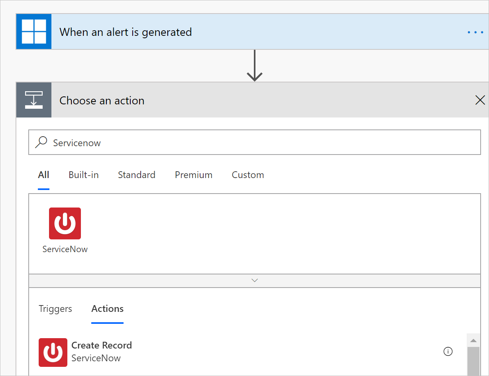

---
# required metadata

title: Integrate Microsoft Power Automate with Microsoft Cloud App Security to get custom alert automation
description: This article provides information about how to get custom alert automation by integrating Microsoft Power Automate with Cloud App Security.
keywords:
author: shsagir
ms.author: shsagir
manager: shsagir
ms.date: 04/27/2020
ms.topic: how-to
ms.collection: M365-security-compliance
ms.prod:
ms.service: cloud-app-security
ms.technology:

# optional metadata

#ROBOTS:
#audience:
#ms.devlang:
ms.reviewer: reutam
ms.suite: ems
#ms.tgt_pltfrm:
#ms.custom:

---

# Integrate with Microsoft Power Automate for custom alert automation

*Applies to: Microsoft Cloud App Security*

Cloud App Security integrates with [Microsoft Power Automate](/flow/getting-started) to provide custom alert automation and orchestration playbooks. By using the [ecosystem of connectors](/connectors/) available in Power Automate, you can automate the triggering of playbooks when Cloud App Security generates alerts. For example, automatically create an issue in ticketing systems using [ServiceNow connector](/connectors/service-now/) or send an approval email to execute a custom governance action when an alert is triggered in Cloud App Security.

## Prerequisites

- You must have a valid [Microsoft Power Automate plan](https://flow.microsoft.com/pricing)

## How it works

On its own, Cloud App Security provides predefined governance options such as suspend a user or make a file private when defining policies. By creating a playbook in Power Automate using Cloud App Security connector, you can create workflows to enable customized governance options for your policies. After the playbook is created in Power Automate, simply associate it with a policy in Cloud App Security to send alerts to Power Automate. Microsoft Power Automate offers several connectors and conditions to create a customized workflow for your organization.

The [Cloud App Security connector](/connectors/cloudappsecurity/) in Power Automate supports automated triggers and actions. Power Automate is triggered automatically when Cloud App Security generates an alert. Actions include changing the alert status in Cloud App Security.

## How to create playbooks with Power Automate

1. [Create an API token](api-tokens.md) in Cloud App Security.

2. Navigate to the [Power Automate portal](https://flow.microsoft.com), select **My flows**, select **New**, and from the drop-down, select **Automated - from blank**.

    

3. Provide a name for the flow, and in **Choose your flow's trigger**, type **Cloud App Security** and select **When an alert is generated**.

    

4. Under **Authentication settings**, paste the API token from step 1.

5. Define the workflow that should be triggered when a policy in Cloud App Security generates an alert. You can add an action, logical condition, switch case conditions or loops and save the playbook.

    

6. In the Cloud App Security portal, go to **Policies** and in the row of the policy whose alerts you want to forward to Power Automate, click the three dots and select **Settings**.
7. Under **Alerts**, select **Send Alerts to Power Automate** and choose the name of the playbook from the drop-down menu.

    

8. Cloud App Security playbooks that you've authored or are granted access to can be seen in the **Security extensions** screen.

    

## Next steps

> [!div class="nextstepaction"]
> [Control cloud apps with policies](control-cloud-apps-with-policies.md)

[!INCLUDE [Open support ticket](includes/support.md)]