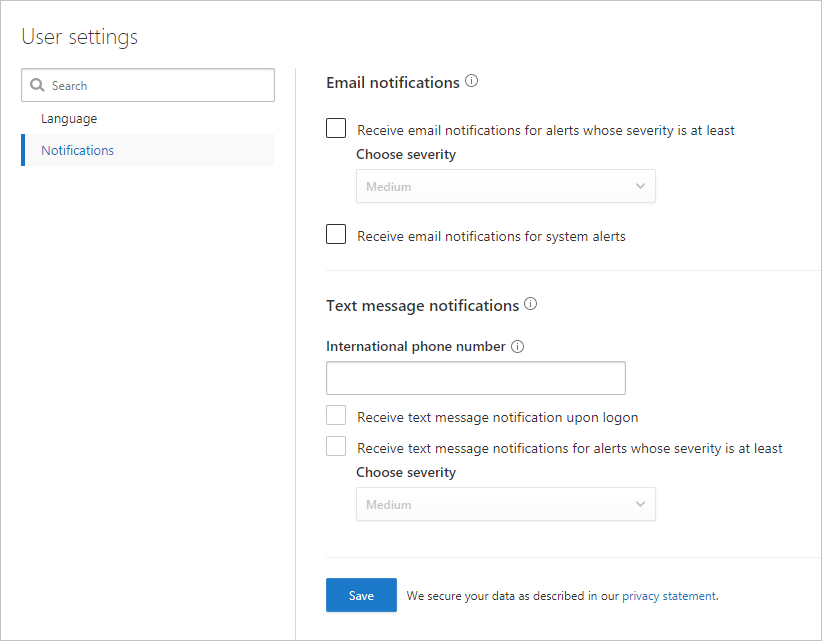
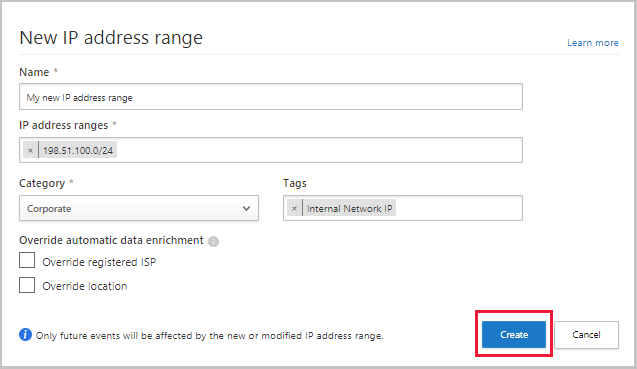

---
# required metadata

title: Customize the portal | Microsoft Docs
description: This topic provides the first steps to customizing the portal.
keywords:
author: rkarlin
ms.author: rkarlin
manager: mbaldwin
ms.date: 12/21/2016
ms.topic: get-started-article
ms.prod:
ms.service: cloud-app-security
ms.technology:
ms.assetid: 2e7e57b0-db54-4d75-896c-4700dd9abe48

# optional metadata

#ROBOTS:
#audience:
#ms.devlang:
ms.reviewer: reutam
ms.suite: ems
#ms.tgt_pltfrm:
#ms.custom:

---

# Customize the portal
The following procedure gives you instructions for customizing the Cloud App Security portal.
  
## Set up the portal  
  
1.  In the Cloud App Security portal, in the menu bar, click the settings icon  and select **General settings** to configure the following:  
  
3.  **Organization details**  
  
     It is important that you provide an **Organization display name** for your organization. It will be displayed on emails and web pages sent from the system.  
  
     Provide an **Environment name** (tenant). This is especially important if you manage multiple tenants.  
  
4. It is also possible to provide a **Logo** that will be displayed in email notifications sent from the system and on web pages sent from the system. The logo should be a png file with a maximum size of 150 x 50 pixels on a transparent background.  

4.  Add a list of your **Managed domains**. The managed domains are used to help Cloud App Security determine which users are internal, which are external, as well as where files should and shouldn't be shared. This is used for reports as well as alerts.  
> [!NOTE] 
> - Users in domains that are not configured as internal will be marked as external and will not be scanned for activities or files.
> - If you are integrating with Azure Information Protection integration, see [Azure Information Protection Integration](azip-integration.md) for infomration. 
  
4.  **Activity log email privacy settings**  
  
     When email messages are detected from Exchange online, it is possible to set how it is displayed, in order to preserve privacy. It is possible to set the email message to be displayed with a **Masked subject line**, with the **Full subject line** or with an **ID only**.  
  
       
  
5.  **Region and Language settings**  
  
     Set the default **Language** to be used for the portal. To modify the language for a specific administrator, go to **User settings** > **Account settings**.  
  
       
  
     Set the **Master time zone**. Cloud App Security continuously analyzes and aggregates your data. By default, the time zone for the Cloud App Security portal is set to UTC. It is important to set the master time zone, which enables Cloud App Security to accurately date incidents in your system. For example, in the Activity chart, the data is organized by date - these dates are impacted by the time zone of your system, so if you did not modify the default time zone, your data will be organized into 24 hour days according to the UTC time zone, which may skew your data by many hours.  
  
       
  
6.  If at any point you want to back up your portal settings, this screen enables you to do that. Click Export portal settings to create a json file of all your portal settings, including policy rules, user groups and IP address ranges.  
  
       
  
7.  To add additional admins to Cloud App Security, click the settings cog  and then **Manage admin access**. Add the admins who should have access to Cloud App Security and click **Close**.  
>[!NOTE]
>Any non-invited user (with a proper role - Global, Security, Compliance Admin), can invite other users to Cloud App Security.
  
  
  
##   Customize your admin settings  
To set up your preferences as an admin of Cloud App Security, click your name in the portal menu bar, and select **User settings** to set the following:  
  
1.  Click **Account settings**. Here you can customize the portal language for your own viewing. You can set it to display the portal in either the default language or you can set a different language for yourself.  
  
       
  
2.  Click **Notifications** and set email and text notification preferences for emails you receive from the system.  You can set the severity for which alerts and violations you want to receive emails - the severity is set per policy, so when violations are triggered, you will receive email notification depending on the setting here and the Severity setting in the policy that was violated. Emails will be sent to the alias associated with the administrator user account you used to log into Cloud App Security. Enter a phone number to enable Cloud App Security to send you text messages when alerts and notifications are sent, and set the severity level for which you want to receive notifications via text message.  
  
> [!NOTE] 
> The maximum number of alerts that will be sent via text message is 10 per phone number per day. Note that the day is calculated according to the UTC timezone. 
  
    
  
3. When you are done, click **Save**.  
  
##   Set IP ranges  
To easily identify known IP addresses, such as your physical office IP addresses, you need to set IP address ranges which allow you to tag and categorize appropriately and customize the way logs and alerts are displayed and investigated.   
Each group of IP ranges can be categorized based on a preset list of IP categories or tagged with your own created IP tags. In addition, this setting allows you to override public geo-location info based on your internal network knowledge.  
  
IPv4 and IPv6 are supported.  
  
In the menu bar, click the settings icon  and select **IP address ranges**. Click **+Add IP address range** and set the following:  
  
> [!NOTE]  
>  The Location and Registered ISP will override defaults.   
> IP tags, however, are added to the activity without overriding data.  
  
1.  **Name** your IP range. The name will not appear in the activities log, it is only used to manage your IP range.  
  
     To include the IP range in an IP category, select a category from the drop-down menu.  
  
2.  Enter the **IP address range** you wish to configure and then click on the "+" button. You can add as many IP addresses and subnets as you want using network prefix notation (also known as CIDR notation), for example 192.168.1.0/32.  
  
3.  To **Override the Location** or Organization (ISP) fields for these addresses, enter new value. For example, if you have an IP address that is considered publicly to be in Ireland, but you know it to be in the US, you can override this setting.  
  
4.  Enter a **Registered ISP**. This will override the data in your activities  
  
5.  To **Tag** the activities from these IP addresses enter a tag. Entering a word into the box creates the tag. After you already have a configured tag you can easily add it to additional IP ranges by choosing it from the list. You can add as many IP tags as you want for each range. IP tags can be used when building policies.  In addition to the IP tags you configure, Cloud App Security has built-in tags that are not configurable. You can see the list of tags under the [IP tags filter](activity-filters.md).  
  
6.  **IP categories** are used to easily recognize activities from interesting IP addresses. The categories are available in the portal yet require user configuration to determine which IP addresses are included in each category, except for the "Risky" category which includes two IP tags - Anonymous proxy and Tor.  
  
     The following IP categories are available:  
  
    -   **Administrative**: these should be all the IP addresses of your admins.  
  
    -   **Internal**: these should be all the IP addresses of your internal network, your branch offices and your Wi-Fi roaming addresses.  
  
    -   **Risky**: these should be any IP addresses that you consider risky. They can include suspicious IP addresses you've seen in the past, IP addresses in your competitors' networks, etc.  
  
    -   **VPN**: these should be any IP addresses you use for remote workers.  
  
    -   **Cloud proxy**: this should be the IP address of your proxy in the cloud.  
  
7.  When you are done, click **Create**.  
  
       
  
##   Personalize your experience  
In the menu bar, click the settings icon  and select **Mail settings**, to set parameters for email notifications sent from Cloud App Security to administrators requesting alerts, and notifications sent to end users about breaches in which they are involved.  
  
  
  
Configure the following:  
  
1.  **From email address**: The email account you want to use to send the notification.  
  
     **From display name**: The name you want to be displayed in the **From** field of the email message.  
  
     **Reply-to email address**: The email account to be used for replies to the message.  
  
       
  
2.  You can use an html file to customize and design the email messages sent from the system. The html file used for your template should include the following:  
  
    -   All template CSS should be inline in the template.  
  
    -   The template should have three un-editable placeholders:  
  
         %%logo%% - a URL to your company's logo that was uploaded in the General setting page  
  
         %%title%% - a placeholder for the title of the email, as set by the policy.  
  
         %%content%% - a placeholder for the content that will be included for end users, as set by the policy.  
  
     The following is a sample email template: 

           
          <!DOCTYPE html PUBLIC "-//W3C//DTD XHTML 1.0 Transitional//EN" "http://www.w3.org/TR/xhtml1/DTD/xhtml1-transitional.dtd">  
          <html>  
          <head>  
            <meta http-equiv="Content-Type" content="text/html; charset=UTF-8"/>  
            <meta name="viewport" content="width=device-width, initial-scale=1.0"/>  
          </head>  
          <body class="end-user">  
          <table border="0" cellpadding="20%" cellspacing="0" width="100%" id="background-table">  
            <tr>  
              <td align="center">  
                <!--[if (gte mso 9)|(IE)]>  
                <table width="600" align="center" cellpadding="0" cellspacing="0" border="0">  
                  <tr>  
                    <td>  
                <![endif]-->  
                <table bgcolor="#ffffff" align="center" border="0" cellpadding="0" cellspacing="0" style="padding-bottom: 40px;" id="container-table">  
                  <tr>  
                    <td align="right" id="header-table-cell">  
                        
                    </td>  
                  </tr>  
                  <tr>  
                    <td style="padding-top: 58px;" align="center" valign="top">  
                      <table width="100%" cellpadding="12">  
                        <tr>  
                          <td align="center" class="round-title">  
                            %%title%%  
                          </td>  
                        </tr>  
                      </table>  
                    </td>  
                  </tr>  
                  <tr>  
                    <td style="padding: 0 40px 79px 40px;" class="content-table-cell" align="left" valign="top">  
                        %%content%%  
                    </td>  
                  </tr>  
                  <tr>  
                    <td class="last-row"></td>  
                  </tr>  
                </table>  
                <!--[if (gte mso 9)|(IE)]>  
                </td>  
                </tr>  
                </table>  
                  <![endif]-->  
              </td>  
              </tr>  
          </table>  
            </body>  
          </html>  
         

  
3.  Click **Upload a template...** and select the file you created.  
  
     Then, click **Send a test email** to send yourself a test email to see an example of the template you created.  
     The email will be sent to the account you used to log into the portal. In the test email you will be able to see the metadata fields, the template, the email subject, the title in the email body and the content.  
  
## Single sign-on  
Cloud App Security is coupled with Azure Active Directory for authentication, provisioning, and licensing related activities. For information on how to manage single sign-on, see [Azure Active Directory federation compatibility list: third-party identity providers that can be used to implement single sign-on](https://msdn.microsoft.com/library/azure/jj679342.aspx).  

> [!NOTE] 
> If you use ExpressRoute, Cloud App Security is deployed in Azure and fully integrated with [ExpressRoute](https://azure.microsoft.com/documentation/articles/expressroute-introduction/). All interactions with the Cloud App Security apps and traffic sent to Cloud App Security, including upload of discovery logs, is routed via ExpressRoute **public peering** for improved latency, performance and security. There are no configuration steps required from the customer side.  
    For more information about  Public Peering, see [ExpressRoute circuits and routing domains](https://azure.microsoft.com/documentation/articles/expressroute-circuit-peerings/).  
    
## See Also  
[Set up Cloud Discovery](set-up-cloud-discovery.md)   
[For technical support, please visit the Cloud App Security assisted support page.](http://support.microsoft.com/oas/default.aspx?prid=16031)   
[Premier customers can also choose Cloud App Security directly from the Premier Portal.](https://premier.microsoft.com/)  
  
  