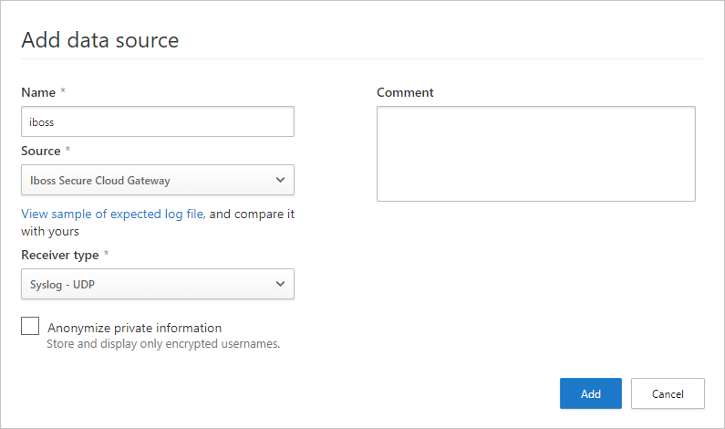

---
# required metadata

title: Integrate Cloud App Security with iboss
description: This article describes how to integrate Microsoft Cloud App Security with iboss secure cloud gateway for seamless Cloud Discovery and automated block of unsanctioned apps.
keywords:
author: rkarlin
ms.author: rkarlin
manager: barbkess
ms.date: 2/2/2019
ms.topic: conceptual
ms.collection: M365-security-compliance
ms.prod:
ms.service: cloud-app-security
ms.technology:
ms.assetid: 920d4272-685b-4c4d-9b31-94a2c6f3503e

# optional metadata

#ROBOTS:
#audience:
#ms.devlang:
ms.reviewer: reutam
ms.suite: ems
#ms.tgt_pltfrm:
ms.custom: seodec18

---
# Integrate Cloud App Security with iboss

*Applies to: Microsoft Cloud App Security*

If you work with both Cloud App Security and iboss, you can integrate the two products to enhance your security Cloud Discovery experience. iboss is a standalone secure cloud gateway that monitors your organization's traffic and enables you to set policies that block transactions. Together, Cloud App Security and iboss provide the following capabilities:

- Seamless deployment of Cloud Discovery - Use iboss to proxy your traffic and send it to Cloud App Security. This eliminates the need for installation of log collectors on your network endpoints to enable Cloud Discovery.
- iboss's block capabilities are automatically applied on apps you set as unsanctioned in Cloud App Security.
- Enhance your iboss admin portal with Cloud App Security's risk assessment of the top 100 cloud apps in your organization, which can be viewed directly in the iboss admin portal.

## Prerequisites

- A valid license for Microsoft Cloud App Security
- A valid license for iboss secure cloud gateway (release 9.1.100.0 or later)

## Deployment

1. In the Cloud App Security portal, perform the following integration steps:
    1. Click on the settings cog and select **Cloud Discovery settings**. 
    2. Select the **Automatic log upload** tab, and then **Add data source**.
    3. In the **Add data source** page, enter the following settings:

       - Name = iboss
       - Source = iboss Secure Cloud Gateway
       - Receiver type = Syslog - UDP

         

    4. Click **View sample of expected log file**. Then click **Download sample log** to view a sample discovery log, and make sure it matches your logs. 

3. Investigate cloud apps discovered on your network. For more information and investigation steps, see [Working with Cloud Discovery](working-with-cloud-discovery-data.md).

4. Any app that you set as unsanctioned in Cloud App Security will be pinged by iboss once every ten minutes, and then automatically blocked by iboss. For more information about unsanctioning apps, see [Sanctioning/unsanctioning an app](governance-discovery.md#BKMK_SanctionApp).

5. To configure iboss to send traffic logs to Microsoft Cloud App Security, contact iboss support.

## Next steps

[Control cloud apps with policies](control-cloud-apps-with-policies.md)

[Premier customers can also create a new support request directly in the Premier Portal.](https://premier.microsoft.com/)  
  
