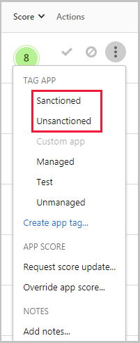
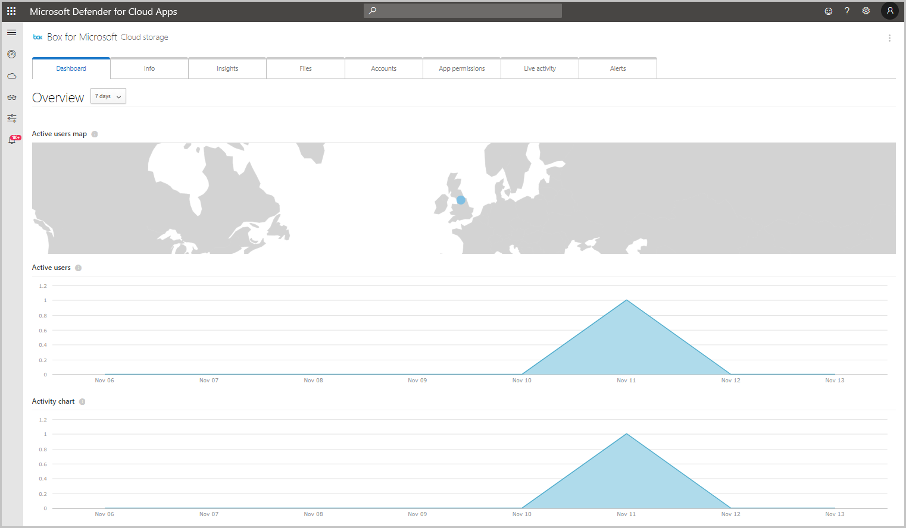
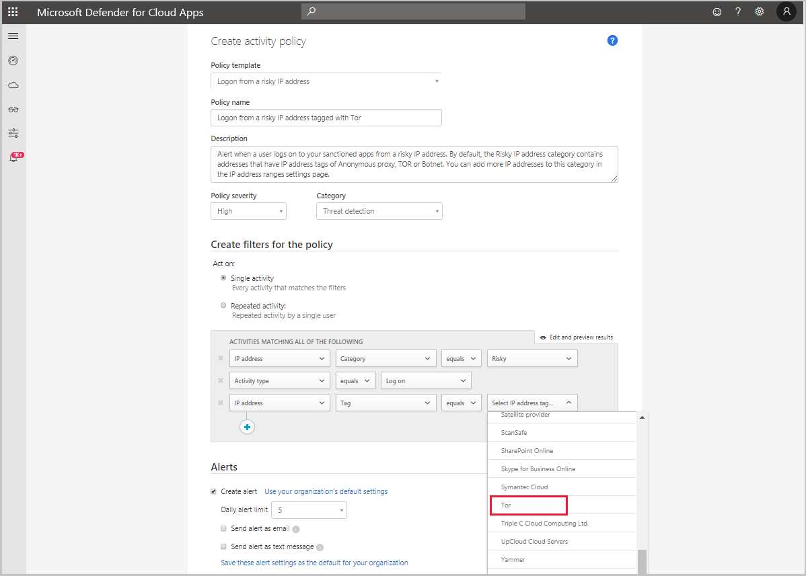

---
# required metadata

title: Investigate cloud app risks & suspicious activity - Cloud App Security
description: This article provides an outline of the process for investigating alerts, issues, and suspicious activities by using Cloud App Security.
keywords:
author: shsagir
ms.author: shsagir
manager: shsagir
ms.date: 11/18/2019
ms.topic: how-to
ms.collection: M365-security-compliance
ms.prod:
ms.service: cloud-app-security
ms.technology:

# optional metadata

#ROBOTS:
#audience:
#ms.devlang:
ms.reviewer: reutam
ms.suite: ems
#ms.tgt_pltfrm:
ms.custom: seodec18

---
# Investigate

*Applies to: Microsoft Cloud App Security*

After Microsoft Cloud App Security runs in your cloud environment, you'll need a stage of learning and investigating. Learn to use the Microsoft Cloud App Security tools to gain a deeper understanding of what's happening in your cloud environment. Based on your particular environment and how it's being used, you can identify the requirements for protecting your organization from risk. This article describes how to do an investigation to get a better understanding of your cloud environment.

## Dashboards

The following dashboards are available to help you investigate apps in your cloud environment:

|Dashboard|Description|
|---------------|-----------------|
|Main dashboard|Overview of cloud status (users, files, activities) and required actions (alerts, activity violations, and content violations).|
|App dashboard: overview|Overview of app usage per location, usage graphs per number of users.|
|App dashboard: info|Information about app details, security, and compliance.|
|App dashboard: insights  
*(where applicable)*|Analysis of data stored in the app, broken down by file type and file-sharing level.|
|App dashboard: files  
*(where applicable)*|Drill down into files; ability to filter according to owner, sharing level, and more. Perform governance actions like quarantine.|
|App dashboard: accounts|Overview of all accounts/users linked to the app.|
|App dashboard: OAuth apps  
*(where applicable)*|Drill down into OAuth apps currently deployed, like G Suite, and define policies.|
|App dashboard: activity log|Drill down into all app activity; ability to filter according to users, ip address, and more.|
|App dashboard: alerts|Drill down into all app alerts; ability to filter according to status, category, severity, and more.|
|App dashboard: special privileged accounts  
*(Salesforce only)*|Overview of users by privileged user type.|
|User dashboard|A complete overview of the user profile in the cloud, locations, recent activities, related alerts.|

## Tag apps as sanctioned or unsanctioned

An important step to understanding your cloud is to tag apps as sanctioned or unsanctioned. After you sanction an app, you can filter for apps that aren't sanctioned and start migration to sanctioned apps of the same type.

- In the Cloud App Security console, go to the App catalog or Discovered apps.

- In the list of apps, on the row in which the app you want to tag as sanctioned appears, choose the three dots at the end of the row  and choose **Mark as sanctioned**.

    

## Use the investigation tools

1. In the Cloud App Security portal, go to **Investigate** and then look at the **Activity log** and filter by a specific app. Check the following items:

    - Who is accessing your cloud environment?

    - From what IP ranges?

    - What is the admin activity?

    - From what locations are admins connecting?

    - Are any outdated devices connecting to your cloud environment?

    - Are failed logins coming from expected IP addresses?

2. Go to **Investigate** and then **Files**, and check the following items:

    - How many files are shared publicly so that anyone can access them without a link?

    - With which partners are you sharing files (outbound sharing)?

    - Do any files have a sensitive name?

    - Are any of the files being shared with someone's personal account?

3. Go to **Investigate** and then **Users and accounts**, and check the following items:

    - Have any accounts been inactive in a particular service for a long time? Maybe you can revoke the license for that user to that service.

    - Do you want to know which users have a specific role?

    - Was someone fired but they still have access to an app and can use that access to steal information?

    - Do you want to revoke a user's permission to a specific app or require a specific user to use multi-factor authentication?

    - You can drill down into the user's account by clicking the three dots at the end of the user's account row and selecting an action to take. Take an action such as **Suspend user** or **Remove user's collaborations**. If the user was imported from Azure Active Directory, you can also click on **Azure AD account settings** to get easy access to advanced user management features. Examples of management features include group management, MFA, details about the user's sign ins, and the ability to block sign in.

4. Go to **Investigate**, followed by **Connected apps** then select an app. The app dashboard opens and gives you information and insights. You can use the tabs across the top to check:

    - What kind of devices are your users using to connect to the app?

    - What types of files are they saving in the cloud?

    - What activity is happening in the app right now?

    - Are there any connected third-party apps to your environment?

    - Are you familiar with these apps?

    - Are they authorized for the level of access they're permitted?

    - How many users have deployed them? How common are these apps in general?

    

5. Go to the **Cloud Discovery dashboard** and check the following items:

    - What cloud apps are being used, to what extent, and by which users?

    - For what purposes are they being used?

    - How much data is being uploaded to these cloud apps?

    - In which categories do you have sanctioned cloud apps, and yet, users are using alternative solutions?

    - For the alternative solutions, do you want to unsanction any cloud apps in your organization?

    - Are there cloud apps that are used but not in compliance with your organization's policy?

## Sample investigation

Let's say that you assume you don't have any access to your cloud environment by risky IP addresses. As an example, let's say Tor. But you create a policy for risk IPs just to make sure:

1. In the portal, go to **Control** and choose **Templates**.

2. Choose the **Activity policy** for the **Type**.

3. At the end of the **Logon from a risky IP address** row, choose the plus sign (**+**) to create a new policy.

4. Change the policy name so you can identify it.

5. Under **Activities matching all of the following**, choose **+** to add a filter. Scroll down to **IP tag**, and then choose **Tor**.

    

Now that you have the policy in place, you're surprised to see that you get an alert that the policy was violated.

1. Go to the **Alerts** page and view the alert about the policy violation.

2. If you see that it looks like a real violation, you want to contain risk or remediate it.

    To contain risk, you can send the user a notification to ask if the violation was intentional and if the user was aware of it.

    You can also drill down into the alert and suspend the user until you can figure out what needs to be done.

3. If it's an allowed event that isn't likely to recur, you can dismiss the alert.

    If it's allowed and you expect it to recur, you can change the policy so that this type of event won't be considered a violation in the future.

## Next steps

To learn how to control your organization's cloud app, see [Control](control.md).

[!INCLUDE [Open support ticket](includes/support.md)].
