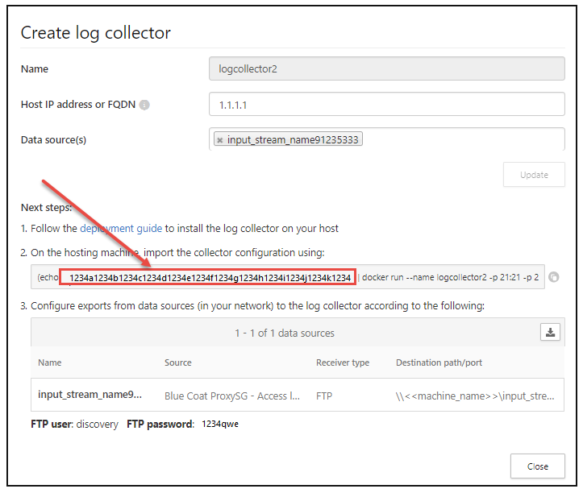

---
# required metadata

title: Enable the log collector behind a proxy - Cloud App Security | Microsoft Docs
description: This article provides information about how to enable the Cloud App Security Cloud Discovery log collector from behind a proxy.
keywords:
author: rkarlin
ms.author: rkarlin
manager: barbkess
ms.date: 2/2/2019
ms.topic: conceptual
ms.collection: M365-security-compliance
ms.prod:
ms.service: cloud-app-security
ms.technology:
ms.assetid: 6bde2a6c-60cc-4a7d-9e83-e8b81ac229b0

# optional metadata

#ROBOTS:
#audience:
#ms.devlang:
ms.reviewer: reutam
ms.suite: ems
#ms.tgt_pltfrm:
ms.custom: seodec18

---
# Enable the log collector behind a proxy

After you configured the log collector, if you are running behind a proxy, the log collector might have trouble sending data to Cloud App Security. This may happen because the log collector doesn't trust the proxy's root certificate authority and is not able to connect to Microsoft Cloud App Security to retrieve its configuration or upload the received logs.

>[!NOTE] 
> For information on how to change the certificates used by the log collector for Syslog or FTP, and to resolve connectivity issues from the firewalls and proxies to the log collector, see [Troubleshooting the Microsoft Cloud App Security Cloud Discovery deployment](troubleshoot-docker.md).
>

## Set up the log collector behind a proxy

Make sure you performed the necessary steps run Docker on a Windows or Linux machine and successfully download the Cloud App Security Docker image on the machine. For more information, see [Configure automatic log upload for continuous reports](discovery-docker.md).

### Validate Docker log collector container creation

In the shell, verify that the container was created and is running using the following command:

    bash
    docker ps

### Copy proxy root CA certificate to the container

From your virtual machine, copy the CA certificate to the Cloud App Security container. In the following example, the container is named *Ubuntu-LogCollector* and the CA certificate is named *Proxy-CA.crt*.
Run the command on the Ubuntu host. It copies the certificate to a folder in the running container:

    bash
    docker cp Proxy-CA.crt Ubuntu-LogCollector:/var/adallom/ftp/discovery

### Set the configuration to work with the CA certificate

1. Go into the container, using the following command. It will open bash in the log collector container:

        bash
        docker exec -it Ubuntu-LogCollector /bin/bash

2. From the bash inside the container, go to the Java jre directory. To avoid a version related path error, use this command:

       bash
       cd 'find /opt/jdk/*/jre -iname bin'

3. Import the root certificate that you copied earlier, from the *discovery* folder into the Java keystore and define a password. The default password is "changeit":

       bash
       ./keytool --import --noprompt --trustcacerts --alias SelfSignedCert --file /var/adallom/ftp/discovery/Proxy-CA.crt --keystore ../lib/security/cacerts --storepass changeit

4. Validate that the certificate was imported correctly into the CA keystore, by using the following command to search for the alias you provided during the import (*SelfSignedCert*):

       bash
       ./keytool --list --keystore ../lib/security/cacerts | grep self

You should see your imported proxy CA certificate.

### Set the log collector to run with the new configuration

The container is now ready. 

Run the **collector_config** command using the API token that you used during the creation of your log collector:

When you run the command, specify your own API token:

      bash
      collector_config abcd1234abcd1234abcd1234abcd1234 ${CONSOLE} ${COLLECTOR}

The log collector is now able to communicate with Cloud App Security. After sending data to it, the status will change from **Healthy** to **Connected** in the Cloud App Security portal.

>[!NOTE]
> If you have to update the configuration of the log collector, to add or remove a data source for example, you normally have to **delete** the container and perform the previous steps again. To avoid this, you can re-run the *collector_config* tool with the new API token generated in the Cloud App Security portal.

 
  
## Next steps 
[User activity policies](user-activity-policies.md)   

[Premier customers can also create a new support request directly in the Premier Portal.](https://premier.microsoft.com/)  
  
  
