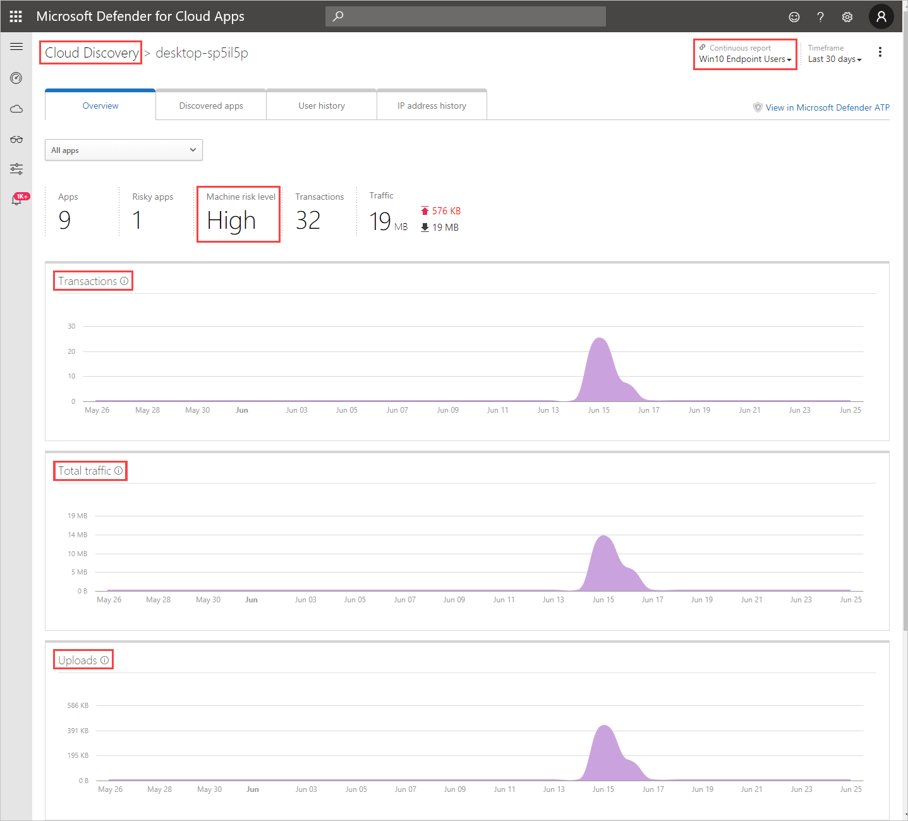
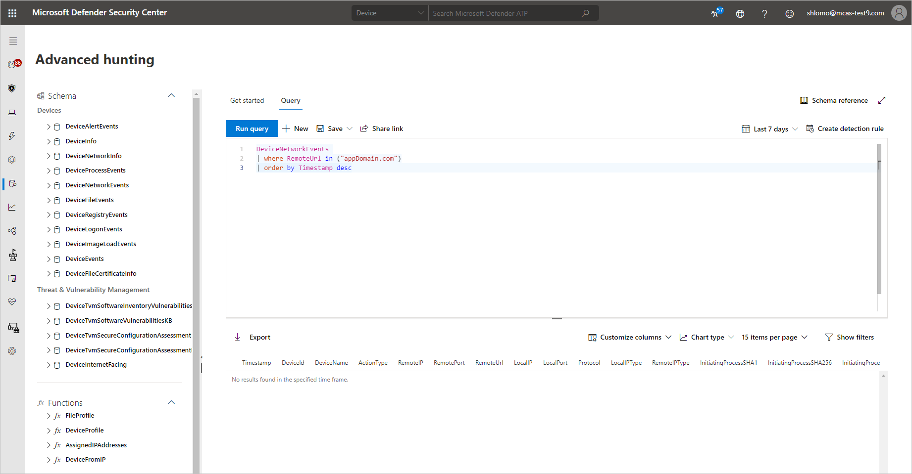

# Microsoft Defender for Endpoint integration with Microsoft Cloud App Security

[!INCLUDE [Banner for top of topics](includes/banner.md)]

Microsoft Cloud App Security integrates with Microsoft Defender for Endpoint natively. The integration simplifies roll out of Cloud Discovery, extends Cloud Discovery capabilities beyond your corporate network, and enables device-based investigation. [Microsoft Defender for Endpoint](/windows/security/threat-protection/microsoft-defender-atp/microsoft-defender-advanced-threat-protection) is a security platform for intelligent protection, detection, investigation, and response. Defender for Endpoint protects endpoints from cyber threats, detects advanced attacks and data breaches, automates security incidents, and improves security posture.

Cloud App Security uses the traffic information collected by Defender for Endpoint about the cloud apps and services being accessed from IT-managed Windows 10 devices. The native integration enables you to run Cloud Discovery on any device in the corporate network, using public Wi-Fi, while roaming, and over remote access. It also enables device-based investigation.

The integration doesn't require any additional deployment and works out of the box. You don't need to route or mirror traffic from your endpoints or do complex integration steps. Logs from your endpoints sent to Cloud App Security provide user information for traffic activities. Defender for Endpoint network activity provides device context. Pairing device context with the username provides a full picture across your network enabling you to determine which user did which activity from which device.

Additionally, when you identify a risky user, you can check all the devices the user accessed to detect potential risks. If you identify a risky device, check all the users who used it to detect further potential risks.

Once traffic information is collected, you are ready to [deep dive into cloud app use](discovered-apps.md#deep-dive-into-discovered-apps) in your organization. Cloud App Security takes advantage of Defender for Endpoint Network Protection capabilities to block endpoint device access to cloud apps. You can block apps by [tagging them as **Unsanctioned**](governance-discovery.md#BKMK_SanctionApp) in the portal. Based on the comprehensive usage and risk assessment of each unsanctioned app, the app's domains are used to create [domain indicators](/windows/security/threat-protection/microsoft-defender-atp/manage-indicators#create-indicators-for-ips-and-urlsdomains-preview) in the Defender for Endpoint portal. Microsoft Defender Antivirus, running on endpoint devices, uses the domain indicators to block access to these apps.

> [!NOTE]
> Want to experience Microsoft Defender for Endpoint? [Sign up for a free trial](https://www.microsoft.com/WindowsForBusiness/windows-atp?ocid=docs-wdatp-assignaccess-abovefoldlink).

## Prerequisites

- Microsoft Cloud App Security license
- Microsoft Defender for Endpoint license
- Windows 10 version 1709 (OS Build 16299.1085 with KB4493441), Windows 10 version 1803 (OS Build 17134.704 with KB4493464), Windows 10 version 1809 (OS Build 17763.379 with KB4489899) or later Windows 10 versions
- Microsoft Defender Antivirus
  - [Real-time protection enabled](/windows/security/threat-protection/windows-defender-antivirus/configure-real-time-protection-windows-defender-antivirus)
  - [Cloud-delivered protection enabled](/windows/security/threat-protection/windows-defender-antivirus/enable-cloud-protection-windows-defender-antivirus)
  - [Network protection enabled and configured to block mode](/windows/security/threat-protection/microsoft-defender-atp/enable-network-protection)

## How it works

On its own, Cloud App Security collects logs from your endpoints using either [logs you upload](create-snapshot-cloud-discovery-reports.md) or by [configuring automatic log upload](discovery-docker.md). Native integration enables you to take advantage of the logs Defender for Endpoint's agent creates when it runs on Windows and monitors network transactions. Use this information for Shadow IT discovery across the Windows devices on your network.

To enable you to perform Cloud Discovery across other platforms, it's best to use both the Cloud App Security [log collector](discovery-docker.md), along with Defender for Endpoint integration to monitor your Windows 10 devices.

[Watch our videos](#related-videos) showing the benefits of using Defender for Endpoint with Cloud App Security.

## How to integrate Microsoft Defender for Endpoint with Cloud App Security

To enable Defender for Endpoint integration with Cloud App Security:

1. In [Microsoft 365 Defender](https://security.microsoft.com/), from the navigation pane, select **Settings**.
2. Under **General**, select **Advanced features**.
3. Toggle the **Microsoft Cloud App Security** to **On**.
4. Click **Apply**.

    >[!NOTE]
    > It takes up to two hours after you enable the integration for the data to show up in Cloud App Security.
    >

    

To configure the severity for alerts sent to Microsoft Defender for Endpoint:

1. In Cloud App Security, click the **Settings** icon, and then select **Microsoft Defender for Endpoint**.
1. Under **Alerts**, select the global severity level for alerts.
1. Click **Save**.

    

## Investigate devices in Cloud App Security

After you integrate Defender for Endpoint with Cloud App Security, you can investigate discovered device data in the Cloud Discovery dashboard.

1. In Cloud App Security, click **Cloud Discovery** and then **Cloud Discovery dashboard**.
2. In the top navigation bar, under **Continuous reports**, select **Win10 endpoint users**.
  
3. Across the top, you'll see the number of discovered devices added after the integration.
4. Click the **Devices** tab.
5. You can drill down into each device that's listed, and use the tabs to view the investigation data. Find correlations between the devices, the users, IP addresses, and apps that were involved in incidents:

    - **Overview**
        - **Device risk level**: Shows how risky the device's profile is relative to other devices in your organization, as indicated by the severity (high, medium, low, informational). Cloud App Security uses device profiles from Defender for Endpoint for each device based on advanced analytics. Activity that is anomalous to a device's baseline is evaluated and determines the device's risk level. Use the device risk level to determine which devices to investigate first.
        - **Transactions**: Information about the number of transactions that took place on the device over the selected period of time.
        - **Total traffic**: Information about the total amount of traffic (in MB) over the selected period of time.
        - Uploads: Information about the total amount of traffic (in MB) uploaded by the device over the selected period of time.
        - **Downloads**: Information about the total amount of traffic (in MB) downloaded by the device over the selected period of time.
    - **Discovered apps**  
    Lists all the discovered apps that were accessed by the device.
    - **User history**  
    Lists all the users who signed in to the device.
    - **IP address history**  
    Lists all the IP addresses that were assigned to the device.
 

As with any other Cloud Discovery source, you can export the data from the Win10 endpoint users report for further investigation.

> [!NOTE]
>
> - Defender for Endpoint sends reports every hour, with a maximum daily bandwidth of 4 MB (~4000 transactions) per endpoint.
> - If the endpoint device is behind a forward proxy, traffic data will not be visible to Defender for Endpoints and hence will not be included in Cloud Discovery reports. We recommend to routing the forward proxy's logs to Cloud App Security using the **Automated log upload** in order to get complete visibility. For an alternative way to view this traffic and investigate accessed URLs by devices behind the forward proxy, see [Monitoring network connection behind forward proxy](https://techcommunity.microsoft.com/t5/Microsoft-Defender-ATP/MDATP-Monitoring-network-connection-behind-forward-proxy-Public/ba-p/758274).

## Investigate device network events in Defender for Endpoint

Use the following steps to gain more granular visibility on device's network activity in Microsoft Defender for Endpoint:

1. In Cloud App Security, under **Discovery** and then select **Devices**.
1. Select the machine you want to investigate and then in the top-right click **View in Microsoft Defender for Endpoint**.
1. In Microsoft 365 Defender, under **Devices** > {selected device}, select **Timeline**.
1. Under **Filters**, select **Network events**.
1. Investigate the device's network events as required.

    

## Investigate app usage in Defender for Endpoint with advanced hunting

Use the following steps to gain more granular visibility on app-related network events in Defender for Endpoint:

1. In Cloud App Security, under **Discovery** and then select **Discovered**.
1. Click on the app you want to investigate to open its drawer.
1. Click on the app's **Domain** list and then copy the list of domains.
1. In Microsoft 365 Defender, under **Devices**, select **Advanced hunting**.
1. Paste the following query and replace `<DOMAIN_LIST>` with the list of domains you copied earlier.

    ```kusto
    DeviceNetworkEvents
    | where RemoteUrl in ("<DOMAIN_LIST>")
    | order by Timestamp desc
    ```

    >[!NOTE]
    >Network events are meant for the investigation of discovered apps in MCAS only. They don't represent the raw data that Cloud App Security uses for Shadow IT discovery.

1. Run the query and investigate network events for this app.

    

## Block access to unsanctioned cloud apps

Cloud App Security uses the built-in [**Unsanctioned**](governance-discovery.md#BKMK_SanctionApp) app tag to mark cloud apps as prohibited for use, available in both the Cloud Discovery and Cloud app catalog pages. By enabling the integration with Defender for Endpoint, you can seamlessly block access to unsanctioned apps with a single click in the Cloud App Security portal.

### How blocking works

Apps marked as **Unsanctioned** in Cloud App Security are automatically synced to Defender for Endpoint, usually within a few minutes. More specifically, the domains used by these unsanctioned apps are propagated to endpoint devices to be blocked by Microsoft Defender Antivirus within the Network Protection SLA.

### How to enable cloud app blocking with Defender for Endpoint

Use the following steps to enable access control for cloud apps:

1. In Cloud App Security, under the settings cog, select **Settings**, under **Cloud Discovery** select **Microsoft Defender for Endpoint**, and then select **Block unsanctioned apps**.

    

1. In Microsoft 365 Defender, go to **Settings** > **Advanced features**, and then select **Custom network indicators**. For information about network indicators, see [Create indicators for IPs and URLs/domains](/windows/security/threat-protection/microsoft-defender-atp/manage-indicators#create-indicators-for-ips-and-urlsdomains-preview).

    This allows you to leverage Microsoft Defender Antivirus network protection capabilities to block access to a predefined set of URLs using Cloud App Security, either by manually assigning [app tags](governance-discovery.md#BKMK_SanctionApp) to specific apps or automatically using an [app discovery policy](cloud-discovery-policies.md#creating-an-app-discovery-policy).

    

## Investigate unsanctioned apps in Microsoft 365 Defender

Every attempt to access an unsanctioned app triggers an alert in Microsoft 365 Defender with in-depth details about the entire session. This enables you to perform deeper investigations into attempts to access unsanctioned apps, as well as providing additional relevant information for use in endpoint device investigation.

Sometimes, access to an unsanctioned app is not blocked, either because the endpoint device is not configured correctly or if the enforcement policy has not yet propagated to the endpoint. In this instance, Defender for Endpoint administrators will receive an alert in Microsoft 365 Defender that the unsanctioned app was not blocked.


> [!NOTE]
>
> - It takes up to two hours after you tag an app as **Unsanctioned** for app domains to propagate to endpoint devices.
> - By default, apps and domains marked as **Unsanctioned** in Cloud App Security, will be blocked for all endpoint devices in the organization.
> - Currently, full URLs are not supported for unsanctioned apps. Therefore, when unsanctioning apps configured with full URLs, they are not propagated to Defender for Endpoint and will not be blocked. For example, `google.com/drive` is not supported, while `drive.google.com` is supported.
> - In-browser notifications may vary between different browsers.

## Next steps

> [!div class="nextstepaction"]
> [Control cloud apps with policies](control-cloud-apps-with-policies.md)

## Related videos

> [!div class="nextstepaction"]
> [Discover and block Shadow IT using Defender for Endpoint](https://www.youtube.com/watch?v=MsHkTOoqSQo)

> [!div class="nextstepaction"]
> [Shadow IT discovery beyond the corporate network](https://www.youtube.com/watch?v=f8hbvbY1Hnc)

[!INCLUDE [Open support ticket](includes/support.md)]
