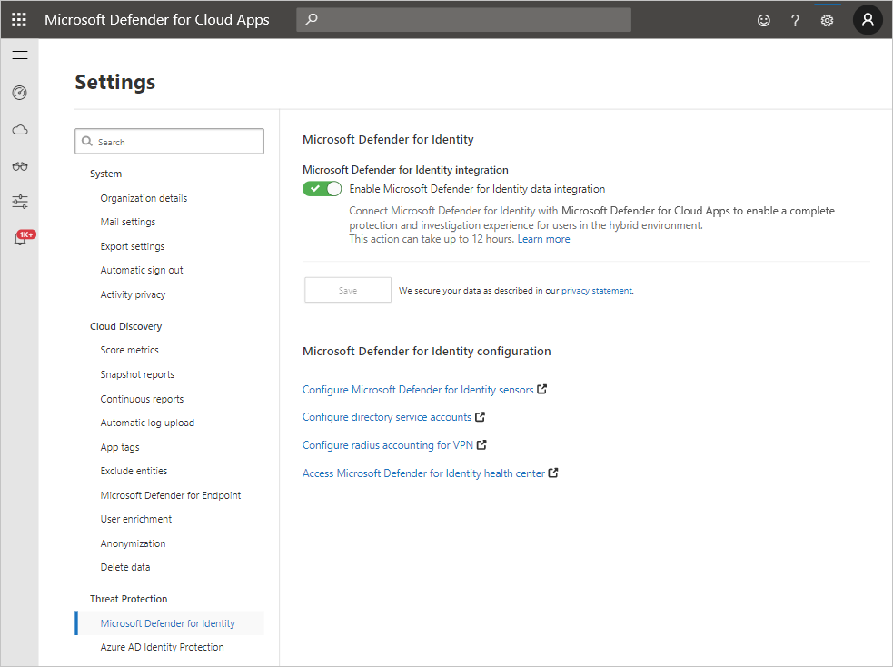

# Microsoft Defender for Identity integration

[!INCLUDE [Banner for top of topics](includes/banner.md)]

Microsoft Cloud App Security integrates with Microsoft Defender for Identity to provide user entity behavioral analytics (UEBA) across a hybrid environment - both cloud app and on-premises, for more information, see [Tutorial: Investigate risky users](tutorial-ueba.md). For more information about the machine learning and behavioral analytics provided by Defender for Identity, see [What is Defender for Identity?](/defender-for-identity/what-is)

## Prerequisites

For complete user investigation across a hybrid environment, you must have:

- A valid license for Microsoft Defender for Identity connected to your Active Directory instance
- You must be an Azure Active Directory global admin to enable integration between Defender for Identity and Cloud App Security

> [!NOTE]
>
> - If you don't have a subscription for Microsoft Cloud App Security, you will still be able to use Cloud App Security to get Defender for Identity insights.
> - Defender for Identity administrators may require new permissions to access Cloud App Security. To learn how to assign permissions to Cloud App Security, see [Manage admin access](manage-admins.md).

## Enable Defender for Identity

To enable Cloud App Security integration with Defender for Identity:

1. In Cloud App Security, under the settings cog, select **Settings**.

    

1. Under **Threat Protection**, select **Microsoft Defender for Identity**.

    

1. Select **Enable Microsoft Defender for Identity data integration** and then click **Save**.

> [!NOTE]
> It may take up to 12 hours until the integration takes effect.

After enabling Defender for Identity integration, you'll be able to see on-premises activities for all the users in your organization. You will also get advanced insights on your users that combine alerts and suspicious activities across your cloud and on-premises environments. Additionally, policies from Defender for Identity will appear on the Cloud App Security policies page. For a list of Defender for Identity policies, see [Security Alerts](/defender-for-identity/suspicious-activity-guide).

You should also use the **Defender for Identity configuration** links to configure Defender for Identity settings that are relevant to Cloud App Security. Use the following information to learn more about these settings:

- [Configure Microsoft Defender for Identity sensors](/defender-for-identity/install-step5)
- [Configure directory service accounts](/defender-for-identity/install-step2)
- [Configure radius accounting for VPN](/defender-for-identity/install-step6-vpn)
- [Access Microsoft Defender for Identity health center](/defender-for-identity/health-center)

## Disable Defender for Identity

To disable Cloud App Security integration with Defender for Identity:

1. In Cloud App Security, under the settings cog, select **Settings**.

1. Under **Threat Protection**, select **Microsoft Defender for Identity**.

1. Clear **Enable Microsoft Defender for Identity data integration** and then click **Save**.

> [!NOTE]
> When the integration is disabled, existing Defender for Identity data is kept in accordance with Cloud App Security retention policies but the Identity Security Posture assessments section is removed.

## Known issues

### Missing SIEM alert updates

This issue affects alerts that are triggered more than once. The first instance of the alert is sent to the SIEM, but subsequent triggers of the same alert are not sent.

#### Resolution

No known resolution.

## Next steps

> [!div class="nextstepaction"]
> [Control cloud apps with policies](control-cloud-apps-with-policies.md)

[!INCLUDE [Open support ticket](includes/support.md)]