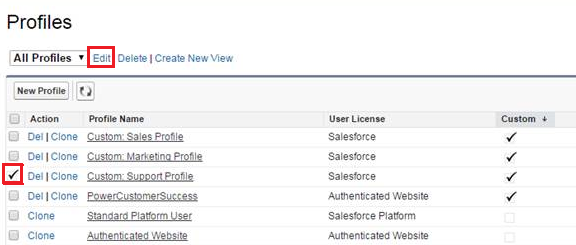
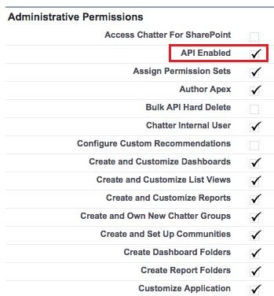
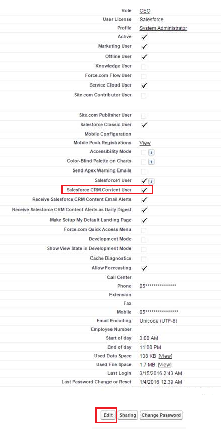
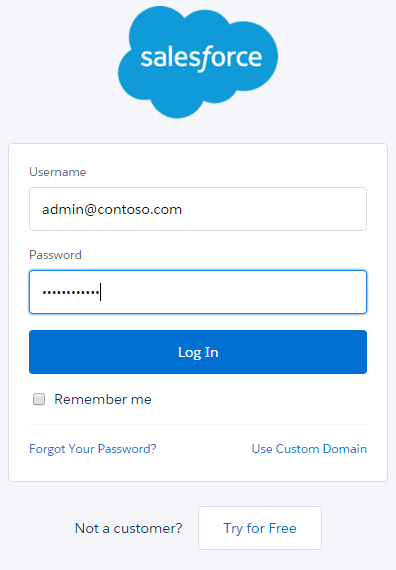

# Connect Salesforce to Microsoft Cloud App Security
  This section provides instructions for connecting [!INCLUDE[Adallom](../migration/includes/adallom_md.md)] to your existing Salesforce account using the app connector API.  
  
## How to connect Salesforce to Cloud App Security  
  
1.  It is recommended to have a dedicated service admin account for [!INCLUDE[Adallom](../migration/includes/adallom_md.md)].  
  
2.  Validate that REST API is enabled in Salesforce.  
  
     Your Salesforce account must be one of the following editions that include REST API support:  
  
     **Performance**, **Enterprise**, **Unlimited** or **Developer**.  
  
     The **Professional** edition does not have REST API by default, but it can be added on demand.  
  
     Check to see that your edition has REST API available and enabled as follows:  
  
    -   Log in to your Salesforce account and go to the **Setup** page.  
  
    -   Under **Manage Users**, go to the **Profiles** page.  
  
           
  
    -   Choose the profile you are using to deploy [!INCLUDE[Adallom](../migration/includes/adallom_md.md)] and click **Edit**.  
  
           
  
    -   Make sure you have the **API Enabled** checkbox selected. If it is not selected, you may need to contact Salesforce to add it to your account.  
  
           
  
3.  If your organization has **Salesforce CRM Content** enabled, make sure that the current administrative account has it enabled as well.  
  
    1.  Go to your Salesforce setup page.  
  
           
  
    2.  From the side-menu, select **Manage Users** and then click **Users**.  
  
           
  
    3.  Select the current administrative user to your dedicated [!INCLUDE[Adallom](../migration/includes/adallom_md.md)] user.  
  
    4.  Make sure that the **Salesforce CRM Content User** checkbox is selected.  
  
         If it is not selected, click **Edit** and then check the checkbox.  
  
           
  
    5.  Click **Save**.  
  
4.  In the [!INCLUDE[Adallom](../migration/includes/adallom_md.md)] console, click **Investigate** and then **Sanctioned apps**.  
  
5.  In the Box row, click **Connect** in the **App Connector status** column, or click the **Connect an app** button followed by **Salesforce**.  
  
       
  
6.  In the Salesforce settings page, on the API tab, click **Follow this link**, depending on which instance you want to install.  
  
7.  This opens the Salesforce logon page. Enter your credentials to allow [!INCLUDE[Adallom](../migration/includes/adallom_md.md)] access to your team's Salesforce app.  
  
       
  
8.  Salesforce will ask you if you want to allow [!INCLUDE[Adallom](../migration/includes/adallom_md.md)] access to your team information and activity log and perform any activity as any team member. To proceed, click **Allow**.  
  
9. At this point, you will receive a success or failure notice regarding the deployment. [!INCLUDE[Adallom](../migration/includes/adallom_md.md)] is now authorized in Salesforce.com.  
  
10. Back in the [!INCLUDE[Adallom](../migration/includes/adallom_md.md)] console, you should see the Salesforce was successfully connected message.  
  
11. Make sure the connection succeeded by clicking **Test API**.  
  
     Testing may take a couple of minutes. After receiving a success notice, click **Done**.  
  
  
  After connecting SalesForce, you will receive Events as follows: Triggers from the moment of connection, Login events and Setup Audit Trail for 60 days prior to connection, EventMonitoring 30 days or 1 day back - depending on your SalesForce EventMonitoring license.
  
## See Also  
 [Control cloud apps with policies](../migration/control-cloud-apps-with-policies.md)   
 [For technical support, please visit the Cloud App Security assisted support page.](http://support.microsoft.com/oas/default.aspx?prid=16031)   
 [Premier customers can also choose Cloud App Security directly from the Premier Portal.](https://premier.microsoft.com/)  
  
  