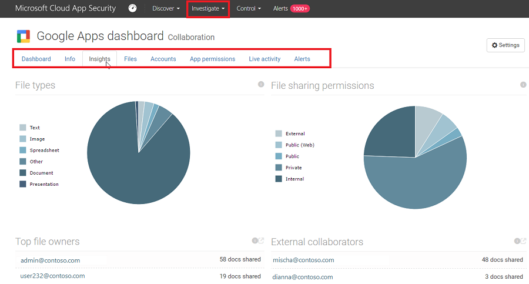
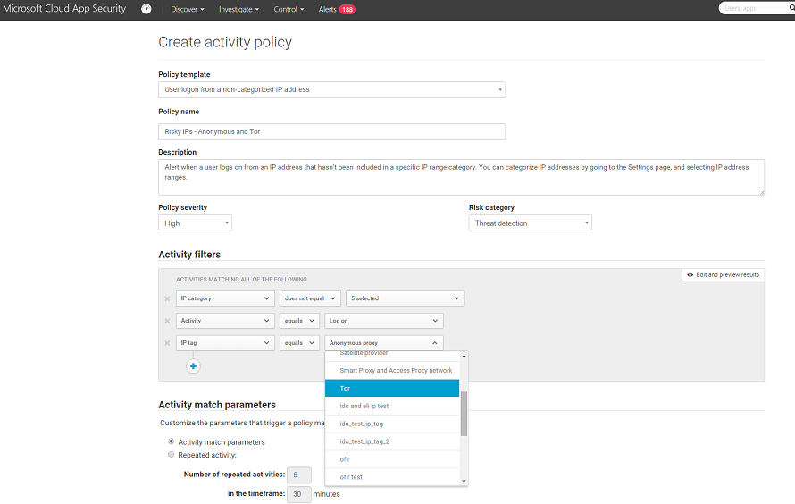

# Investigate
  After [!INCLUDE[Adallom](../migration/includes/adallom_md.md)] runs on your cloud environment, you will require a stage of learning and investigating using [!INCLUDE[Adallom](../migration/includes/adallom_md.md)]'s tools to gain deeper  understanding of what's happening in your cloud environment. Then based on your particular environment and how it's being used, you can identify the requirements necessary to protect your organization from risk.  
  
 This section describes how to perform deep dive investigation to get a better understanding of what's going on in your cloud environment.  
  
## Dashboards  
 The following dashboards are available to help you investigate what's going on with apps in your cloud environment:  
  
|Dashboard|Description|  
|---------------|-----------------|  
|Main dashboard|Overview of cloud status (users, files, activities) as well as required actions (alerts, activity violations and content violations)|  
|Application dashboard - overall|Overview of application usage per location, usage graphs per number of users|  
|Application dashboard – insights|Analysis of data stored in the app; broken down by files type and file sharing level|  
|Application dashboard – files|Drill down into files, ability to filter according to owner, sharing level etc. as well as perform governance actions (such as quarantine)|  
|Application dashboard – 3rd party apps|Drill down into 3rd party apps currently deployed, such as Google Apps and define policies for them|  
|User dashboard|A complete overview of the user profile in the cloud including groups, locations, recent activities, related alerts and browsers used|  
  
##   Sanction or unsanction apps  
 The first step to understanding your cloud is to sanction apps. After you sanction an app, you can filter for apps that aren't sanctioned and initiate migration to sanctioned apps of the  same type.  
  
-   In the [!INCLUDE[Adallom](../migration/includes/adallom_md.md)] console, click on **Discover** and then **Discovery dashboard**.  
  
-   In the list of discovered apps, on the row in which the app you want to sanction appears, click on the three dots at the end of the row  and select **Mark as sanctioned**.  
  
       
  
> [!NOTE]  
>  For each app you want to monitor with the [!INCLUDE[Adallom](../migration/includes/adallom_md.md)] API integration, we recommend creating a admin service account dedicated to [!INCLUDE[Adallom](../migration/includes/adallom_md.md)].  
  
## Use the investigation tools  
  
1.  In the [!INCLUDE[Adallom](../migration/includes/adallom_md.md)] portal, go to **Investigate** and then look at the **Activity log** and filter by a specific app. Check the following:  
  
    -   Who is accessing your cloud environment?  
  
    -   From what IP ranges?  
  
    -   What is the admin activity?  
  
    -   From what locations are admins connecting?  
  
    -   Are there any outdated devices connecting to your cloud environment?  
  
    -   Are failed logins coming from expected IP addresses?  
  
2.  Go to **Investigate** and then **Files**, and check the following:  
  
    -   How many files are shared publicly so that anyone can access them without a link?  
  
    -   With which partners are you sharing files? (outbound sharing)  
  
    -   Are there any files that contain a sensitive name?  
  
    -   Are any of the files being shared with someone's personal account?  
  
3.  Go to **Investigate** and then **Accounts**, and check the following:  
  
    -   Are there any accounts that have not been active in a particular service for a long time, maybe you can revoke the license for that user to that service?  
  
    -   Do you want to know which users have a specific role?  
  
    -   Was someone fired but they still have access to an app and can use that access to steal information?  
  
    -   Do you want to revoke a user's permission to a specific app or require a specific user to perform multi-factor authentication?  
  
4.  Go to **Investigate** and then select an app. You will get to the App dashboard which gives you information and insights so that you can use the tabs across the top to check the following:  
  
       
  
    -   What kind of devices are your users using to connect to the app?  
  
    -   What types of files are they saving in the cloud?  
  
    -   What activity is happening in the app right now?  
  
    -   Are there any connected 3rd party apps to your environment?  
  
    -   Are you familiar with these apps?  
  
    -   Are they authorized for the level of access they are permitted to?  
  
    -   How many users have deployed them? How common are these apps in general?  
  
5.  Go to the **Cloud Discovery dashboard** and check the following:  
  
    -   What cloud apps are being used, to what extent and by whom?  
  
    -   For what purposes are they being used?  
  
    -   How much data is being uploaded to these cloud apps?  
  
    -   In which categories do you have sanctioned cloud apps, and yet, users are using alternative solutions?  
  
    -   For the alternative solution, are there cloud apps that you want to unsanction in your organization?  
  
    -   Are there cloud apps that are used but not in compliance with your organization’s policy?  
  
## How to use reports to investigate risk  
 When you start trying to gain control over your cloud environment, you make certain assumptions based on what you expect to find - you don't really know your cloud yet. And based on these assumptions, you create policies. Then, after [!INCLUDE[Adallom](../migration/includes/adallom_md.md)] runs on your cloud environment, you can use the built-in reports (as well as custom reports) to see what's really going on in your cloud, and based on this, you adjust your policies again to include exceptions so that eventually your policy catches very few things that are false positives.  
  
 Built-in reports offer you aggregated views for investigation.  
  
 To work with Built-in Reports, go to **Investigate** and then **Built-in reports**. For more information about the various built-in reports, see the [Built-in report reference](../migration/built-in-report-reference.md).  
  
## Sample investigation  
 Let's say that you assume you don't have any access to your cloud environment by risky IP addresses (for example, Anonymous proxies and Tor). But you create a Risky IP policy just to make sure:  
  
1.  In the portal, go to **Control** and select **Policies**.  
  
2.  In the **Policy center**, click the **Templates** tab.  
  
3.  At the end of the **User logon from a non-categorized IP address** row, click the **+** to create a new policy.  
  
4.  Change the policy name so you'll be able to identify this policy.  
  
5.  Under **Activity filters**, click the **+** to add a filter. Scroll down to **IP tag** and then select **Anonymous** and **Tor**.  
  
       
  
 Now that you have the policy in place, you're surprised to see that you get an alert that the policy was violated.  
  
1.  Go to the **Alerts** page and view the alert about the policy violation.  
  
2.  If you see that it looks like a real violation, you want to contain risk or remediate.  
  
     To contain risk, you can send the user a notification to ask if the violation was intentional and if the user was aware of it.  
  
     You can also drill down into the alert and suspend the user until you can figure out what needs to be done.  
  
3.  If it's an allowed event that isn't likely to recur, you can dismiss the alert.  
  
     If it's allowed and you expect it to recur, you can modify the policy to avoid this type of event being considered a violation in the future.  
  
## See Also  
 [Control](../migration/control.md)   
 [For technical support, please visit the Cloud App Security assisted support page.](http://support.microsoft.com/oas/default.aspx?prid=16031)   
 [Premier customers can also choose Cloud App Security directly from the Premier Portal.](https://premier.microsoft.com/)  
  
  