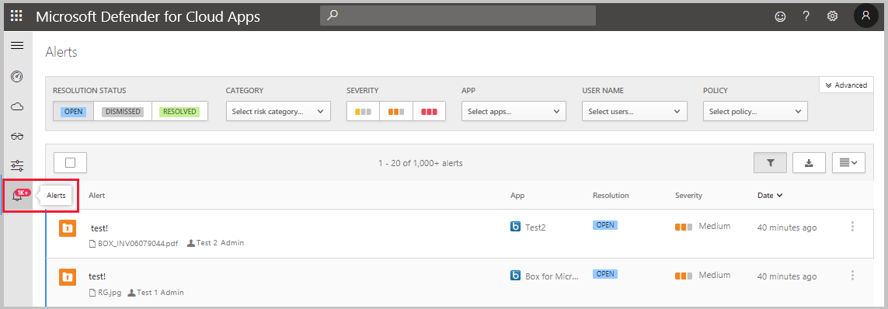

---
# required metadata

title: Working with alerts in Cloud App Security | Microsoft Docs
description: This topic provides a list and description of all alerts.
keywords:
author: rkarlin
ms.author: rkarlin
manager: mbaldwin
ms.date: 1/23/2017
ms.topic: article
ms.prod:
ms.service: cloud-app-security
ms.technology:
ms.assetid: f118a3bf-1663-46ba-884f-b1b03a84ab66

# optional metadata

#ROBOTS:
#audience:
#ms.devlang:
ms.reviewer: reutam
ms.suite: ems
#ms.tgt_pltfrm:
#ms.custom:

---

# Alerts
To view alerts:

In the Cloud App Security portal, click on Alerts.

The following alerts types will be displayed. 

## Built-in alerts

|Alert name|AlertID|Description|
|----|----|----|
|New location|ALERT_GEOLOCATION_NEW_COUNTRY|A new location was detected since the scan began (up to 6 months). This only shows up once for each country for your entire organization. |
|New admin user|ALERT_ADMIN_USER|A new admin was detected for a specific app – this can be someone who is an admin in one application and is now an admin for another application. This alert relates to the specific admin type, so it will show up each time the type of admin changes. If a user lost admin privileges and then got them again, this alert will be displayed.|
|Inactive account|ALERT_ZOMBIE_USER|If a user is inactive for 60 days per application – for example, if someone is active in Box but hasn't touched Google Apps for 60 days, the user will be considered inactive in Google Apps. A tag is added to these users so you can search for inactive accounts.|
|Unexpected admin location|ALERT_NEW_ADMIN_LOCATION|A new location was detected for administrators since the scan began (up to 6 months). This only shows up once for each country for any admin across your organization. |
|Compromised account|ALERT_COMPROMISED_ACCOUNT|If there was a breach in an application, and the list of breached accounts is published, Cloud App Security downloads the list and compares it to your list of users - including internal users, external users and personal accounts. |

## Custom Alerts

|Alert name|AlertID|Description|
|----|----|----|
|Suspicious activity alert|ALERT_SUSPICIOUS_ACTIVITY|Suspicious activities are scored according to how suspicious the anomalous activity is (Is there an inactive account involved? Is it from a new location?) These criteria are all calculated together to provide a risk score based on the following risk factors:  User is administrator  Strictly remote user Anonymous proxy  Entire session is failed logins Numerous failed login New (admin) IP/ISP/country/user-agent for user/tenant  IP/ISP/country/user-agent used only by (admin) user First (admin) user activity in a while First time this particular administrative activity is performed in a while This particular administrative activity is not common / was never performed before This IP had only failed logins in the past Impossible travel|
|Suspicious cloud use alert|ALERT_DISCOVERY_ANOMALY_DETECTION|Cloud Discovery anomaly detection checks the pattern of regular behavior and looks for users or apps that are used in an unusual way. |
|Activity policy violation|ALERT_CABINET_EVENT_MATCH_AUDIT|This alert lets you know when a policy match was detected.|
|File policy violation|ALERT_CABINET_EVENT_MATCH_FILE|This alert lets you know when a policy match was detected.|
|Proxy policy violation|ALERT_CABINET_INLINE_EVENT_MATCH|This alert lets you know when a policy match was detected.|
|Field policy violation|ALERT_CABINET_EVENT_MATCH_OBJECT|This alert lets you know when a policy match was detected.|
|New service discovered|ALERT_CABINET_DISCOVERY_NEW_SERVICE|A new app was discovered.|
|Use of personal account|ALERT_PERSONAL_USER_SAGE|Based on file shares and user names, the detection engine searches for personal accounts. |

## See Also  
[Daily activities to protect your cloud environment](daily-activities-to-protect-your-cloud-environment.md)   
[For technical support, please visit the Cloud App Security assisted support page.](http://support.microsoft.com/oas/default.aspx?prid=16031)   
[Premier customers can also choose Cloud App Security directly from the Premier Portal.](https://premier.microsoft.com/)  
  
  