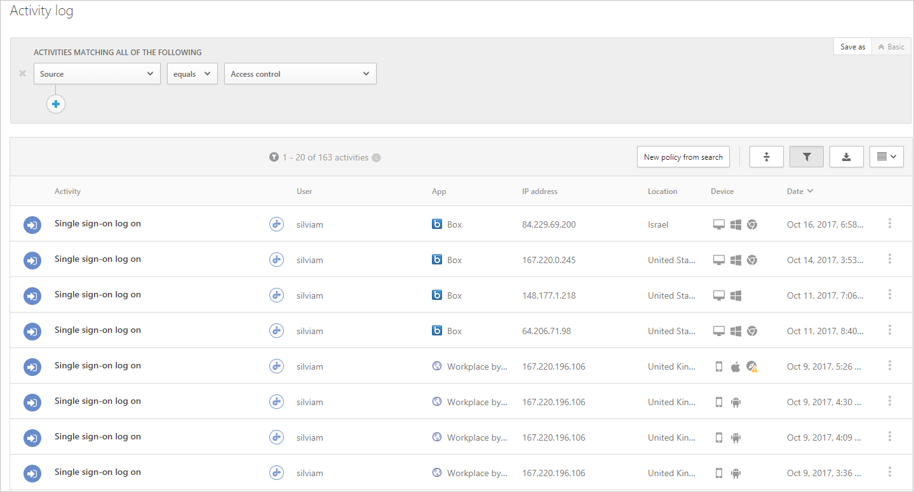

---
# required metadata

title: Deploy Cloud App Security Conditional Access App Control for Azure AD apps
description: This article provides information about how to deploy the Microsoft Cloud App Security Conditional Access App Control reverse proxy features for Azure AD apps.
keywords:
author: shsagir
ms.author: shsagir
manager: shsagir
ms.date: 9/23/2019
ms.topic: conceptual
ms.collection: M365-security-compliance
ms.service: cloud-app-security

# optional metadata

#ROBOTS:
#audience:
ms.suite: ems
---
# Deploy Conditional Access App Control for featured apps

*Applies to: Microsoft Cloud App Security*

>[!div class="step-by-step"]
[« Previous: Introduction to Conditional Access App Control](proxy-intro-aad.md) 
[Next: Onboard and deploy Conditional Access App Control for any app »](proxy-deployment-any-app.md)

Session controls in Microsoft Cloud App Security work with the featured apps. For a list of apps that are featured by Cloud App Security to work out-of-the-box, see [Protect apps with Microsoft Cloud App Security Conditional Access App Control](proxy-intro-aad.md#featured-apps).

## Prerequisites

To deploy Conditional Access App Control for Azure AD apps, you need a valid [license for Azure AD Premium P1](https://docs.microsoft.com/azure/active-directory/license-users-groups) as well as a Cloud App Security license.

## To deploy featured apps

Follow these steps to configure featured apps to be controlled by Microsoft Cloud App Security Conditional Access App Control.

**Step 1: [Go to the Azure AD portal and create a conditional access policy for the apps and route the session to Cloud App Security](#add-azure-ad)**

**Step 2: [Sign in to each app using a user scoped to the policy](#sign-in-scoped)**

**Step 3: [Verify the apps are configured to use access and session controls](#portal)**

**Step 4: [Test the deployment](#test)**

## Step 1: Create an Azure AD conditional access test policy 

1. In Azure Active Directory, under **Security**, click **Conditional Access**.

1. Click **New policy** and create a new policy.

1. In the TEST policy, under **Users**, assign a test user or user that can be used for an initial sign-on and verification.

1. In the TEST policy, under **Cloud app**, assign the apps you want to control with Conditional Access App Control.

1. Under **Session**, set the policy to use either of the built-in policies, **Monitor only** or **Block downloads**. Or select **Use custom policy** to set an advanced policy in the Cloud App Security portal.

1. Add any applicable **Condition assignments** or **Grant controls** (optional).

    

1. Click **Enable** and **Save**.

## Step 2: Sign in to each app using a user scoped to the policy

> [!NOTE]
> Before proceeding, make sure to first sign out of existing sessions.

After you've created the policy, sign in to each app configured in that policy. Make sure you sign in using a user configured in the policy.

Cloud App Security will sync your policy details to its servers for each new app you sign in to. This may take up to one minute.

## Step 3: Verify the apps are configured to use access and session controls

The instructions above helped you create a built-in Cloud App Security policy for featured apps directly in Azure AD. In this step, verify that the access and session controls are configured for these apps.

1. In the Cloud App Security portal, click the settings cog , and then select **Conditional Access App Control**.

1. In the Conditional Access App Control apps table, look at the **Available controls** column and verify that both **Access control** and **Session control** appear for your apps.

    > [!NOTE]
    > If session control doesn't appear for an app, it's not yet available for that specific app. You can either add it immediately as a [custom app](proxy-deployment-any-app.md), or you can open a request to add it as a featured app by clicking **Request session control**.
    >
    >

## Step 4: Test the deployment

1. First sign out of any existing sessions. Then, try to sign in to each app that was successfully deployed. Sign in using a user that matches the policy configured in Azure AD.

1. In the Cloud App Security portal, under **Investigate**, select **Activity log**, and make sure the login activities are captured for each app.

1. You can filter by clicking on **Advanced**, and then filtering using **Source equals Access control**.

    

1. It's recommended that you sign into mobile and desktop apps from managed and unmanaged devices. This is to make sure that the activities are properly captured in the activity log. 
To verify that the activity is properly captured, click on a single sign-on log on activity so that it opens the activity drawer. Make sure the **User agent tag** properly reflects whether the device is a native client (meaning either a mobile or desktop app) or the device is a managed device (compliant, domain joined, or valid client certificate).

> [!NOTE]
> After it is deployed, you can't remove an app from the Conditional Access App Control page. As long as you don't set a session or access policy on the app, the Conditional Access App Control won't change any behavior for the app.

>[!div class="step-by-step"]
[« Previous: Introduction to Conditional Access App Control](proxy-intro-aad.md) [Next: Onboard and deploy Conditional Access App Control for any app »](proxy-deployment-any-app.md)

## Next steps

> [!div class="nextstepaction"]
> [Working with Cloud App Security Conditional Access App Control](proxy-intro-aad.md)

[!INCLUDE [Open support ticket](includes/support.md)]
