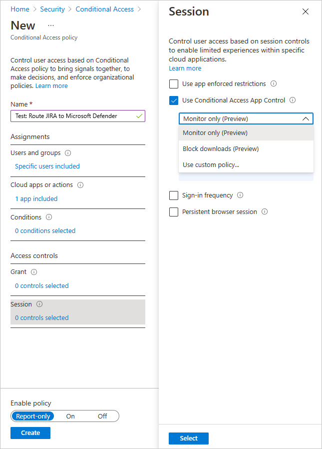
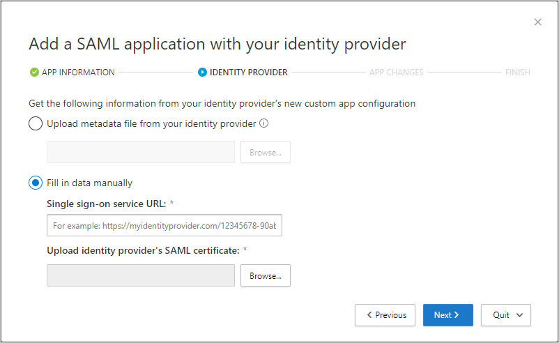

---
# required metadata

title: Deploy Cloud App Security Conditional Access App Control for Azure AD apps
description: This article provides information about how to deploy the Microsoft Cloud App Security Conditional Access App Control reverse proxy features for Azure AD apps.
keywords:
author: shsagir
ms.author: shsagir
manager: shsagir
ms.date: 03/31/2020
ms.topic: conceptual
ms.collection: M365-security-compliance
ms.service: cloud-app-security

# optional metadata

#ROBOTS:
#audience:
ms.suite: ems
---
# Deploy Conditional Access App Control for featured apps

*Applies to: Microsoft Cloud App Security*

Session controls in Microsoft Cloud App Security work with the featured apps. For a list of apps that are featured by Cloud App Security to work out-of-the-box, see [Protect apps with Cloud App Security Conditional Access App Control](proxy-intro-aad.md#featured-apps).

## Prerequisites

- Your organization must have the following licenses to use Conditional Access App Control:

  - [Azure Active Directory (Azure AD) Premium P1](https://docs.microsoft.com/azure/active-directory/license-users-groups) or higher, or the license required by your identity provider (IdP) solution
  - Microsoft Cloud App Security

- Apps must be configured with single sign-on
- Apps must use one of the following authentication protocols:

    |IdP|Protocols|
    |---|---|
    |Azure AD|SAML 2.0 or OpenID Connect|
    |Other|SAML 2.0|

## To deploy featured apps

Follow these steps to configure featured apps to be controlled by Microsoft Cloud App Security Conditional Access App Control.

**Step 1: [Configure your IdP to work with Cloud App Security](#conf-idp)**

**Step 2: [Sign in to each app using a user scoped to the policy](#sign-in-scoped)**

**Step 3: [Verify the apps are configured to use access and session controls](#portal)**

**Step 4: [Test the deployment](#test)**

## Step 1:  Configure your IdP to work with Cloud App Security

### Configure integration with Azure AD

Use the following steps to create an Azure AD Conditional Access policy that routes app sessions to Cloud App Security. For other IdP solutions, see [Configure integration with other IdP solutions](#configure-integration-with-other-idp-solutions).

1. In Azure AD, browse to **Security** > **Conditional Access**.

1. On the **Conditional Access** pane, in the toolbar at the top, click **New policy**.

1. On the **New** pane, in the **Name** textbox, enter the policy name.

1. Under **Assignments**, click **Users and groups**, assign the users that will be onboarding (initial sign on and verification) the app, and then click **Done**.

1. Under **Assignments**, click **Cloud apps**, assign the apps you want to control with Conditional Access App Control, and then click **Done**.

1. Under **Access controls**, click **Session**, select **Use Conditional Access App Control** and choose a built-in policy (**Monitor only** or **Block downloads**) or **Use custom policy** to set an advanced policy in Cloud App Security, and then click **Select**.

    

1. Optionally, add conditions and grant controls as required.

1. Set **Enable policy** to **On** and then click **Create**.

### Configure integration with other IdP solutions

Use the following steps to route app sessions from other IdP solutions to Cloud App Security. For Azure AD, see [Configure integration with Azure AD](#configure-integration-with-azure-ad).

1. In Cloud App Security, browse to **Investigate** > **Connected apps** > **Conditional Access App Control apps**.

1. Click the plus sign, and in the pop-up, select the app you want to deploy, and then click **Start Wizard**.
1. On the **APP INFORMATION** page, fill out the form using the information from your app's single sign-on configuration page, and then click **Next**.
    - If your IdP provides a single sign-on metadata file for the selected app, select **Upload metadata file from the app** and upload the metadata file.
    - Or, select **Fill in data manually** and provide the following information:
        - **Assertion consumer service URL**
        - If your app provides a SAML certificate, select **Use <app_name> SAML certificate** and upload the certificate file.

    

1. On the **IDENTITY PROVIDER** page, use the provided steps to set up a new application in your IdP's portal, and then click **Next**.
    1. Go to your IdP's portal and create a new custom SAML app.
    1. Copy the single sign-on configuration of the existing `<app_name>` app to the new custom app.
    1. Assign users to the new custom app.
    1. Copy the apps single sign-on configuration inf'rmation, you'll need it in the next step.

    

    > [!NOTE]
    > These steps may differ slightly depending on your identity provider. This step is recommended for the following reasons:
    >
    > - Some identity providers do not allow you to change the SAML attributes or URL properties of a gallery app
    > - Configuring a custom app enables you to test this application with access and session controls without changing the existing behavior for your organization.

1. On the next page, fill out the form using the information from your app's single sign-on configuration page, and then click **Next**.
    - If your IdP provides a single sign-on metadata file for the selected app, select **Upload metadata file from the app** and upload the metadata file.
    - Or, select **Fill in data manually** and provide the following information:
        - **Assertion consumer service URL**
        - If your app provides a SAML certificate, select **Use <app_name> SAML certificate** and upload the certificate file.

    

1. On the next page, copy the following information, and then click **Next**. You'll need the information in the next step.

    - Single sign-on URL
    - Attributes and values

    

1. In your IdP's portal, do the following:
    > [!NOTE]
    > The settings are commonly found in IdP portal's custom app settings page

    1. In the single sign-on URL field, enter the single sign-on URL you made a note of earlier.
        > [!NOTE]
        > Some providers may refer to the single sign-on URL as the *Reply URL*.
    1. Add the attributes and values you made a note of earlier to the app's properties.
        > [!NOTE]
        >
        > - Some providers may refer to them as *User attributes* or *Claims*.
        > - When creating a new SAML app, the Okta Identity Provider limits attributes to 1024 characters. To mitigate this limitation, first create the app without the relevant attributes. After creating the app, edit it, and then add the relevant attributes.
    1. Verify that the name identifier is in the email address format.
    1. Save your settings.
1. On the **APP CHANGES** page, do the following, and then click **Next**. You'll need the information in the next step.

    - Copy the Single sign-on URL
    - Download the Cloud App Security SAML certificate

    

1. In your app's portal, on the single sign-on settings, do the following:
    1. [Recommended] Create a backup of your current settings.
    1. In the single sign-on URL field, enter the single sign-on URL you made a note of earlier.
    1. Upload the Cloud App Security SAML certificate you made a note of earlier.
    > [!NOTE]
    > After saving your settings, all associated login requests to this app will be routed through Conditional Access App Control.

## Step 2: Sign in to each app using a user scoped to the policy

> [!NOTE]
> Before proceeding, make sure to first sign out of existing sessions.

After you've created the policy, sign in to each app configured in that policy. Make sure you sign in using a user configured in the policy.

Cloud App Security will sync your policy details to its servers for each new app you sign in to. This may take up to one minute.

## Step 3: Verify the apps are configured to use access and session controls

The instructions above helped you create a built-in Cloud App Security policy for featured apps directly in Azure AD. In this step, verify that the access and session controls are configured for these apps.

1. In the Cloud App Security portal, click the settings cog , and then select **Conditional Access App Control**.

1. In the Conditional Access App Control apps table, look at the **Available controls** column and verify that both **Access control** or **Azure AD Conditional Access**, and **Session control** appear for your apps.

    > [!NOTE]
    > If session control doesn't appear for an app, it's not yet available for that specific app. You can either add it immediately as a [custom app](proxy-deployment-any-app.md), or you can open a request to add it as a featured app by clicking **Request session control**.
    >
    >

## Step 4: Test the deployment

1. First sign out of any existing sessions. Then, try to sign in to each app that was successfully deployed. Sign in using a user that matches the policy configured in Azure AD, or for a SAML app configured with your identity provider.

1. In the Cloud App Security portal, under **Investigate**, select **Activity log**, and make sure the login activities are captured for each app.

1. You can filter by clicking on **Advanced**, and then filtering using **Source equals Access control**.

    

1. It's recommended that you sign into mobile and desktop apps from managed and unmanaged devices. This is to make sure that the activities are properly captured in the activity log.  
To verify that the activity is properly captured, click on a single sign-on login activity so that it opens the activity drawer. Make sure the **User agent tag** properly reflects whether the device is a native client (meaning either a mobile or desktop app) or the device is a managed device (compliant, domain joined, or valid client certificate).

> [!NOTE]
> After it is deployed, you can't remove an app from the Conditional Access App Control page. As long as you don't set a session or access policy on the app, the Conditional Access App Control won't change any behavior for the app.

## Next steps

> [!div class="nextstepaction"]
> [« PREVIOUS: Introduction to Conditional Access App Control](proxy-intro-aad.md)

> [!div class="nextstepaction"]
> [NEXT: Onboard and deploy Conditional Access App Control for any app »](proxy-deployment-any-app.md)

> [!div class="nextstepaction"]
> [Troubleshooting access and session controls](troubleshooting-proxy.md)

[!INCLUDE [Open support ticket](includes/support.md)]
