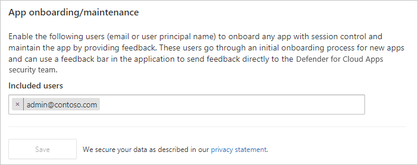
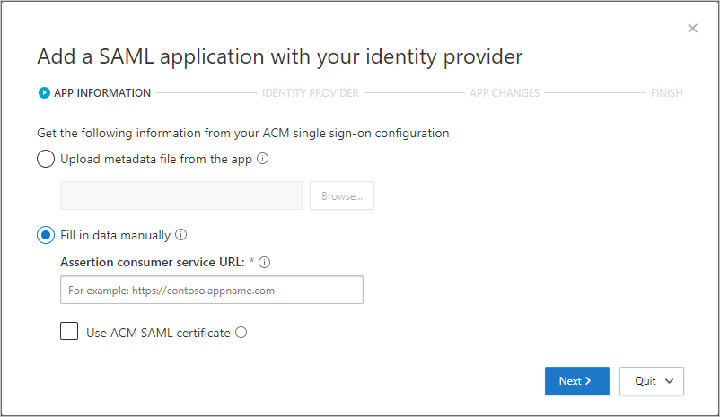
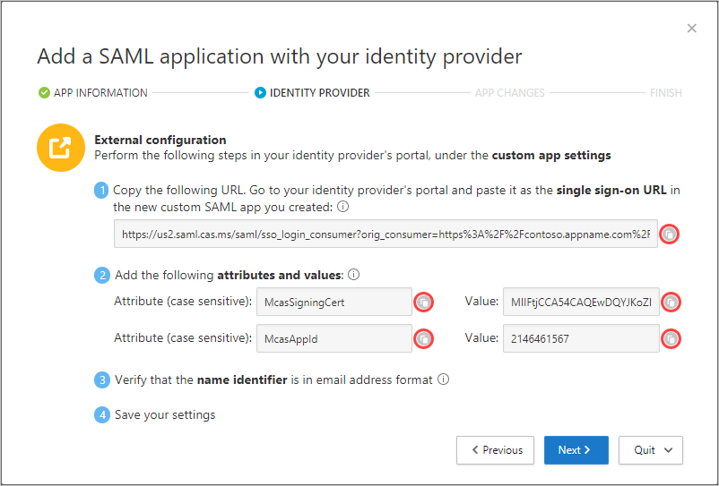
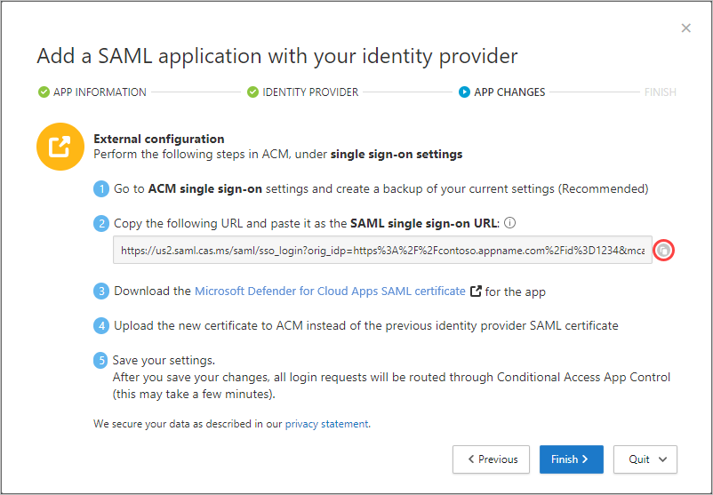

# Onboard and deploy Conditional Access App Control for custom apps with third-party IdP

[!INCLUDE [Banner for top of topics](includes/banner.md)]

Session controls in Microsoft Defender for Cloud Apps can be configured to work with any web apps. This article describes how to onboard and deploy custom line-of-business apps, non-featured SaaS apps, and on-premise apps hosted via the Azure Active Directory (Azure AD) Application Proxy with session controls. It provides steps to route app sessions from other IdP solutions to Defender for Cloud Apps. For Azure AD, see [Onboard and deploy Conditional Access App Control for custom apps using Azure Active Directory](proxy-deployment-any-app.md).

For a list of apps that are featured by Defender for Cloud Apps to work out-of-the-box, see [Protect apps with Defender for Cloud Apps Conditional Access App Control](proxy-intro-aad.md#featured-apps).

## Prerequisites

### Add admins to the app onboarding/maintenance list

1. In the menu bar of Defender for Cloud Apps, select the settings cog  and select **Settings**.

1. Under **Conditional Access App Control**, select **App onboarding/maintenance**.

1. Enter the user principal name or email for the users that will be onboarding the app, and then select **Save**.

    

### Check for necessary licenses

- Your organization must have the following licenses to use Conditional Access App Control:

  - The license required by your identity provider (IdP) solution
  - Microsoft Defender for Cloud Apps

- Apps must be configured with single sign-on
- Apps must use the following authentication protocols:

    |IdP|Protocols|
    |---|---|
    |Other|SAML 2.0|

## To deploy any app

Follow these steps to configure any app to be controlled by Defender for Cloud Apps Conditional Access App Control.

1. **[Configure your IdP to work with Defender for Cloud Apps](#step-1-configure-your-idp-to-work-with-defender-for-cloud-apps)**

1. **[Configure the app that you are deploying](#conf-app)**

1. **[Verify that the app is working correctly](#verify-app)**

1. **[Enable the app for use in your organization](#enable-app)**

> [!NOTE]
> To deploy Conditional Access App Control for Azure AD apps, you need a valid [license for Azure Active Directory Premium P1 or higher](/azure/active-directory/license-users-groups) as well as a Defender for Cloud Apps license.

## Step 1: Configure your IdP to work with Defender for Cloud Apps

> [!NOTE]
> For examples of how to configure IdP solutions, see:
>
> - [Configure your PingOne IdP](proxy-idp-pingone.md)
> - [Configure your AD FS IdP](proxy-idp-adfs.md)
> - [Configure your Okta IdP](proxy-idp-okta.md)

1. In Defender for Cloud Apps, browse to **Investigate** > **Connected apps** > **Conditional Access App Control apps**.

1. Select the plus sign (**+**), and in the pop-up, select the app you want to deploy, and then select **Start Wizard**.
1. On the **APP INFORMATION** page, fill out the form using the information from your app's single sign-on configuration page, and then select **Next**.
    - If your IdP provides a single sign-on metadata file for the selected app, select **Upload metadata file from the app** and upload the metadata file.
    - Or, select **Fill in data manually** and provide the following information:
        - **Assertion consumer service URL**
        - If your app provides a SAML certificate, select **Use <app_name> SAML certificate** and upload the certificate file.

    

1. On the **IDENTITY PROVIDER** page, use the provided steps to set up a new application in your IdP's portal, and then select **Next**.
    1. Go to your IdP's portal and create a new custom SAML app.
    1. Copy the single sign-on configuration of the existing `<app_name>` app to the new custom app.
    1. Assign users to the new custom app.
    1. Copy the apps single sign-on configuration information. You'll need it in the next step.

    

    > [!NOTE]
    > These steps may differ slightly depending on your identity provider. This step is recommended for the following reasons:
    >
    > - Some identity providers do not allow you to change the SAML attributes or URL properties of a gallery app
    > - Configuring a custom app enables you to test this application with access and session controls without changing the existing behavior for your organization.

1. On the next page, fill out the form using the information from your app's single sign-on configuration page, and then select **Next**.
    - If your IdP provides a single sign-on metadata file for the selected app, select **Upload metadata file from the app** and upload the metadata file.
    - Or, select **Fill in data manually** and provide the following information:
        - **Assertion consumer service URL**
        - If your app provides a SAML certificate, select **Use <app_name> SAML certificate** and upload the certificate file.

    

1. On the next page, copy the following information, and then select **Next**. You'll need the information in the next step.

    - Single sign-on URL
    - Attributes and values

    

1. In your IdP's portal, do the following:
    > [!NOTE]
    > The settings are commonly found in IdP portal's custom app settings page.

    1. **Recommended** - Create a backup of your current settings.
    1. Replace the single sign-on URL field value with the Defender for Cloud Apps SAML single sign-on URL you noted earlier.
        > [!NOTE]
        > Some providers may refer to the single sign-on URL as the *Reply URL*.
    1. Add the attributes and values you made a note of earlier to the app's properties.
        > [!NOTE]
        >
        > - Some providers may refer to them as *User attributes* or *Claims*.
        > - When creating a new SAML app, the Okta Identity Provider limits attributes to 1024 characters. To mitigate this limitation, first create the app without the relevant attributes. After creating the app, edit it, and then add the relevant attributes.

    1. Verify that the name identifier is in the email address format.
    1. Save your settings.
1. On the **APP CHANGES** page, do the following, and then select **Next**. You'll need the information in the next step.

    - Copy the Single sign-on URL
    - Download the Defender for Cloud Apps SAML certificate

    

1. In your app's portal, on the single sign-on settings, do the following:
    1. **Recommended** - Create a backup of your current settings.
    1. In the single sign-on URL field, enter the Defender for Cloud Apps single sign-on URL you made a note of earlier.
    1. Upload the Defender for Cloud Apps SAML certificate you downloaded earlier.
    > [!NOTE]
    >
    > - After saving your settings, all associated login requests to this app will be routed through Conditional Access App Control.
    > - The Defender for Cloud Apps SAML certificate is valid for one year. After it expires, a new certificate will need to be generated.

[!INCLUDE [Configuration steps](includes/proxy-deploy-configure.md)]

## Next steps

> [!div class="nextstepaction"]
> [« PREVIOUS: Deploy Conditional Access App Control for featured apps](proxy-deployment-aad.md)

> [!div class="nextstepaction"]
> [NEXT: How to create a session policy »](session-policy-aad.md)

## See also

> [!div class="nextstepaction"]
> [Introduction to Conditional Access App Control](proxy-intro-aad.md)

> [!div class="nextstepaction"]
> [Troubleshooting access and session controls](troubleshooting-proxy.md)

[!INCLUDE [Open support ticket](includes/support.md)]

