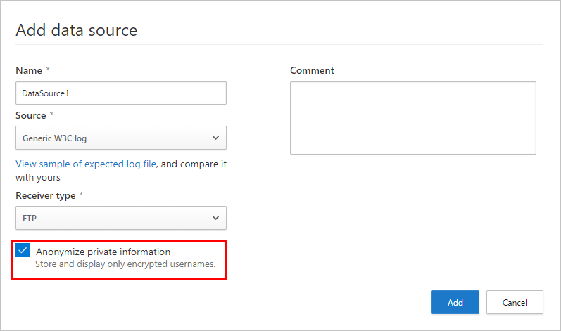
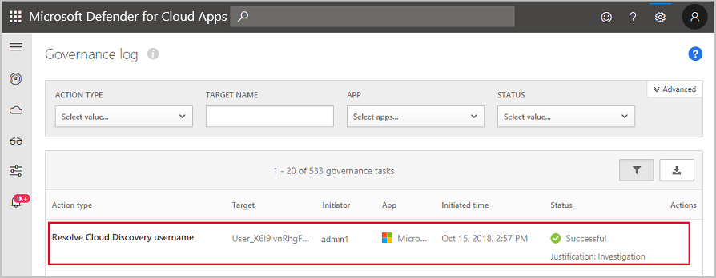

---
# required metadata

title: Deploy Cloud Discovery | Microsoft Docs
description: This topic describes the setup procedure for getting Cloud Discovery working.
keywords:
author: rkarlin
ms.author: rkarlin
manager: mbaldwin
ms.date: 12/26/2016
ms.topic: get-started-article
ms.prod:
ms.service: cloud-app-security
ms.technology:
ms.assetid: a9b5bd8d-305b-4e93-9a4c-a4683ea09080

# optional metadata

#ROBOTS:
#audience:
#ms.devlang:
ms.reviewer: reutam
ms.suite: ems
#ms.tgt_pltfrm:
#ms.custom:

---

# Set up Cloud Discovery
Cloud Discovery analyzes your traffic logs against Cloud App Security's cloud app catalog of over 13,000 cloud apps that are ranked and scored based on more than 50 attributes, to provide you with ongoing visibility into cloud use, Shadow IT, and the risk Shadow IT poses into your organization.
The **Cloud app catalog** rates risk for your cloud apps based on regulatory certification, industry standards, and best practices. Four complementary processes run in the Cloud app catalog to keep it up to date:
1.	Automated data extraction directly from the cloud app (for attributes such as SOC 2 compliance).
2.	Automated advanced data extraction for data by Cloud App Security's algorithms (for attributes such as HTTP security headers).
3.	Continuous analysis by the Cloud App Security cloud analyst team (for attributes such as encryption at rest).
4.	Customer-based revision requests, based on customer submission requests for changes to the Cloud app catalog. All requests are reviewed by our cloud analyst team and updated based on their findings.
  
## Snapshot and continuous risk assessment reports 

There are two types of reports you can generate: 
- **Snapshot reports** provide ad-hoc visibility on a set on traffic logs you manually upload from your firewalls and proxies.
 
- **Continuous reports** analyze all logs that are forwarded from your network using Cloud App Security’s log collector. They provide improved visibility over all data, and automatically identify anomalous use using either the Machine Learning anomaly detection engine or by using custom policies that you define.
 
## Log process flow: From raw data to risk assessment  
The process of generating a risk assessment consists of the following steps and takes between a few minutes to several hours depending of the amount of data processed.  
  
-   **Upload** – Web traffic logs from your network are uploaded to the portal.  
  
-   **Parse** – Cloud App Security parses and extracts traffic data from the traffic logs with a dedicated parser for each data source.  
  
-   **Analyze** – Traffic data is analyzed against the Cloud App Catalog to identify more than 13,000 cloud apps and to assess their risk score. Active users and IP addresses are also identified as part of the analysis.  
  
-   **Generate report** - A risk assessment report of the data extracted from log files is generated.   
 
 
>[!NOTE]
>Continuous report data is analyzed twice a day.
 
## Using traffic logs for  Cloud Discovery
Cloud Discovery utilizes the data in your traffic logs. The more detailed your log, the better visibility you get. Cloud Discovery requires web-traffic data with the following attributes:
- Date of the transaction
- Source IP
- Source user - highly recommended
- Destination IP address
- Destination URL **recommended** (URLs provide higher accuracy for cloud app detection than IP addresses)
- Total amount of data (data information is highly valuable)
- Amount of uploaded or downloaded data (provides insights about the usage patterns of the cloud apps)
- Action taken (allowed/blocked)
 
Cloud Discovery cannot show or analyze attributes that are not included in your logs.
For example, **Cisco ASA Firewall** standard log format does not contain the **Amount of uploaded bytes per transaction** nor **Username**, and does not contain **Target URL** (but only target IP).
Therefore, these attributes will be shown in Cloud Discovery data for these logs, and the visibility into the cloud apps we be limited. For Cisco ASA firewalls, it is necessary to set the information level to 6. 
 

In order to successfully generate a Cloud Discovery report, your traffic logs must meet the following conditions:
1.  Data source is supported (see list below).
2.  Log format matches the expected standard format (this will be checked upon upload by the Log tool).
3.  Events are not more than 90 days old.
4.  The log file is valid and includes outbound traffic information.
 
## Supported firewalls and proxies
- Blue Coat Proxy SG - Access log (W3C)
- Check Point
- Cisco ASA Firewall (For Cisco ASA firewalls, it is necessary to set the information level to 6)
- Cisco IronPort WSA
- Cisco ScanSafe
- Cisco Merkai – URLs log
- Dell Sonicwall
- Fortiner Fortigate
- Juniper SRX
- McAfee Secure Web Gateway
- Microsoft Forefront Threat Management Gateway (W3C)
- Palo Alto series Firewall
- Sophos SG
- Sophos Cyberoam
- Squid (Common)
- Squid (Native)
- Websense - Web Security Solutions - Investigative detail report (CSV)
- Websense - Web Security Solutions - Internet activity log (CEF)
- Zscaler

If your log is not supported, select **Other** as the **Data source** and specify the appliance and log you are trying to upload. Your log will be reviewed by the Cloud App Security cloud analyst team and you will be notified if support for your log type is added. 

Data attributes (according to vendor documentation):

|Data source|Target App URL|Target App IP|Username|Origin IP|Total traffic|Uploaded bytes|
|----|----|----|-----|----|----|----|
|Blue Coat|**Yes**|No|**Yes**|**Yes**|**Yes**|**Yes**|
|Checkpoint|No|**Yes**|No|**Yes**|No|No|
|Cisco ASA|No|**Yes**|No|**Yes**|**Yes**|No|
|Cisco FWSM|No|**Yes**|No|**Yes**|**Yes**|No|
|Cisco Ironport WSA|**Yes**|**Yes**|**Yes**|**Yes**|**Yes**|**Yes**|
|Cisco Scansfe|**Yes**|No|**Yes**|**Yes**|**Yes**|**Yes**|
|Dell SonicWall|**Yes**|**Yes**|No|**Yes**|**Yes**|**Yes**|
|Fortigate|No|**Yes**|No|**Yes**|**Yes**|**Yes**|
|Juniper SRX|No|**Yes**|No|**Yes**|**Yes**|**Yes**|
|McAfee SWG|**Yes**|No|No|**Yes**|**Yes**|**Yes**|
|Meraki|**Yes**|**Yes**|No|**Yes**|No|No|
|MS TMG|**Yes**|No|**Yes**|**Yes**|**Yes**|**Yes**|
|PAN|**Yes**|**Yes**|**Yes**|**Yes**|**Yes**|**Yes**|
|Sophos|**Yes**|**Yes**|**Yes**|**Yes**|**Yes**|No|
|Websense - Investigative detail report (CSV)|**Yes**|No|No|**Yes**|No|No|
|Websense - Internet activity log (CEF)|**Yes**|**Yes**|**Yes**|**Yes**|**Yes**|**Yes**|
|Zscaler|**Yes**|No|**Yes**|No|**Yes**|No|

## Cloud Discovery data anonymization

Cloud Discovery data anonymization enables you to protect user privacy. Once the data log is uploaded to the Cloud App Security portal, the log is sanitized and all username information is replaced with encrypted usernames. This way, all could activities are kept anonymous. When necessary, for a specific security investigation (for example, due to a security breach or suspicious user activity), admins can resolve the real username. If an admin has a reason to suspect a specific user, he can also look up the encrypted username of a known username, and then start investigating using the encrypted username. Each username conversion is audited in the portal’s **Governance log**.

Key points:
•	No private information is stored or displayed. Only encrypted information.
•	Private data is encrypted using AES-128 with a dedicated key per tenant.
•	Resolving usernames is performed ad-hoc, per-username by deciphering a given encrypted username.

How data anonymization works:

1.	[Create a new snapshot report](create-snapshot-cloud-discovery-report.md) 

 

or [configure automated upload for a new data source](configure-automatic-log-upload-for-continuous-reports.md).  
 

2.	Cloud App Security parses the traffic log and extracts specific data attributes.
3.	Cloud App Security replaces the  username with an encrypted username.
4.	It then analyzes cloud usage data and generates Cloud Discovery reports based on the anonymized data.

 
 

5.	For specific investigation, such as investigation of an anomalous usage alert, you can resolve the specific username in the portal and provide a business justification. 
This page can also be used to look up the encrypted username of a known username.  

6.	The action is audited in the portal’s **Governance log**. 

To set anonymization:

1. Under the Settings cog, select **Cloud Discovery settings**.
2. In the Anonymization tab, to anonymize usernames by default, select **Anonymize private information by default in new reports and data sources**.

To investigate a suspicious activity by resolving usernames:

1. Under the Settings cog, select **Cloud Discovery settings**.
2. In the **Anonymization** tab, under **Anonymize and resolve usernames**  enter a justification for why you are performing the resolution.
3. Under **Enter username to resolve**, select **From anonymized** and enter the anonymized username, or select **To anonymmized** and enter the original username to resolve. Click **Resolve**.
 
 
 
[Create snapshot Cloud Discovery reports](create-snapshot-cloud-discovery-reports.md)

[Configure automatic log upload for continuous reports](configure-automatic-log-upload-for-continuous-reports.md)

[Working with Cloud Discovery data](working-with-cloud-discovery-data.md)
  
  