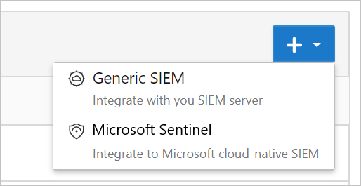
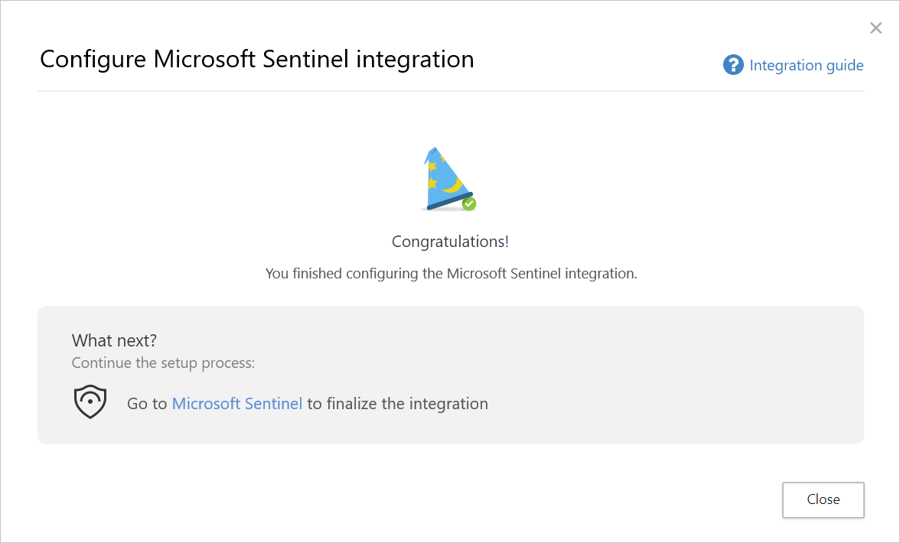
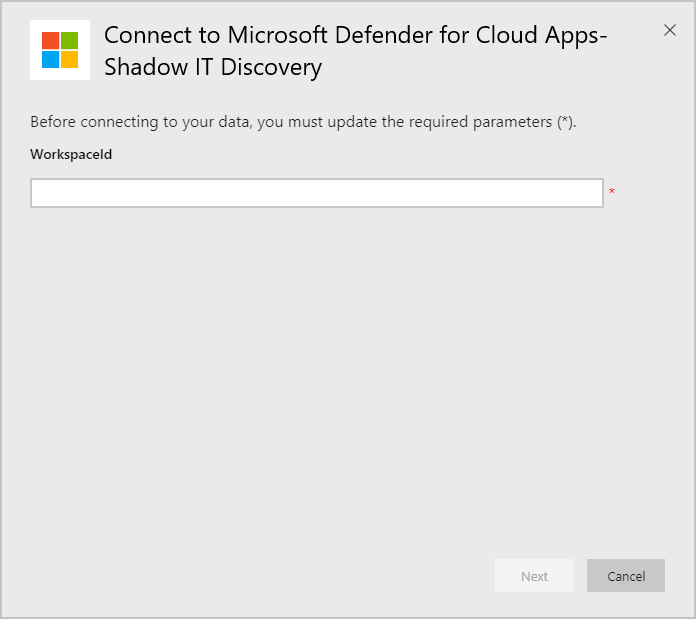
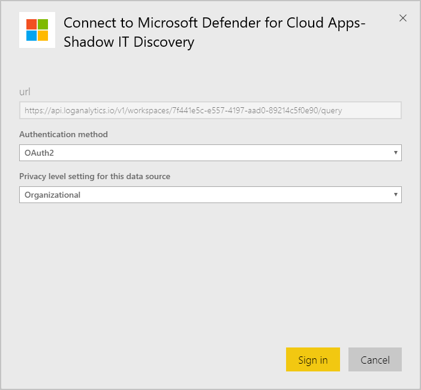

---
# required metadata

title: Azure Sentinel integration with Cloud App Security
description: This article provides information integrating your generic SIEM with Cloud App Security.
keywords:
author: shsagir
ms.author: shsagir
manager: shsagir
ms.date: 10/28/2019
ms.topic: conceptual
ms.collection: M365-security-compliance
ms.prod:
ms.service: cloud-app-security
ms.technology:

# optional metadata

ms.suite: ems
#ms.tgt_pltfrm:
ms.custom: seodec18
---

# Azure Sentinel integration (preview)

*Applies to: Microsoft Cloud App Security*

You can integrate Microsoft Cloud App Security with Azure Sentinel (a scalable, cloud-native SIEM and SOAR) to enable centralized monitoring of alerts and discovery data. Integrating with Azure Sentinel allows you to better protect your cloud applications while maintaining your usual security workflow, automating security procedures, and correlating between cloud-based and on-premises events.

Benefits of using Azure Sentinel include:

* Longer data retention provided by Log Analytics.
* Out-of-the-box visualizations.
* Use tools such as Microsoft Power BI or Azure Sentinel workbooks to create your own discovery data visualizations that fit your organizational needs.

Additional integration solutions include:

* **Generic SIEMs** - Integrate Cloud App Security with your generic SIEM server. For information in integrating with a Generic SIEM, see [Generic SIEM integration](siem.md).
* **Microsoft security graph API** - An intermediary service (or broker) that provides a single programmatic interface to connect multiple security providers. For more information, see [Security solution integrations using the Microsoft Graph Security API](https://docs.microsoft.com/graph/security-integration#list-of-connectors-from-microsoft).

## How to integrate

Integrating with your SIEM is accomplished in two steps:

1. Set it up in Cloud App Security.
1. Set it up in Azure Sentinel.

### Prerequisites

To integrate with Azure Sentinel:

* You must have a valid Azure Sentinel license
* You must be a Global Administrator or a Security Administrator in your tenant.

### Integrating with Azure Sentinel

1. In the Cloud App Security portal, under the **Settings** cog, click **Security extensions**.

1. On the **SIEM agents** tab, click add (**+**), and then choose **Azure Sentinel**.

    

1. In the wizard, select the data types you want to forward to Azure Sentinel. You can configure the integration, as follows:
    1. **Alerts**: Alerts are automatically turned on once Azure Sentinel is enabled. <!--Use the **Apply to** drop-down to filter which alerts are sent to Azure Sentinel.-->
    1. **Discovery logs**: Use the slider to enable and disable them, by default, everything is selected, and then use the **Apply to** drop-down to filter which discovery logs are sent to Azure Sentinel.

    

1. Click **Next**, and continue to Azure Sentinel to finalize the integration. For information on configuring Azure Sentinel, see [https://docs.microsoft.com/azure/sentinel/connect-cloud-app-security](https://docs.microsoft.com/azure/sentinel/connect-cloud-app-security).

    

> [!NOTE]
> New discovery logs will start forwarding to Azure Sentinel within 15 minutes of configuring them in the Cloud App Security portal.

## Alerts and discovery logs in Azure Sentinel

Once the integration is completed, you can view Cloud App Security alerts and discovery logs in Azure Sentinel.

In Azure Sentinel, under **Logs**, under **Security Insights**, you can find the logs for the Cloud App Security data types, as follows:

| Data type | Table |
| --- | --- |
| Discovery logs | McasShadowItReporting |
| Alerts | SecurityAlert |

The following table describes each field in the **McasShadowItReporting** schema:

| Field | Type | Description | Examples |
| --- | --- | --- | --- |
| TenantId | String | Workspace ID | b459b4u5-912x-46d5-9cb1-p43069212nb4 |
| SourceSystem | String | Source system – static value | Azure |
| TimeGenerated [UTC] | DateTime | Date of discovery data | 2019-07-23T11:00:35.858Z |
| StreamName | String | Name of the specific stream | Marketing Department |
| TotalEvents | Integer | Total number of events per session | 122 |
| BlockedEvents | Integer | Number of blocked events | 0 |
| UploadedBytes | Integer | Amount of uploaded data | 1,514,874 |
| TotalBytes | Integer | Total amount of data | 4,067,785 |
| DownloadedBytes | Integer | Amount of downloaded data | 2,552,911 |
| IpAddress | String | Source IP address | 127.0.0.0 |
| UserName | String | User name | `Raegan@contoso.com` |
| EnrichedUserName | String | Enriched user name with Azure AD username | `Raegan@contoso.com` |
| AppName | String | Name of cloud app | Microsoft OneDrive for Business |
| AppId | Integer | Cloud app identifier | 15600 |
| AppCategory | String | Category of cloud app | Cloud storage |
| AppTags | String array | Built-in and custom tags defined for the app | ["sanctioned"] |
| AppScore | Integer | The risk score of the app in a scale 0-10, 10 being  a score for a non-risky app | 10 |
| Type | String | Type of logs – static value | McasShadowItReporting |

## Use Power BI with Cloud App Security data in Azure Sentinel

Once the integration is completed, you can also use the Cloud App Security data stored in Azure Sentinel in other tools.

This section describes how you can use Microsoft Power BI (Power BI) to easily shape and combine data to build reports and dashboards that meet the needs of your organization.

You can get started quickly by using the following steps:

1. In Power BI, import queries from Azure Sentinel for Cloud App Security data. For more information, see [Import Azure Monitor log data into Power BI](https://docs.microsoft.com/azure/azure-monitor/platform/powerbi).
1. [Install the Cloud App Security Shadow IT Discovery app](https://aka.ms/MCASShadowITReporting) and [connect it](#connect-the-cloud-app-security-app) to your discovery log data to view the built-in Shadow IT Discovery dashboard.

    > [!NOTE]
    > Currently, the app is not published on Microsoft AppSource. Therefore, you may need to contact your Power BI admin for permissions to install the app.

    

1. Optionally, build custom dashboards in Power BI Desktop and tweak it to fit the visual analytics and reporting requirements of your organization.

### Connect the Cloud App Security app

1. In Power BI, click **Apps**, and then click on the **Shadow IT Discovery** app.

1. On the **Get started with your new app** page, click **Connect**.

    

1. On the workspace ID page, enter your Azure Sentinel workspace ID as displayed in your log analytics overview page, and then click **Next**.

    

1. On the authentication page, specify the authentication method and privacy level, and then click **Sign in**.

    

1. After connecting your data, go to the workspace **Datasets** tab and click **Refresh**. This will update the report with your own data.

[!INCLUDE [Open support ticket](includes/support.md)]
