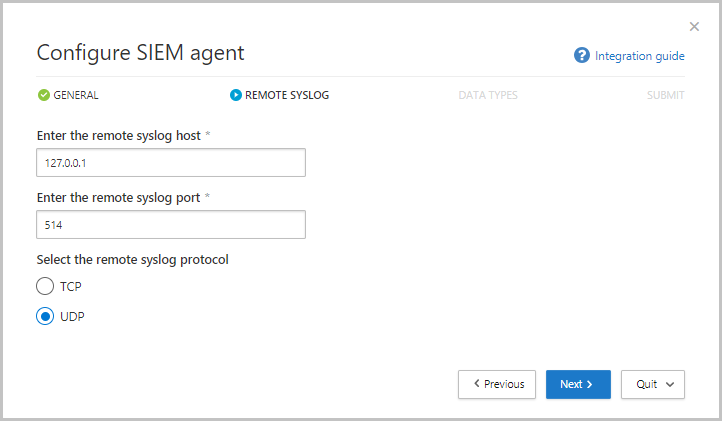
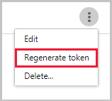
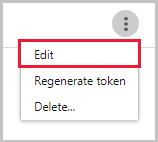

---
# required metadata

title: SIEM integration with Cloud App Security | Microsoft Docs
description: This topic provides information integrating your SIEM with Cloud App Security.
keywords:
author: rkarlin
ms.author: rkarlin
manager: mbaldwin
ms.date: 5/14/2017
ms.topic: article
ms.prod:
ms.service: cloud-app-security
ms.technology:
ms.assetid: 4649423b-9289-49b7-8b60-04b61eca1364

# optional metadata

#ROBOTS:
#audience:
#ms.devlang:
ms.reviewer: reutam
ms.suite: ems
#ms.tgt_pltfrm:
#ms.custom:

---

# SIEM integration
    
You can now integrate Cloud App Security with your SIEM server to enable centralized monitoring of alerts and activities. Integrating with a SIEM service allows you to better protect your cloud applications while maintaining your usual security workflow, automating security procedures and correlating between cloud-based and on-premises events. The Cloud App Security SIEM agent runs on your server and pulls alerts and activities from Cloud App Security and streams them into the SIEM server.

When you first integrate your SIEM with Cloud App Security, activities and alerts from the last two days will be forwarded to the SIEM and all activities and alerts (based on the filter you select) from then on. Additionally, if you disable this feature for an extended period, when you enable it again it will forward the past two days of alerts and activities and then all alerts and activities from then on.

## SIEM integration architecture

The SIEM agent is deployed in your organization’s network. When deployed and configured, it polls the data types that were configured (alerts and activities) using Cloud App Security RESTful APIs.
The traffic is then sent over an encrypted HTTPS channel on port 443.

Once the SIEM agent retrieves the data from Cloud App Security, it sends the Syslog messages to your local SIEM using the network configurations you provided during the setup (TCP or UDP with a custom port). 

## Sample SIEM logs

The logs provided to your SIEM from Cloud App Security are CEF over Syslog. In the following sample logs you are able to see the type of event typically sent by Cloud App Security to your SIEM server. In these you can see when the alert was triggered, the **type of event**, the **policy** that was breached, the **user** who triggered the event, the **app** the user was using to create the breach, and the **URL** the alert is coming from:

Sample activity log: 
  
2017-05-12T13:15:32.131Z CEF:0|MCAS|SIEM_Agent|0.97.33|EVENT_CATEGORY_UPLOAD_FILE|**Upload file**|0|externalId=AVv8zNojeXPEqTlM-j6M start=1494594932131 end=1494594932131 msg=**Upload file: passwords.txt** **suser=admin@contoso.com** destination**ServiceName=Jive Software** dvc= requestClientApplication= cs1Label=**portalURL cs1=https://contoso.cloudappsecurity.com**/#/audits?activity.id\=eq(AVv8zNojeXPEqTlM-j6M,) cs2Label=uniqueServiceAppIds cs2=APPID_JIVE cs3Label=targetObjects cs3=test.txt c6a1Label="Device IPv6 Address" c6a1=

Sample alerts log: 

2017-05-12T13:25:57.640Z CEF:0|MCAS|SIEM_Agent|0.97.33|ALERT_CABINET_EVENT_MATCH_AUDIT|asddsddas|3|externalId=5915b7e50d5d72daaf394da9 start=1494595557640 end=1494595557640 msg=**Activity policy 'log ins to Jive'** was triggered by 'admin@contoso.com' **suser=admin@contoso.com** destination**ServiceName=Jive Software** cn1Label=riskScore cn1= cs1Label=portal**URL cs1=https://contoso.cloudappsecurity.com**/#/alerts/5915b7e50d5d72daaf394da9 cs2Label=uniqueServiceAppIds cs2=APPID_JIVE cs3Label=relatedAudits cs3=AVv81ljWeXPEqTlM-j-j

## How to integrate

Integrating with your SIEM is accomplished in three steps:
1. Set it up in the Cloud App Security portal. 
2. Download the JAR file and run it on your server.
3. Validate that the SIEM agent is working.

### Prerequisites

- A standard Windows or Linux server (can be a virtual machine).
- The server must be running Java 8; earlier versions are not supported.

## Integrating with your SIEM

### Step 1: Set it up in the Cloud App Security portal

1. In the Cloud App Security portal, under the Settings cog, click **SIEM agents**.

2. Click Add SIEM agent to start the wizard.
3. In the wizard, click **Add SIEM agent**.	
4. In the wizard, fill in a name, and **Select your SIEM format** and set any **Advanced settings** that are relevant to that format. 
Click **Next**.

   

5. Type in the IP address of the **Remote syslog host** and the **Syslog port number**. Select TCP or UDP as the Remote Syslog protocol.
You can work with your security admin to get these details if you don't have them.
Click **Next**.
  

6. Select which data types, **Alerts** and **Activities** you want to export to your SIEM server. 
Use the slider to enable and disable them, by default, everything is selected. You can use the **Apply to** drop-down to set filters to send only specific alerts and activities to your SIEM server.
You can click **Edit and preview results** to check that the filter works as expected. 
Click **Next**. 

  

7. Copy the token and save it for later. 
After you click Finish and leave the Wizard, back in the SIEM page, you can see the SIEM agent you added in the table. It will show that it's **Created** until it’s connected later.

### Step 2: Download the JAR file and run it on your server

1. [Download the .zip file from the Microsoft Download Center](https://go.microsoft.com/fwlink/?linkid=838596) and unzip it.

2. Extract the .jar file from the zip file and run it on your server.
 After running the file, run the following:
    
      java -jar mcas-siemagent-0.87.20-signed.jar [--logsDirectory DIRNAME] [--proxy ADDRESS[:PORT]] --token TOKEN
> [!NOTE]
> - The file name may differ depending on the version of the SIEM agent.
> - Parameters in brackets [] are optional, and should be used only if relevant.

Where the following variables are used:
- DIRNAME is the path to the directory you want to use for local agent debug logs.
- ADDRESS[:PORT] is the proxy server address and port that the server uses to connect to the Internet.
- TOKEN is the SIEM agent token you copied in the previous step.

You can type -h at any time to get help.

### Step 3: Validate that the SIEM agent is working

1. Make sure the status of the SIEM agent in the Cloud App Security portal is not **Connection error** or **Disconnected** and there are no agent notifications. It will show up as **Connection error** if the connection is down for more than two hours and as **Disconnected** if the connection is down for over 12 hours.
 
 
   Instead, the status should be connected, as seen here:
    

2. In your Syslog/SIEM server, make sure you see activities and alerts arriving from Cloud App Security.

## Regenerating your token
If you lose the token, you can always regenerate it by clicking the three dots at the end of the row for the SIEM agent in the table, and selecting **Regenerate token**.

 

## Editing your SIEM agent 
If you need to edit the SIEM agent in the future, you can click on the three dots at the end of the row for the SIEM agent in the table, and select **Edit**. If you edit the SIEM agent, you do not need to rerun the .jar file, it updates automatically.

## Deleting your SIEM agent
If you need to delete the SIEM agent in the future, you can click on the three dots at the end of the row for the SIEM agent in the table, and select **Delete**.

> [!NOTE]
> This feature is in public preview.

## See Also  
[Troubleshooting SIEM integration issues](troubleshooting-siem.md)   
[For technical support, please visit the Cloud App Security assisted support page.](http://support.microsoft.com/oas/default.aspx?prid=16031)   
[Premier customers can also choose Cloud App Security directly from the Premier Portal.](https://premier.microsoft.com/)  
  
  