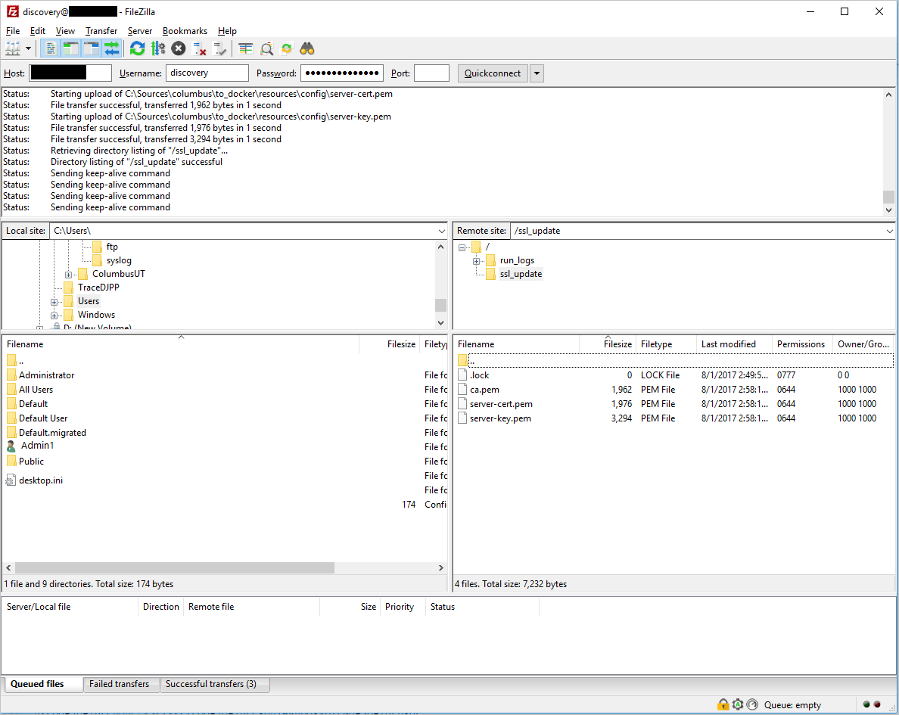

---
# required metadata

title: Troubleshooting Cloud Discovery Docker Deployment | Microsoft Docs
description: This topic describes the process for modifying configuration for the Cloud App Security Cloud Discovery docker.
keywords:
author: rkarlin
ms.author: rkarlin
manager: mbaldwin
ms.date: 1/15/2018
ms.topic: get-started-article
ms.prod:
ms.service: cloud-app-security
ms.technology:
ms.assetid: 776e834f-3c20-4d5f-9fab-4c5b975edb06

# optional metadata

#ROBOTS:
#audience:
#ms.devlang:
ms.reviewer: reutam
ms.suite: ems
#ms.tgt_pltfrm:
#ms.custom:

---

# Troubleshooting the Cloud App Security Cloud Discovery Docker

## Changing the FTP password

1. Connect to the log collector host.

2.	Run `docker exec -it <collector name> pure-pw passwd <ftp user>`

    1. Enter the new password.
    2. Enter the new password again for confirmation.
 
3.	Run `docker exec -it <collector name> pure-pw mkdb` to apply the change.

  

## Customize certificate files

Follow this procedure to customize the certificate files you use for secure connections to the Cloud Discovery docker.

1.	Open an FTP client and connect to the log collector.

  

2.	Navigate to the `ssl_update` directory.
3.	Upload new certificate files to the `ssl_update` directory (the names are mandatory).

    

    1.	For FTP: Only one file is required, containing the key and certificate data, in that order, named **pure-ftpd.pem**.
    
    2.	For Syslog: Three files are required: **ca.pem**, **server-key.pem** and **server-cert.pem**. If any of the files is missing, the update will not take place.

4.	In a terminal run: `docker exec -t <collector name> update_certs`. This should produce a similar output to that seen in the following screen.

    

## See Also
[Deploy Cloud Discovery](set-up-cloud-discovery.md)

[Premier customers can also choose Cloud App Security directly from the Premier Portal](https://premier.microsoft.com/)

