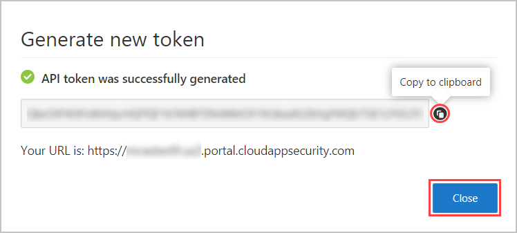
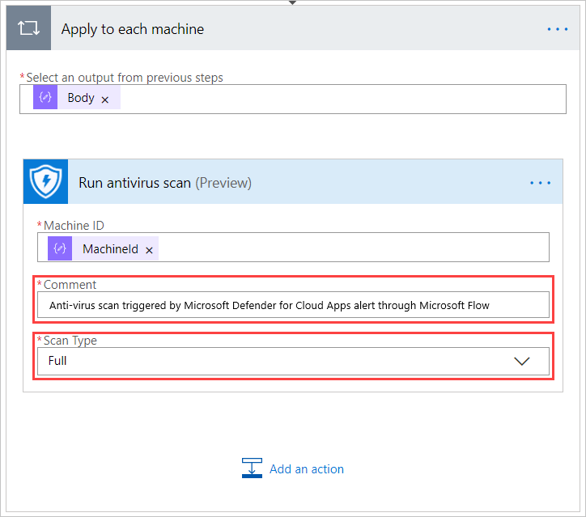

# Tutorial: Extending governance to coordinate remediation with endpoints

Cloud App Security provides predefined governance options for policies, such as suspend a user or make a file private. With Microsoft Flow, you can use a large ecosystem of software as a service (SaaS) connectors to build workflows to automate processes. Using predefined or custom workflows as policy governance actions, you can extend Cloud App Security remediation capabilities.

For example, when detecting a possible malware threat, you can use workflows to start Microsoft Defender Advanced Threat Protection (ATP) remediation actions such as running an antivirus scan or isolating an endpoint.

In this tutorial, you'll learn how to configure a policy governance action to use a workflow to run an antivirus scan on an endpoint where the user shows signs of suspicious behavior.

> [!NOTE]
> These workflows are only relevant for policies that contains user activity. For example, you can't use these workflows with Discovery or OAuth policies.

If you don’t have a Microsoft Flow plan, [sign up for a free trial account](https://flow.microsoft.com/pricing).

## Prerequisites

* You must have a valid [Microsoft Flow plan](https://flow.microsoft.com/pricing)
* The Microsoft Flow environment must be Azure AD synced, Defender ATP monitored, and domain joined

## To configure a policy to run an antivirus scan using Microsoft Defender ATP

### Step 1: Create a Cloud App Security connector

> [!NOTE]
> If you have previously created a workflow using a Cloud App Security connector, Microsoft Flow automatically reuses the token and you can skip this step.

1. In Cloud App Security, in the menu bar, click the settings cog  and select **Security extensions**.

1. In the **Security extensions** page, click the plus button to generate a new API token.
1. In the **Generate new token** pop-up window, enter the token name (for example, "Flow-Token"), and then click **Generate**.

    
1. Once the token is generated, click the copy icon to the right of the generated token, and then click **Close**. You'll need the token later.

    

### Step 2: Create a flow to run an antivirus scan

> [!NOTE]
> If you have previously created a flow using a Defender ATP connector, Flow automatically reuses the connector and you can skip the **Sign in** step.

1. Go to the [Microsoft Flow portal](https://flow.microsoft.com/) and select Templates.
    

1. Search for "Cloud App Security" and select **Run antivirus scan using Windows Defender upon a Cloud App Security alert**.

    

1. Click **Sign in** and enter the admin credentials you want to use with the Microsoft Defender ATP connector.

    

### Step 3: Configure the flow

> [!NOTE]
> If you have previously created a flow using an Azure AD connector, Microsoft Flow automatically reuses the token and you can skip this step.

1. Click **Create**.

    

1. In the **Cloud App Security** pop-up window, enter the connection name (for example, "Cloud App Security Token"), paste the API token you copied, and then click **Create**.

    

1. In the list of apps, on the row in which **HTTP with Azure AD** appears, choose the three dots at the end of the row, and then click **Add new connection**.

1. In the **HTTP with Azure AD** pop-up window, for both the **Base Resource URL** and **Azure AD Resource URI** fields, enter `https://graph.microsoft.com`, and then click **Sign in** and enter the admin credentials you want to use with the HTTP with Azure AD connector.

    

1. Click **Continue**.

    

1. Once all the connecters are successfully connected, on the flow's page under **Apply to each machine**, optionally modify the comment and scan type, and then click **Save**.

    

### Step 4: Apply the flow to a policy

1. In Cloud App Security, edit the policy where you want to add the antivirus flow, and under **Alerts**, select **Send alerts to Flow**, and then select **Run antivirus scan using Windows Defender upon a Cloud App Security alert**.

    

The steps used in this tutorial can be used to create a wide range of workflow based actions to extend Cloud App Security remediation capabilities. To see alist of predefined workflows, in Microsoft Flow, search for "Cloud App Security".

## Next steps

> [!div class="nextstepaction"]
[Integrate with Microsoft Flow for custom alert automation](flow-integration.md)
