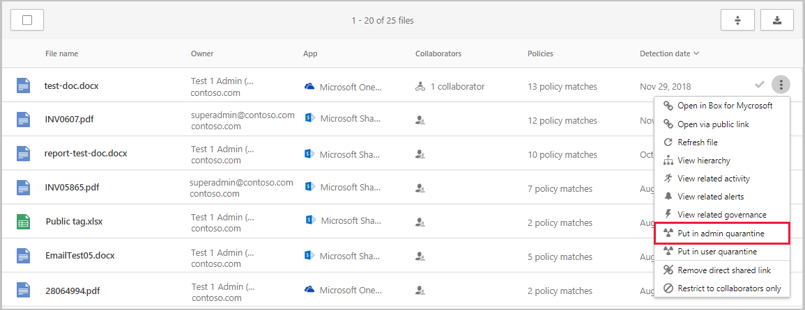
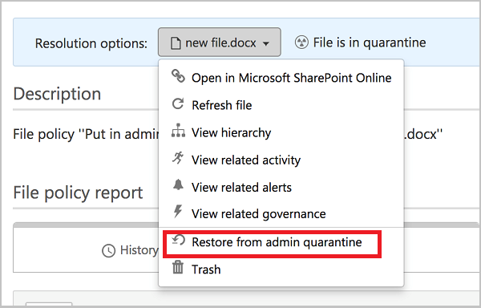

---
# required metadata

title: Use case for how to investigate and remediate file breaches using admin quarantine | Microsoft Docs
description: This topic describes the scenario for using admin quarantine to control data breaches.
keywords:
author: rkarlin
ms.author: rkarlin
manager: mbaldwin
ms.date: 5/23/2017
ms.topic: article
ms.prod:
ms.service: cloud-app-security
ms.technology:
ms.assetid: 3fc04cfb-ad4c-4ac2-980a-ee9f4c740d88

# optional metadata

#ROBOTS:
#audience:
#ms.devlang:
ms.reviewer: reutam
ms.suite: ems
#ms.tgt_pltfrm:
#ms.custom:

---

# Protecting your files with admin quarantine - PREVIEW

[File policies](data-protection-policies.md) are a great tool for finding threats to your information protection policies, for instance finding places where users stored sensitive information, credit card numbers and third-party ICAP files in your cloud. With Cloud App Security, not only can you detect these unwanted files stored in your cloud that leave you vulnerable, but you can take immediate action to stop them in their tracks and lock down the files that pose a threat. Using **Admin quarantine**, you can protect your files in the cloud and remediate problems, as well as prevent future leaks from occurring. 

>![NOTE] 
> For a list of apps that support admin quarantine, see the the list of [governance actions](governance-actions.md).
 
## How quarantine works 

1. When a file matches a policy, the **Admin quarantine** option will be available for the file.

3. Perform one of the following to quarantine the file:
    - Manually apply the **Admin quarantine** action:
     
      

    - Set it as an automated quarantine action in the policy: 

     

4. When **Admin quarantine** is applied, the following occurs behind the scenes:

    1. The original file is moved to the admin quarantine folder you set.
    2. The original file is deleted.
    3. A tombstone file is uploaded to the original file location.

      

    4. The user has access only to the tombstone, where they can read the custom guidelines provided by IT and the correlation ID to contact IT to release the file.

4. When you receive the alert that a file has been quarantined, investigate the file in the Cloud App Security **Alerts** page:

   
 
5. And also in the **Policy Report** on the **Quarantined** tab:

  
    
5. After a file is quarantined, use the following process to remediate the threat situation:
       
    1. Inspect the file in the quarantined folder on SharePoint online.
    3. You can also look at the audit logs to deep dive into the file properties.
    4. If the file is found to be against corporate policy, run the organization’s Incident Response (IR) process.
    5. If the file is found to be harmless, you can restore the file from quarantine, at which point the original file is released, i.e. it is copied back to the original location, the tombstone is deleted and the user can access the file.
       
6. After you have validated that the policy runs smoothly, you can use the automatic governance actions in the policy to prevent further leaks and automatically applying Admin quarantine when the policy is matched.

>[!NOTE]
>When you restore a file:
- Original shares are not restored, default folder inheritance applied.
- The restored file contains only the most recent version.

>[!NOTE]
>The quarantine folder site access management is the customer’s responsibility.

#### How to set up admin quarantine

1. Set file policies that detect breaches, such as a metadata only policy (such as a classification label in SharePoint Online), a native DLP policy (such as a policy that searches for credit card numbers) or an ICAP third party policy (such as a policy that looks for Vontu).

2. Set a quarantine location:
    1. For Office 365 SharePoint or OneDrive for Business, before you set up Admin quarantine, you will not be able to put files in admin quarantine as part of a policy:
    .

    To set admin quarantine settings, under the settings cog, go to **General settings**, and provide a location for the quarantined files and a user notification that your user will receive when their file is quarantined. 
    .

    2. For Box, the quarantine folder location and user message cannot be customized. The folder location is the drive of the admin who connected Box to Cloud App Security and the user message is: This file was quarantined to your administrator's drive because it might violate your company's security and compliance policies. Contact your IT administrator for help.

## See Also  
[Daily activities to protect your cloud environment](daily-activities-to-protect-your-cloud-environment.md)   
[For technical support, please visit the Cloud App Security assisted support page.](http://support.microsoft.com/oas/default.aspx?prid=16031)   
[Premier customers can also choose Cloud App Security directly from the Premier Portal.](https://premier.microsoft.com/)  
  
  