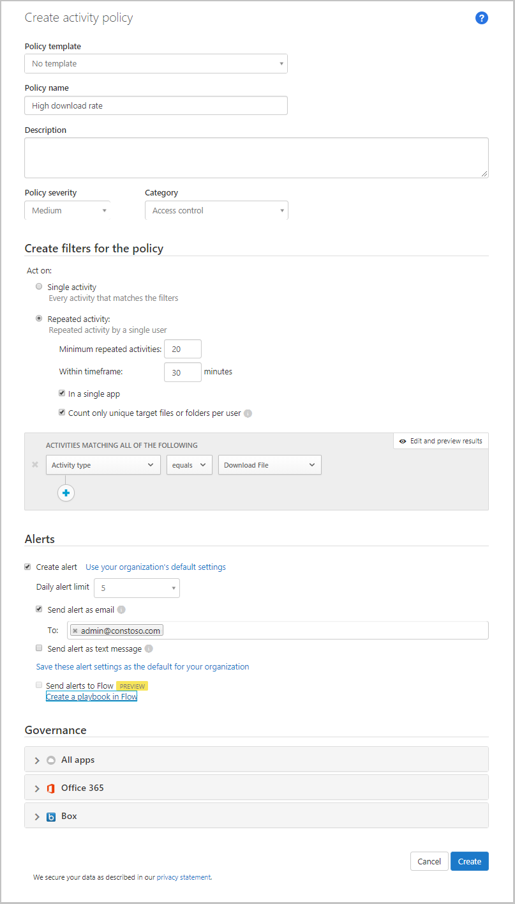

---
# required metadata

title: Creating policies to control activities in Cloud App Security | Microsoft Docs
description: This topic provides instructions for creating and working with activity policies.
keywords:
author: rkarlin
ms.author: rkarlin
manager: mbaldwin
ms.date: 12/9/2018
ms.topic: conceptual
ms.prod:
ms.service: cloud-app-security
ms.technology:
ms.assetid: 99d5fd37-d922-4269-b557-86d7f84180eb

# optional metadata

#ROBOTS:
#audience:
#ms.devlang:
ms.reviewer: reutam
ms.suite: ems
#ms.tgt_pltfrm:
#ms.custom:

---
*Applies to: Microsoft Cloud App Security*

# Activity policies
Activity policies allow you to enforce a wide range of automated processes leveraging the app provider’s APIs. These policies enable you to monitor specific activities carried out by various users, or follow unexpectedly high rates of one certain type of activity.  
  
After you set an activity detection policy, it starts to generate alerts - alerts are only generated on activities that occur after you create the policy.
  
  
## Custom alerts  
Activity policies enable you to set custom alerts to be sent or actions to be taken when user activity is detected. For example, if you want to know every time a user tries to log on and fails 70 times in one minute, or if a user downloads 7,000 files or is logged in from Afghanistan, you can set activity alerts to be sent to yourself or to the user when these events occur. You can even suspend the user until you have time to investigate what happened.  
  
To create a new activity policy, follow this procedure:  
  
1.  In the console, click on **Control** followed by **Policies**.  
  
2.  Click **Create policy** and select **Activity policy**.  
  
       
  
3.  Give your policy a name and description, if you want you can base it on a template, for more information on policy templates, see [Control cloud apps with policies](control-cloud-apps-with-policies.md).  
  
4.  To set which actions or other metrics will trigger this policy, work with the **Activity filters**.  
  
5.  Under **Activity match parameters**, select whether a policy violation will be triggered when a single activity matches the filters or if a violation is only detected when a specified number of **Repeated activities** are detected.  
    If you choose **Repeated activity**, you can set **Group matched activities per app**. This will trigger a policy match only when the repeated activities occur in the same app (for example, 5 downloads from Box).  
  
6.  Configure the **Actions** that should be taken when a match is found.  
  
Take a look at these examples:  
  
-   Multiple failed logins  
  
     You can set your policy so that you receive an alert when there have been a large number of failed login attempts within a certain, relatively short, time period. To configure a policy like this, choose the appropriate activity filter in the **New Activity Policy** page.  
  
     Beneath the **Activity filters** field, configure the parameters for which the alert will be triggered.  
  
       
  
-   High download rate  
  
     You can set your policy so that you receive an alert when there has been an unexpected or uncharacteristic level of downloading activity. To configure a policy like this, under **Rate** parameters, choose the parameters to trigger the alert.  
  
       
  
  
## Activity policy reference  
This section provides reference details about policies, providing explanations for each policy type and the fields that can be configured for each policy.  
  
An **Activity policy** is an API-based policy that enables you to monitor your organization's activities in the cloud, taking into account over 20 file metadata filters (including device type and location). Based on the policy results, notifications can be generated and users can be suspended from the cloud app.   
Each policy is composed of the following parts:  
  
- Activity filters – Enable you to create very granular conditions based on metadata.  
  
- Activity match parameters – Enable you to set a threshold for the number of times an activity repeats to be considered to match the policy.  Specify the number of repeated activities required to match the policy, for example, setting a policy to alert when a user performs 10 unsuccessful login attempts in a 2 minute time frame.  By default, **Activity match parameters**, raises a match for every single activity that meet all of the activity filters.   
  Using **Repeated activity** you can set the number of repeated activities, the duration of the time frame in which the activities are counted, and even specify that all activities should be performed by the same user and in the same cloud app.  
  
  
- Actions – The policy provides a set of governance actions that can be automatically applied when violations are detected.  
  ## See Also  
  [Data protection policies](data-protection-policies.md)   

[Premier customers can also create a new support request directly in the Premier Portal.](https://premier.microsoft.com/)  
  
  